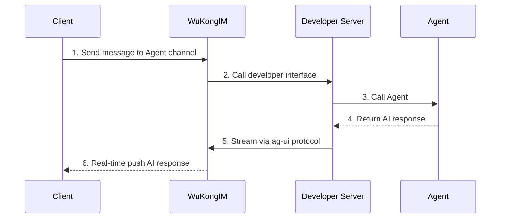

# AI Agent Support

## Overview

WuKongIM natively supports AI Agent functionality, implementing streaming AI conversation experiences through integration with the [ag-ui protocol](https://docs.ag-ui.com/introduction). Developers can easily build intelligent chatbots, AI assistants, and other applications, providing users with natural and smooth AI interaction experiences.

## Workflow

### Process Details

1. **User sends message**: Client user sends a message to WuKongIM's Agent channel
2. **Trigger callback**: WuKongIM receives the message and calls the developer's configured server interface
3. **Call Agent**: Developer server sends the user message to the Agent large model for processing
4. **Get response**: Agent large model generates AI response content
5. **Stream delivery**: Developer server streams the response to the client through WuKongIM's ag-ui protocol interface
6. **Real-time display**: Client receives and displays AI response content in real-time

## ag-ui Protocol Support

WuKongIM natively supports the [ag-ui protocol](https://docs.ag-ui.com/introduction), which is a user interface protocol specifically designed for AI applications.
