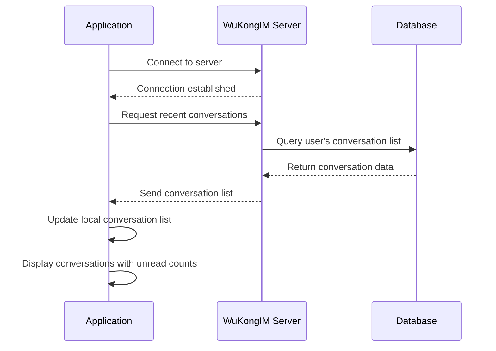
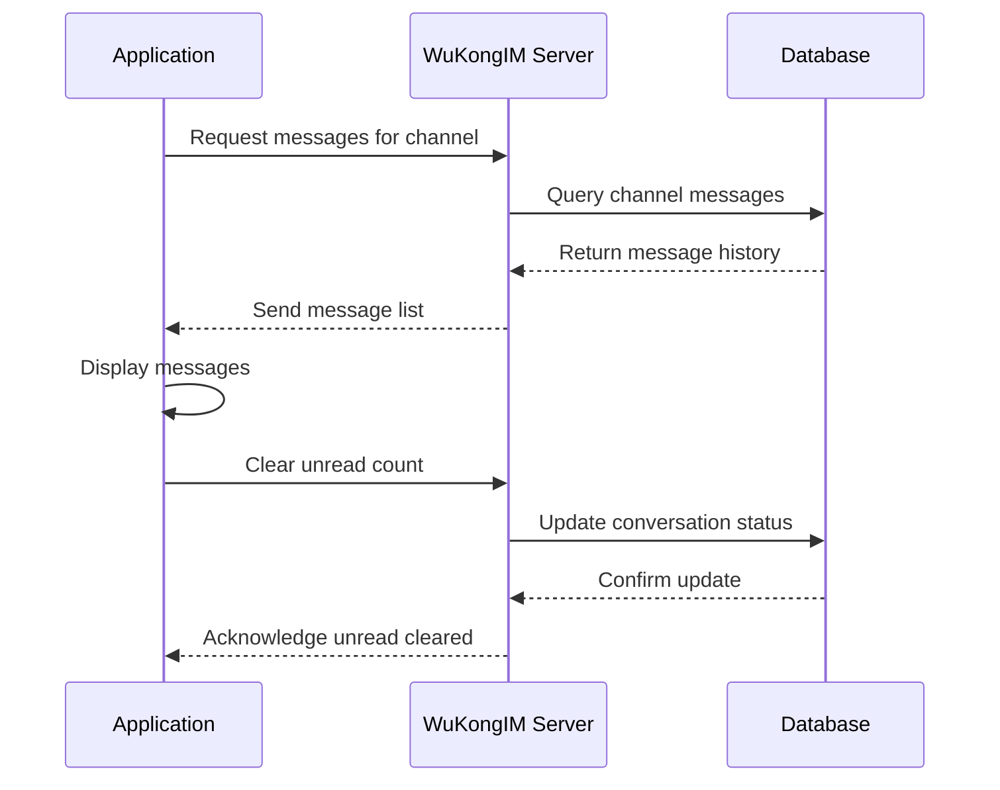

# Offline Messages

*WuKongIM* adopts a read-diffusion model. What are read-diffusion and write-diffusion? Reference article: [Link](https://blog.csdn.net/m0_53246313/article/details/122674197)

After enabling the recent conversation configuration, *WuKongIM* maintains a recent conversation list for each user on the server side.

1. When an application goes from offline to online, it needs to synchronize the recent conversation list, as shown in the diagram below:


2. After the application comes online, the application should maintain the recent conversation list online.

3. When clicking on a conversation (channel) to enter the chat interface, you need to synchronize the messages of that conversation (channel), as shown in the diagram below (at the same time, you need to clear the unread count of the recent conversation using `/conversations/setUnread`):


## Offline Message Processing Flow

### 1. Application Startup Process

When your application starts up and the user comes online, follow this process:



### 2. Message Synchronization Process

When entering a specific conversation:



## Implementation Best Practices

### 1. Conversation List Management

**Sync Recent Conversations on Startup:**

```javascript
// Example: Sync conversations when app starts
async function syncConversationsOnStartup() {
    try {
        // Get recent conversations from server
        const conversations = await getRecentConversations();
        
        // Update local conversation list
        updateLocalConversations(conversations);
        
        // Update UI with unread counts
        displayConversationsWithUnreadCounts(conversations);
        
        console.log('Conversation sync completed');
    } catch (error) {
        console.error('Failed to sync conversations:', error);
        // Handle sync failure - maybe retry or show error
    }
}

// Call on app startup
window.addEventListener('load', syncConversationsOnStartup);
```

### 2. Message History Synchronization

**Load Messages When Entering Chat:**

```javascript
// Example: Load messages when entering a conversation
async function enterConversation(channelId, channelType) {
    try {
        // 1. Load message history
        const messages = await getChannelMessages(channelId, channelType);
        
        // 2. Display messages in chat interface
        displayMessages(messages);
        
        // 3. Clear unread count
        await clearUnreadCount(channelId, channelType);
        
        // 4. Update conversation list UI
        updateConversationUnreadCount(channelId, 0);
        
        console.log(`Entered conversation ${channelId}`);
    } catch (error) {
        console.error('Failed to enter conversation:', error);
    }
}
```

### 3. Real-time Updates

**Handle Real-time Message Updates:**

```javascript
// Example: Handle incoming messages while online
function handleIncomingMessage(message) {
    const { channelId, channelType } = message;
    
    // Check if user is currently viewing this conversation
    if (isCurrentlyViewingConversation(channelId, channelType)) {
        // Display message immediately
        displayNewMessage(message);
        
        // Mark as read automatically
        markMessageAsRead(message);
    } else {
        // Update conversation list with new message
        updateConversationLastMessage(channelId, message);
        
        // Increment unread count
        incrementUnreadCount(channelId);
        
        // Show notification if needed
        showNotification(message);
    }
}
```

## API Integration Examples

### Using WuKongIM APIs

**1. Get Recent Conversations:**

```javascript
async function getRecentConversations() {
    const response = await fetch('/conversations/sync', {
        method: 'POST',
        headers: { 'Content-Type': 'application/json' },
        body: JSON.stringify({
            uid: currentUserId,
            version: lastSyncVersion || 0,
            limit: 50
        })
    });
    
    return await response.json();
}
```

**2. Get Channel Messages:**

```javascript
async function getChannelMessages(channelId, channelType, limit = 20) {
    const response = await fetch('/channel/messagesync', {
        method: 'POST',
        headers: { 'Content-Type': 'application/json' },
        body: JSON.stringify({
            channel_id: channelId,
            channel_type: channelType,
            start_message_seq: 0,
            end_message_seq: 0,
            limit: limit,
            pull_mode: 1 // Pull down mode
        })
    });
    
    return await response.json();
}
```

**3. Clear Unread Count:**

```javascript
async function clearUnreadCount(channelId, channelType) {
    const response = await fetch('/conversations/clearUnread', {
        method: 'POST',
        headers: { 'Content-Type': 'application/json' },
        body: JSON.stringify({
            uid: currentUserId,
            channel_id: channelId,
            channel_type: channelType
        })
    });
    
    return await response.json();
}
```

## Performance Optimization

### 1. Incremental Synchronization

Use version-based incremental sync to reduce data transfer:

```javascript
// Store last sync version locally
let lastConversationSyncVersion = localStorage.getItem('lastSyncVersion') || 0;

async function incrementalConversationSync() {
    const response = await fetch('/conversations/sync', {
        method: 'POST',
        headers: { 'Content-Type': 'application/json' },
        body: JSON.stringify({
            uid: currentUserId,
            version: lastConversationSyncVersion,
            limit: 50
        })
    });
    
    const data = await response.json();
    
    // Update local version
    if (data.version) {
        lastConversationSyncVersion = data.version;
        localStorage.setItem('lastSyncVersion', data.version);
    }
    
    return data;
}
```

### 2. Pagination for Large Conversations

Implement pagination for conversations with many messages:

```javascript
async function loadMoreMessages(channelId, channelType, oldestMessageSeq) {
    const response = await fetch('/channel/messagesync', {
        method: 'POST',
        headers: { 'Content-Type': 'application/json' },
        body: JSON.stringify({
            channel_id: channelId,
            channel_type: channelType,
            start_message_seq: 0,
            end_message_seq: oldestMessageSeq - 1,
            limit: 20,
            pull_mode: 1
        })
    });
    
    const data = await response.json();
    
    // Prepend older messages to chat
    prependMessagesToChat(data.messages);
    
    return data;
}
```

## Error Handling

### Robust Sync Error Handling

```javascript
async function robustConversationSync(retryCount = 3) {
    for (let i = 0; i < retryCount; i++) {
        try {
            const conversations = await getRecentConversations();
            updateLocalConversations(conversations);
            return conversations;
        } catch (error) {
            console.error(`Sync attempt ${i + 1} failed:`, error);
            
            if (i === retryCount - 1) {
                // Last attempt failed, show error to user
                showSyncError('Failed to sync conversations. Please check your connection.');
                throw error;
            }
            
            // Wait before retry (exponential backoff)
            await new Promise(resolve => setTimeout(resolve, Math.pow(2, i) * 1000));
        }
    }
}
```

## Best Practices Summary

1. **Always sync conversations on app startup** to get the latest state
2. **Use incremental sync** with version numbers to optimize performance
3. **Clear unread counts** when users view conversations
4. **Handle real-time updates** properly based on current user context
5. **Implement proper error handling** with retry mechanisms
6. **Use pagination** for large message histories
7. **Cache data locally** to improve user experience during network issues
