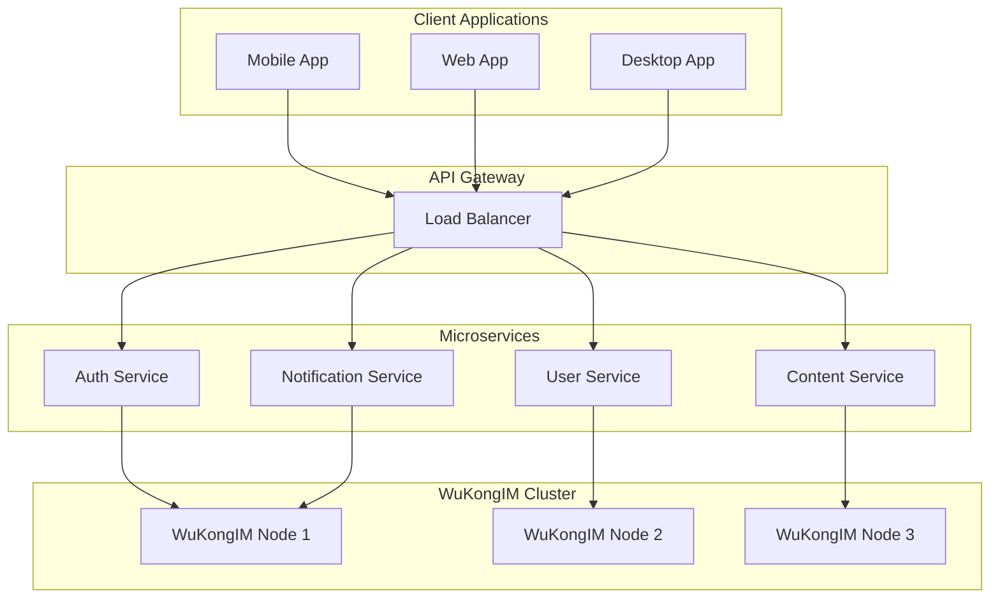

WuKongIM is designed to support a wide variety of real-time communication scenarios. Here are some common use cases and how WuKongIM can help you build them.

## Chat Applications

### Group Chat Platforms
Build social platforms with unlimited group sizes and rich messaging features.

**Key Features:**
- Support for 100,000+ members per group
- Rich media message support
- Message history and search
- Real-time typing indicators
- Message reactions and replies

**Example Applications:**
- Social media platforms
- Gaming communities
- Professional team collaboration
- Educational platforms

### Direct Messaging
Create secure one-on-one communication channels.

**Key Features:**
- End-to-end encryption
- Message delivery receipts
- Offline message storage
- File and media sharing
- Voice and video call signaling

## Message Push & Notifications

### Real-time Notifications
Send instant notifications to users across all platforms.

**Use Cases:**
- Order status updates
- Breaking news alerts
- System notifications
- Marketing messages
- Emergency alerts

**Benefits:**
- High delivery rates
- Cross-platform support
- Reliable message delivery
- Scalable to millions of users

## IoT Communication

### Device-to-Device Messaging
Enable communication between IoT devices and servers.

**Applications:**
- Smart home automation
- Industrial IoT monitoring
- Vehicle telematics
- Environmental sensors
- Asset tracking

**Features:**
- Low bandwidth protocols
- Reliable message delivery
- Device authentication
- Message persistence
- Scalable device management

## Live Streaming & Broadcasting

### Interactive Live Streams
Add real-time chat and interaction to live broadcasts.

**Features:**
- High-throughput message delivery
- Moderation tools
- Emoji reactions
- Viewer engagement metrics
- Multi-language support

**Use Cases:**
- Live gaming streams
- Educational webinars
- Entertainment broadcasts
- Corporate events
- Sports commentary

## Customer Service Systems

### Support Chat Platforms
Build comprehensive customer support solutions.

**Capabilities:**
- Agent-customer matching
- Chat history and context
- File sharing and screen sharing
- Queue management
- Performance analytics

**Benefits:**
- Improved response times
- Better customer satisfaction
- Scalable support operations
- Integration with CRM systems

## AI Communication

### Chatbots & Virtual Assistants
Integrate AI-powered conversational interfaces.

**Features:**
- Natural language processing
- Context-aware responses
- Multi-turn conversations
- Human handoff capabilities
- Analytics and insights

**Applications:**
- Customer service bots
- Personal assistants
- Educational tutors
- E-commerce assistants
- Healthcare chatbots

## Audio/Video Signaling

### WebRTC Coordination
Coordinate audio and video calls using WuKongIM for signaling.

**Capabilities:**
- Call setup and teardown
- Participant management
- Screen sharing coordination
- Recording control
- Quality monitoring

**Use Cases:**
- Video conferencing
- Online education
- Telemedicine
- Remote collaboration
- Live streaming

## Instant Communities

### Real-time Forums
Create dynamic community platforms with instant updates.

**Features:**
- Topic-based discussions
- Real-time updates
- User presence indicators
- Moderation tools
- Content filtering

**Applications:**
- Developer communities
- Support forums
- Interest-based groups
- Professional networks
- Educational communities

## Architecture Patterns

### Microservices Integration
WuKongIM fits seamlessly into microservices architectures.

### Event-Driven Architecture
Use WuKongIM as the messaging backbone for event-driven systems.

**Benefits:**
- Loose coupling between services
- Scalable event processing
- Reliable event delivery
- Real-time system updates

## Performance Characteristics by Use Case

| Use Case | Concurrent Users | Messages/Second | Latency |
|----------|------------------|-----------------|---------|
| **Group Chat** | 100K+ | 50K+ | &lt;10ms |
| **Live Streaming Chat** | 1M+ | 200K+ | &lt;5ms |
| **IoT Messaging** | 10M+ | 500K+ | &lt;50ms |
| **Push Notifications** | 50M+ | 1M+ | &lt;100ms |
| **Customer Service** | 10K+ | 10K+ | &lt;5ms |

## Getting Started with Your Use Case

<CardGroup cols={2}>
  <Card
    title="Quick Start Guide"
    icon="rocket"
    href="/getting-started/quickstart"
  >
    Get WuKongIM running in minutes
  </Card>
  <Card
    title="API Documentation"
    icon="code"
    href="/api/getting-started"
  >
    Integrate WuKongIM into your application
  </Card>
  <Card
    title="SDK Documentation"
    icon="mobile"
    href="/sdk/overview"
  >
    Use our client SDKs for your platform
  </Card>
  <Card
    title="Example Applications"
    icon="play"
    href="/examples/sample-apps"
  >
    See WuKongIM in action
  </Card>
</CardGroup>

## Need Help Choosing?

If you're unsure which features you need or how to architect your solution:

- Check out our [live demos](/examples/live-demos)
- Review our [best practices guide](/examples/best-practices)
- Join our [community discussions](https://github.com/WuKongIM/WuKongIM/discussions)
- [Contact our team](https://github.com/WuKongIM/WuKongIM/issues) for architecture advice
