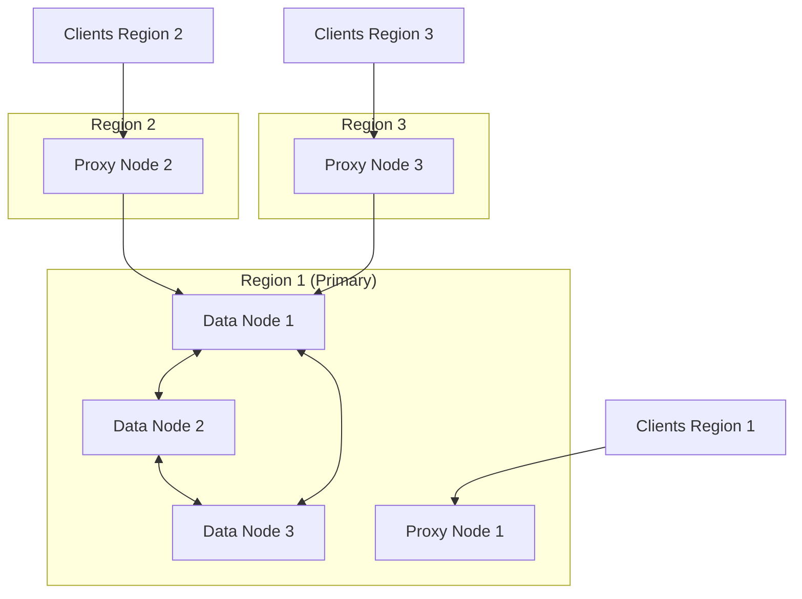

WuKongIM offers flexible deployment options to suit different environments and requirements. Choose the method that best fits your infrastructure and scaling needs.

## Deployment Options

<CardGroup cols={3}>
  <Card
    title="Docker Compose"
    icon="docker"
    href="/installation/docker/single-node"
  >
    Quick setup for development and small production deployments
  </Card>
  <Card
    title="Kubernetes"
    icon="dharmachakra"
    href="/installation/k8s/single-node"
  >
    Cloud-native deployment with automatic scaling and management
  </Card>
  <Card
    title="Linux Binary"
    icon="linux"
    href="/installation/linux/single-node"
  >
    Direct installation on Linux servers for maximum control
  </Card>
</CardGroup>

## Single Node vs Cluster Deployment

### Single Node Deployment

**Advantages:**
- Simple deployment and management
- Good performance for moderate loads
- Easy to upgrade to cluster later
- Lower resource requirements

**Disadvantages:**
- No automatic failover
- Manual backup required
- Single point of failure

**Best for:**
- Development environments
- Small to medium applications (up to 400k daily active users)
- Applications with relaxed availability requirements

### Cluster Deployment

**Advantages:**
- High availability with automatic failover
- Automatic data replication and backup
- Load balancing across nodes
- Horizontal scaling capabilities

**Disadvantages:**
- More complex setup and management
- Requires multiple servers
- Higher resource overhead

**Best for:**
- Production environments
- Large applications (1M+ daily active users)
- Mission-critical applications requiring high availability

## Hardware Requirements

### Single Node Deployment

For up to 400k daily active users:

<Tabs>
  <Tab title="Minimum">
    - **CPU**: 2 cores
    - **Memory**: 8GB RAM
    - **Storage**: SSD recommended
    - **Network**: 1Gbps
  </Tab>
  <Tab title="Recommended">
    - **CPU**: 4 cores
    - **Memory**: 16GB RAM
    - **Storage**: NVMe SSD
    - **Network**: 10Gbps
  </Tab>
</Tabs>

### Cluster Deployment

For 1M+ daily active users (3-node cluster):

<Tabs>
  <Tab title="Per Node">
    - **CPU**: 4+ cores
    - **Memory**: 16GB+ RAM
    - **Storage**: NVMe SSD
    - **Network**: 10Gbps
  </Tab>
  <Tab title="Total Cluster">
    - **Nodes**: 3+ (odd number recommended)
    - **Total CPU**: 12+ cores
    - **Total Memory**: 48GB+ RAM
    - **Replication**: 3x data redundancy
  </Tab>
</Tabs>

## Network Requirements

### Ports

WuKongIM uses the following ports by default:

| Port | Protocol | Purpose | Required |
|------|----------|---------|----------|
| 5001 | HTTP | REST API | Yes |
| 5100 | TCP | Client connections | Yes |
| 5200 | WebSocket | Web client connections | Yes |
| 5210 | WSS | Secure WebSocket | Optional |
| 5300 | HTTP | Management interface | Optional |
| 11110 | TCP | Cluster communication | Cluster only |

### Firewall Configuration

<Tabs>
  <Tab title="Single Node">
    ```bash
    # Allow client connections
    ufw allow 5001/tcp  # API
    ufw allow 5100/tcp  # TCP clients
    ufw allow 5200/tcp  # WebSocket clients
    ufw allow 5210/tcp  # WSS (if using SSL)
    ```
  </Tab>
  <Tab title="Cluster">
    ```bash
    # Client connections (same as single node)
    ufw allow 5001/tcp
    ufw allow 5100/tcp
    ufw allow 5200/tcp
    ufw allow 5210/tcp
    
    # Cluster communication
    ufw allow 11110/tcp  # Inter-node communication
    ```
  </Tab>
</Tabs>

## Geographic Distribution

### Supported Configurations

<Callout type="info">
  **Current Limitation**: Cross-region data node deployment is not supported. However, proxy nodes can be deployed globally.
</Callout>

- **Data Nodes**: Must be in the same region/datacenter
- **Proxy Nodes**: Can be deployed globally for reduced latency
- **Client Routing**: Automatic routing to nearest proxy node

### Multi-Region Architecture



## Choosing Your Deployment Method

### Decision Matrix

| Factor | Docker Compose | Kubernetes | Linux Binary |
|--------|----------------|------------|--------------|
| **Ease of Setup** | ⭐⭐⭐⭐⭐ | ⭐⭐⭐ | ⭐⭐⭐⭐ |
| **Production Ready** | ⭐⭐⭐ | ⭐⭐⭐⭐⭐ | ⭐⭐⭐⭐⭐ |
| **Scaling** | ⭐⭐ | ⭐⭐⭐⭐⭐ | ⭐⭐⭐ |
| **Monitoring** | ⭐⭐ | ⭐⭐⭐⭐⭐ | ⭐⭐⭐⭐ |
| **Resource Usage** | ⭐⭐⭐ | ⭐⭐ | ⭐⭐⭐⭐⭐ |

### Recommendations

<Tabs>
  <Tab title="Development">
    **Docker Compose** - Quick setup for local development and testing
    
    ```bash
    # Get started in minutes
    curl -O https://raw.githubusercontent.com/WuKongIM/WuKongIM/main/docker-compose.yml
    docker-compose up -d
    ```
  </Tab>
  <Tab title="Small Production">
    **Linux Binary** - Direct control and optimal performance
    
    - Single node deployment
    - Manual backup strategy
    - Direct server management
  </Tab>
  <Tab title="Large Production">
    **Kubernetes** - Full cloud-native deployment
    
    - Automatic scaling and management
    - Built-in monitoring and logging
    - High availability by default
  </Tab>
</Tabs>

## Next Steps

Choose your deployment method and follow the detailed installation guide:

<CardGroup cols={3}>
  <Card
    title="Docker Compose Setup"
    icon="docker"
    href="/installation/docker/single-node"
  >
    Start with Docker for quick deployment
  </Card>
  <Card
    title="Kubernetes Setup"
    icon="dharmachakra"
    href="/installation/k8s/single-node"
  >
    Deploy on Kubernetes cluster
  </Card>
  <Card
    title="Linux Installation"
    icon="linux"
    href="/installation/linux/single-node"
  >
    Install directly on Linux servers
  </Card>
</CardGroup>

## Common Questions

<AccordionGroup>
  <Accordion title="Can I migrate from single node to cluster later?">
    Yes! WuKongIM supports online migration from single node to cluster deployment without downtime. The process involves adding new nodes and redistributing data automatically.
  </Accordion>
  
  <Accordion title="What's the difference between data nodes and proxy nodes?">
    Data nodes store and process messages, while proxy nodes handle client connections and route requests to data nodes. This separation allows for better scaling and geographic distribution.
  </Accordion>
  
  <Accordion title="Do I need a load balancer?">
    For single node deployments, no load balancer is needed. For cluster deployments, WuKongIM includes built-in load balancing, but you may want an external load balancer for additional features like SSL termination.
  </Accordion>
</AccordionGroup>
