## What is WuKongEasySDK

WuKongEasySDK is a lightweight instant messaging SDK series designed for rapid integration. It provides unified API design across platforms, enabling developers to add real-time chat functionality to any application in just 5 minutes.

<Note>
  **Design Philosophy**: Simplify integration complexity, focus on core functionality, and provide out-of-the-box chat experience.
</Note>

## Core Advantages

### 🚀 Lightning Fast Integration
- **5-Minute Setup**: From installation to sending the first message takes only 5 minutes
- **Zero Configuration Start**: Ready to use out of the box, no complex initialization configuration needed
- **Automated Processing**: Built-in connection management, auto-reconnection, message synchronization mechanisms

### 📱 Full Platform Coverage
- **Web/JavaScript**: Supports modern browsers (Chrome 60+, Firefox 55+, Safari 11+, Edge 79+)
- **iOS**: Supports iOS 12.0 or higher, Xcode 12.0+, Swift 5.0+
- **Android**: Supports Android 5.0 (API level 21) or higher, Kotlin 1.5.0+
- **Flutter**: Supports Flutter 3.0.0 or higher, Dart 2.17.0+

### 💡 Unified Design
- **Consistent API**: All platforms use the same method names and parameter structures
- **Modern Async Patterns**: JavaScript Promise, Swift async/await, Kotlin coroutines, Dart async/await
- **Event-Driven Architecture**: Unified event listening and handling mechanisms

### Integration Process Overview

```mermaid
graph TD
    A[Choose Platform SDK] --> B[Install Dependencies]
    B --> C[Initialize SDK]
    C --> D[Setup Event Listeners]
    D --> E[Connect to Server]
    E --> F[Send First Message]
    F --> G[🎉 Integration Complete]

    style A fill:#e1f5fe
    style G fill:#e8f5e8
```



## Cross-Platform Code Examples

Here are basic integration code examples for each platform, demonstrating WuKongEasySDK's unified API design:

<CodeGroup>
```javascript Web/JavaScript
import { WKIM, WKIMChannelType, WKIMEvent } from 'easyjssdk';

// 1. Initialize SDK
const im = WKIM.init("ws://your-server.com:5200", {
    uid: "your_user_id",
    token: "your_auth_token"
});

// 2. Listen for messages
im.on(WKIMEvent.Message, (message) => {
    console.log("New message received:", message);
});

// 3. Connect to server
await im.connect();

// 4. Send message
const result = await im.send("friend_user_id", WKIMChannelType.Person, {
    type: 1,
    content: "Hello from Web!"
});
```

```swift iOS
import WuKongEasySDK

// 1. Initialize SDK
let config = WuKongConfig(
    serverUrl: "ws://your-server.com:5200",
    uid: "your_user_id",
    token: "your_auth_token"
)
let easySDK = WuKongEasySDK(config: config)

// 2. Listen for messages
easySDK.onMessage { message in
    print("New message received:", message)
}

// 3. Connect to server
try await easySDK.connect()

// 4. Send message
let result = try await easySDK.send(
    to: "friend_user_id",
    channelType: .person,
    payload: MessagePayload(type: 1, content: "Hello from iOS!")
)
```

```kotlin Android
import com.githubim.easysdk.*

// 1. Initialize SDK
val config = WuKongConfig.Builder()
    .serverUrl("ws://your-server.com:5200")
    .uid("your_user_id")
    .token("your_auth_token")
    .build()
val easySDK = WuKongEasySDK.getInstance()
easySDK.init(this, config)

// 2. Listen for messages
easySDK.addEventListener(WuKongEvent.MESSAGE, object : WuKongEventListener<Message> {
    override fun onEvent(message: Message) {
        Log.d("WuKong", "New message received: $message")
    }
})

// 3. Connect to server
lifecycleScope.launch {
    easySDK.connect()
}

// 4. Send message
val result = easySDK.send(
    channelId = "friend_user_id",
    channelType = WuKongChannelType.PERSON,
    payload = MessagePayload(type = 1, content = "Hello from Android!")
)
```

```dart Flutter
import 'package:wukong_easy_sdk/wukong_easy_sdk.dart';

// 1. Initialize SDK
final config = WuKongConfig(
  serverUrl: "ws://your-server.com:5200",
  uid: "your_user_id",
  token: "your_auth_token",
);
final easySDK = WuKongEasySDK.getInstance();
await easySDK.init(config);

// 2. Listen for messages
easySDK.addEventListener(WuKongEvent.message, (Message message) {
  print("New message received: $message");
});

// 3. Connect to server
await easySDK.connect();

// 4. Send message
final result = await easySDK.send(
  channelId: "friend_user_id",
  channelType: WuKongChannelType.person,
  payload: MessagePayload(type: 1, content: "Hello from Flutter!"),
);
```
</CodeGroup>

<Note>
  **Unified Design**: Notice that all platforms use the same method names (init, connect, send) and similar parameter structures, making cross-platform development easier.
</Note>

## Use Case Guidelines

### ✅ Recommended Scenarios for WuKongEasySDK

<Tabs>
  <Tab title="Project Types">
    - **Rapid Prototyping**: Prototype projects that need to quickly validate chat functionality
    - **MVP Projects**: Minimum viable products for quick market validation
    - **Simple Chat Applications**: Chat applications with relatively simple feature requirements
    - **Learning and Demos**: Learning instant messaging development or product feature demonstrations
    - **Internal Tools**: Enterprise internal communication tools or customer service systems
  </Tab>
  <Tab title="Technical Requirements">
    - **Tight Development Timeline**: Projects that need rapid delivery
    - **Simple Tech Stack**: Teams with limited experience in complex SDK integration
    - **Standard Feature Needs**: Standard chat functionality meets requirements
    - **Cross-Platform Consistency**: Need consistent user experience across multiple platforms
    - **Maintenance Cost Sensitive**: Want to reduce long-term maintenance and upgrade costs
  </Tab>
</Tabs>

## Get Started Now

Choose your development platform and begin your 5-minute quick integration journey:

<CardGroup cols={2}>
  <Card title="Web" icon="globe" href="/en/sdk/easy/javascript/getting-started">
    Quick integration for web applications and H5 pages
  </Card>
  <Card title="iOS" icon="apple" href="/en/sdk/easy/ios/getting-started">
    Quick integration for iOS native applications
  </Card>
  <Card title="Android" icon="android" href="/en/sdk/easy/android/getting-started">
    Quick integration for Android native applications
  </Card>
  <Card title="Flutter" icon="flutter" href="/en/sdk/easy/flutter/getting-started">
    Quick integration for Flutter cross-platform applications
  </Card>
</CardGroup>

<Tip>
  **Selection Advice**: If you're unsure which platform to choose, we recommend starting with Web EasySDK as it can quickly validate functionality and is easy to debug.
</Tip>
