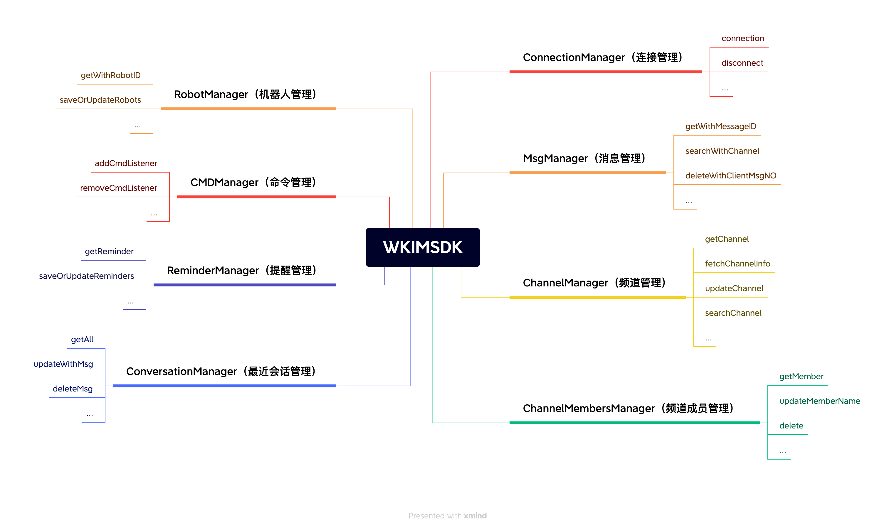

## Design Philosophy

To enable developers to use the SDK faster and more conveniently, WuKong SDK provides a single entry point to access all functionality in the SDK. Like a book's table of contents, you can find corresponding content through the directory. For example, connecting to IM: `WKIM.getInstance().getConnectionManager().connection()`

## Architecture Overview



Common SDK functionality introduction:

```java
// Message Manager
// Responsible for message CRUD operations, new message listening, refresh message listening, 
// message storage, send message receipt listening, monitoring sync of specific chat data, etc.
WKIM.getInstance().getMsgManager()

// Connection Manager
// Responsible for IM connection, disconnection, logout, connection status monitoring, 
// connection IP monitoring, etc.
WKIM.getInstance().getConnectionManager()

// Channel Manager
// Can get Channel information, refresh Channel cache, monitor Channel changes 
// [pinning, do not disturb, muting], search Channels, etc.
WKIM.getInstance().getChannelManager()

// Conversation Manager
// Get recent chat records, refresh recent conversations [add chat, red dot changes], 
// monitor removal of conversations, monitor sync recent conversations, etc.
WKIM.getInstance().getConversationManager()

// Channel Members Manager
// Get Channel member list, set member notes, save and modify member data, 
// monitor refresh members and remove members, etc.
WKIM.getInstance().getChannelMembersManager()

// Reminder Manager
// Get conversation reminders like: [someone @me] [group join request], etc. 
// Also supports custom reminder items like voice unread, etc.
WKIM.getInstance().getReminderManager()

// CMD Manager
// Responsible for monitoring command messages sent from the server
WKIM.getInstance().getCMDManager()

// Robot Manager
// Can get robot menus, sync robot menus, query menus, etc.
WKIM.getInstance().getRobotManager()
```

## SDK Integration with Apps


The SDK-APP interaction flow is: APP calls SDK provided methods, SDK processes data and callbacks data to APP through events. For example, message sending flow: APP calls send message method, SDK pushes the stored message to APP.

## Core Functionality Modules

### Message Management (MsgManager)
- Message CRUD operations
- New message listening and refresh message listening
- Message storage and status management
- Send message receipt listening
- Sync chat data monitoring

### Connection Management (ConnectionManager)
- IM connection establishment and disconnection
- Logout handling
- Connection status monitoring
- Connection IP monitoring
- Network status handling

### Channel Management (ChannelManager)
- Get channel information
- Refresh channel cache
- Monitor channel changes (pinning, do not disturb, muting)
- Search channel functionality
- Channel settings management

### Conversation Management (ConversationManager)
- Get recent chat records
- Refresh recent conversations (add chat, red dot changes)
- Monitor removal of conversations
- Monitor sync recent conversations
- Unread message counting

### Channel Members Management (ChannelMembersManager)
- Get channel member list
- Set member notes
- Save and modify member data
- Monitor refresh members and remove members
- Member permission management

### Reminder Management (ReminderManager)
- Get conversation reminders (someone @me, group join request, etc.)
- Custom reminder items (voice unread, etc.)
- Reminder status management
- Reminder message handling

### CMD Management (CMDManager)
- Monitor command messages sent from server
- Command message handling
- System notification management

### Robot Management (RobotManager)
- Get robot menus
- Sync robot menus
- Query menu functionality
- Robot interaction handling

## Development Advantages

- **Unified Entry Point**: Access all functionality through `WKIM.getInstance()`
- **Modular Design**: Clear separation of functional modules for easy maintenance and extension
- **Event-Driven**: Event callback mechanism based on listener pattern
- **High Performance**: Local database caching, optimized network requests
- **Easy Integration**: Clean API design for quick integration into existing Android projects
- **Complete Functionality**: Covers all core instant messaging features

## Next Steps

After understanding the overall architecture of Android SDK, you can:

1. [SDK Integration](/en/sdk/wukongim/android/integration) - Start integrating WuKongIM Android SDK
2. [Basic Features](/en/sdk/wukongim/android/base) - Learn basic SDK configuration and usage
3. [Message Management](/en/sdk/wukongim/android/message) - Implement message sending and receiving functionality
4. [Channel Management](/en/sdk/wukongim/android/channel) - Manage channels and members
5. [Conversation Management](/en/sdk/wukongim/android/conversation) - Handle conversation lists and unread messages
