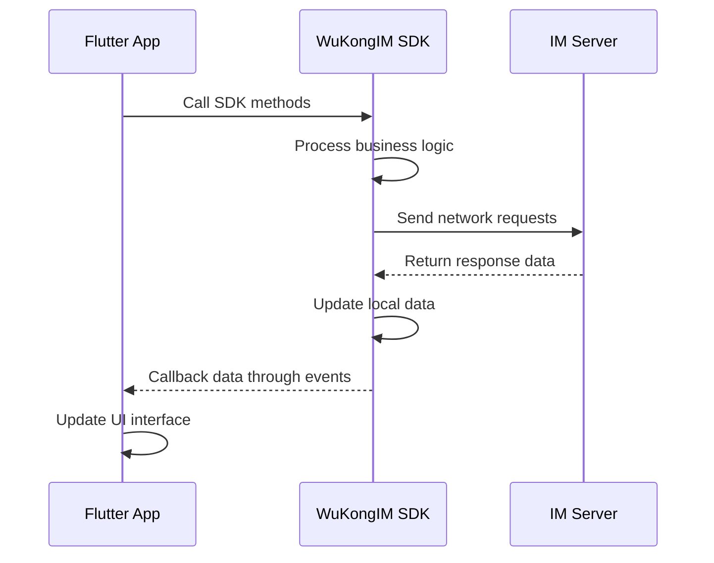

WuKongIM Flutter SDK provides a complete instant messaging solution for Flutter applications, using modular design to enable developers to quickly integrate and use various IM features.

## Design Philosophy

To make it faster and more convenient for developers to use the SDK, WuKong SDK provides a single entry point to access all functions in the SDK. Like a table of contents in a book, you can find corresponding content through the directory. For example, connecting to IM:

```dart
WKIM.shared.connectionManager.connect();
```

This design allows developers to:
- **Unified Entry**: Access all functions through `WKIM.shared`
- **Modular Management**: Each functional module has clear responsibilities
- **Easy Maintenance**: Clear code structure, easy to debug and maintain

## Architecture Overview

WuKongIM Flutter SDK adopts a modular architecture design, where various modules work together to provide developers with complete instant messaging functionality:

```mermaid
graph TB
    A[WKIM.shared] --> B[MessageManager Message Manager]
    A --> C[ConversationManager Conversation Manager]
    A --> D[ConnectionManager Connection Manager]
    A --> E[ChannelManager Channel Manager]
    A --> F[ChannelMemberManager Channel Member Manager]
    A --> G[ReminderManager Reminder Manager]
    A --> H[CMDManager Command Manager]
    
    B --> B1[Message Send/Receive]
    B --> B2[Message History]
    B --> B3[Message Listening]
    
    C --> C1[Conversation List]
    C --> C2[Unread Messages]
    C --> C3[Conversation Operations]
    
    D --> D1[Connection Status]
    D --> D2[Network Management]
    D --> D3[Reconnection Mechanism]
    
    E --> E1[Channel Information]
    E --> E2[Channel Operations]
    E --> E3[Channel Listening]
    
    F --> F1[Member List]
    F --> F2[Member Operations]
    F --> F3[Permission Management]
    
    G --> G1[@Reminders]
    G --> G2[Custom Reminders]
    G --> G3[Reminder Management]
    
    H --> H1[Command Listening]
    H --> H2[Command Processing]
    H --> H3[System Messages]
```

## Core Functional Modules

### Message Manager (MessageManager)

Responsible for CRUD operations on messages, new message listening, refresh message listening, message storage, monitoring sync of specific chat data, etc.

```dart
// Message Manager
WKIM.shared.messageManager

// Main Functions
- Send various types of messages (text, image, voice, video, etc.)
- Receive and process new messages
- Query message history
- Message status management
- Custom message types
```

### Conversation Manager (ConversationManager)

Get recent chat records, refresh recent conversations [new chats, red dot changes], listen for removing a conversation, listen for syncing recent conversations, etc.

```dart
// Conversation Management
WKIM.shared.conversationManager

// Main Functions
- Get conversation list
- Conversation sorting and filtering
- Unread message statistics
- Conversation operations (delete, pin, etc.)
- Conversation status listening
```

### Connection Manager (ConnectionManager)

Responsible for IM connection, disconnection, logout, listening for connection status, listening for getting connection IP, etc.

```dart
// Connection Management
WKIM.shared.connectionManager

// Main Functions
- Establish and maintain connections
- Connection status listening
- Automatic reconnection mechanism
- Network status handling
- Login/logout management
```

### Channel Manager (ChannelManager)

Can get Channel information, refresh Channel cache, listen for Channel changes [pin, do not disturb, mute], etc.

```dart
// Channel Management
WKIM.shared.channelManager

// Main Functions
- Get channel information
- Channel settings management
- Channel status listening
- Channel cache management
- Channel search
```

### Channel Member Manager (ChannelMemberManager)

Get Channel member list, set member remarks, save and modify member data, listen for refreshing members and removing members, etc.

```dart
// Channel Member Management
WKIM.shared.channelMemberManager

// Main Functions
- Get member list
- Member information management
- Member permission control
- Member operation listening
- Member search and filtering
```

### Reminder Manager (ReminderManager)

Get reminders for a conversation such as: [someone @me] [group join request], etc. You can also customize reminder items, such as unread voice messages, etc.

```dart
// Reminder Management
WKIM.shared.reminderManager

// Main Functions
- @Reminder management
- System notification reminders
- Custom reminder types
- Reminder status management
- Reminder history
```

### Command Manager (CMDManager)

Responsible for listening to command messages sent by the server.

```dart
// Command Management
WKIM.shared.cmdManager

// Main Functions
- System command listening
- Command message processing
- Business instruction dispatch
- Status sync commands
- Custom command extensions
```

## SDK and APP Interaction Principles

WuKongIM Flutter SDK adopts an event-driven interaction mode to ensure clear and controllable data flow:



### Interaction Flow Description

1. **APP calls SDK methods**: Application initiates operations through SDK-provided APIs
2. **SDK processes data**: SDK internally handles business logic, including data validation, format conversion, etc.
3. **Network communication**: SDK exchanges data with the server
4. **Event callbacks**: SDK callbacks processing results to the application through event mechanisms
5. **UI updates**: Application updates user interface based on callback data

### Event Listening Example

```dart
class ChatPage extends StatefulWidget {
  @override
  _ChatPageState createState() => _ChatPageState();
}

class _ChatPageState extends State<ChatPage> {
  @override
  void initState() {
    super.initState();
    
    // Listen for new messages
    WKIM.shared.messageManager.addOnNewMsgListener('chat', (msgs) {
      setState(() {
        // Update message list
        _updateMessageList(msgs);
      });
    });
    
    // Listen for connection status
    WKIM.shared.connectionManager.addOnConnectionStatus('chat', (status, reason, connInfo) {
      setState(() {
        // Update connection status
        _updateConnectionStatus(status);
      });
    });
  }
  
  @override
  void dispose() {
    // Remove listeners
    WKIM.shared.messageManager.removeNewMsgListener('chat');
    WKIM.shared.connectionManager.removeOnConnectionStatus('chat');
    super.dispose();
  }
  
  // Send message example
  void _sendMessage(String text) {
    final textContent = WKTextContent(text);
    final channel = WKChannel('channelId', WKChannelType.personal);
    
    // Call SDK method to send message
    WKIM.shared.messageManager.sendMessage(textContent, channel);
    // SDK will callback message sending result through events
  }
}
```

## Development Advantages

### 1. Simple and Easy to Use
- **Unified Entry**: All functions accessed through `WKIM.shared`
- **Clear Structure**: Modular design with clear responsibilities
- **Rich Examples**: Complete usage examples provided

### 2. Complete Functionality
- **Full Platform Support**: Supports both iOS and Android platforms
- **Rich Message Types**: Supports text, image, voice, video and other message types
- **Custom Extensions**: Supports custom message types and business logic

### 3. Performance Optimization
- **Local Caching**: Smart caching mechanism reduces network requests
- **Incremental Sync**: Only syncs changed data for improved efficiency
- **Memory Management**: Optimized memory usage, avoiding memory leaks

### 4. Stable and Reliable
- **Auto Reconnection**: Automatic reconnection during network exceptions
- **Data Consistency**: Ensures data integrity and consistency
- **Error Handling**: Comprehensive error handling mechanisms

## Quick Start

Ready to start using WuKongIM Flutter SDK?

<CardGroup cols={2}>
  <Card
    title="Integration Guide"
    icon="rocket"
    href="/en/sdk/wukongim/flutter/integration"
  >
    Learn how to integrate WuKongIM SDK in Flutter projects
  </Card>
  <Card
    title="Basic Features"
    icon="foundation"
    href="/en/sdk/wukongim/flutter/base"
  >
    Master connection management and basic API usage
  </Card>
  <Card
    title="Message Management"
    icon="message-circle"
    href="/en/sdk/wukongim/flutter/message"
  >
    Learn message sending/receiving and history query
  </Card>
  <Card
    title="Advanced Features"
    icon="cog"
    href="/en/sdk/wukongim/flutter/advance"
  >
    Explore custom messages and extension features
  </Card>
</CardGroup>
