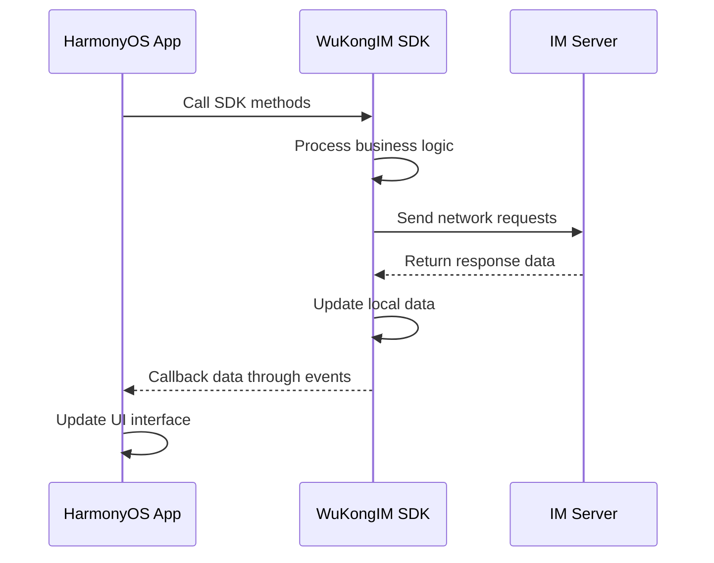

WuKongIM HarmonyOS SDK provides a complete instant messaging solution for HarmonyOS applications, using modular design to enable developers to quickly integrate and use various IM features.

## Design Philosophy

To make it faster and more convenient for developers to use the SDK, WuKong SDK provides a single entry point to access all functions in the SDK. Like a table of contents in a book, you can find corresponding content through the directory. For example, connecting to IM:

```typescript
WKIM.shared.connectionManager().connection();
```

This design allows developers to:
- **Unified Entry**: Access all functions through `WKIM.shared`
- **Modular Management**: Each functional module has clear responsibilities
- **Easy Maintenance**: Clear code structure, easy to debug and maintain

## Architecture Overview

WuKongIM HarmonyOS SDK adopts a modular architecture design, where various modules work together to provide developers with complete instant messaging functionality:

```mermaid
graph TB
    A[WKIM.shared] --> B[MessageManager Message Manager]
    A --> C[ConversationManager Conversation Manager]
    A --> D[ConnectionManager Connection Manager]
    A --> E[ChannelManager Channel Manager]
    A --> F[ChannelMemberManager Channel Member Manager]
    A --> G[ReminderManager Reminder Manager]
    A --> H[CMDManager Command Manager]
    
    B --> B1[Message Send/Receive]
    B --> B2[Message History]
    B --> B3[Message Listening]
    
    C --> C1[Conversation List]
    C --> C2[Unread Messages]
    C --> C3[Conversation Operations]
    
    D --> D1[Connection Status]
    D --> D2[Network Management]
    D --> D3[Reconnection Mechanism]
    
    E --> E1[Channel Information]
    E --> E2[Channel Operations]
    E --> E3[Channel Listening]
    
    F --> F1[Member List]
    F --> F2[Member Operations]
    F --> F3[Permission Management]
    
    G --> G1[@Reminders]
    G --> G2[Custom Reminders]
    G --> G3[Reminder Management]
    
    H --> H1[Command Listening]
    H --> H2[Command Processing]
    H --> H3[System Messages]
```

## Core Functional Modules

### Connection Manager (ConnectionManager)

Responsible for IM connection, disconnection, logout, listening for connection status, etc.

```typescript
// Connection Management
WKIM.shared.connectionManager()

// Main Functions
- Establish and maintain connections
- Connection status listening
- Automatic reconnection mechanism
- Network status handling
- Login/logout management
```

### Message Manager (MessageManager)

Responsible for CRUD operations on messages, new message listening, refresh message listening, message storage, etc.

```typescript
// Message Management
WKIM.shared.messageManager()

// Main Functions
- Send various types of messages (text, image, voice, video, etc.)
- Receive and process new messages
- Query message history
- Message status management
- Custom message types
```

### Conversation Manager (ConversationManager)

Responsible for CRUD operations on conversations, conversation list listening, conversation message listening, etc.

```typescript
// Conversation Management
WKIM.shared.conversationManager()

// Main Functions
- Get conversation list
- Conversation sorting and filtering
- Unread message statistics
- Conversation operations (delete, pin, etc.)
- Conversation status listening
```

### Channel Manager (ChannelManager)

Can get Channel information, refresh Channel cache, listen for Channel changes [pin, do not disturb, mute], etc.

```typescript
// Channel Management
WKIM.shared.channelManager()

// Main Functions
- Get channel information
- Channel settings management
- Channel status listening
- Channel cache management
- Channel search
```

### Channel Member Manager (ChannelMemberManager)

Get Channel member list, set member remarks, save and modify member data, listen for refreshing members and removing members, etc.

```typescript
// Channel Member Management
WKIM.shared.channelMemberManager()

// Main Functions
- Get member list
- Member information management
- Member permission control
- Member operation listening
- Member search and filtering
```

### Reminder Manager (ReminderManager)

Get reminders for a conversation such as: [someone @me] [group join request], etc. You can also customize reminder items, such as unread voice messages, etc.

```typescript
// Reminder Management
WKIM.shared.reminderManager()

// Main Functions
- @Reminder management
- System notification reminders
- Custom reminder types
- Reminder status management
- Reminder history
```

### Command Manager (CMDManager)

Responsible for listening to command messages sent by the server.

```typescript
// Command Management
WKIM.shared.cmdManager()

// Main Functions
- System command listening
- Command message processing
- Business instruction dispatch
- Status sync commands
- Custom command extensions
```

## SDK and APP Interaction Principles

WuKongIM HarmonyOS SDK adopts an event-driven interaction mode to ensure clear and controllable data flow:



### Interaction Flow Description

The SDK and APP interaction flow is that the APP calls the methods provided by the SDK, and after the SDK processes the data, it callbacks the data to the APP through events. For example, the message sending flow: APP calls the send message method, and the SDK pushes the stored message to the APP.

1. **APP calls SDK methods**: Application initiates operations through SDK-provided APIs
2. **SDK processes data**: SDK internally handles business logic, including data validation, format conversion, etc.
3. **Network communication**: SDK exchanges data with the server
4. **Event callbacks**: SDK callbacks processing results to the application through event mechanisms
5. **UI updates**: Application updates user interface based on callback data

### Event Listening Example

```typescript
@Entry
@Component
struct ChatPage {
  @State private messages: WKMsg[] = [];
  @State private connectionStatus: string = 'Disconnected';
  
  aboutToAppear(): void {
    this.setupListeners();
  }
  
  aboutToDisappear(): void {
    this.removeListeners();
  }
  
  private setupListeners(): void {
    // Listen for new messages
    WKIM.shared.messageManager().addNewMsgListener((msgs: WKMsg[]) => {
      this.messages = [...this.messages, ...msgs];
    });
    
    // Listen for connection status
    WKIM.shared.connectionManager().addConnectStatusListener((status: number, reasonCode?: number, connInfo?: ConnectionInfo) => {
      this.updateConnectionStatus(status);
    });
  }
  
  private removeListeners(): void {
    // Remove listeners
    WKIM.shared.messageManager().removeNewMsgListener();
    WKIM.shared.connectionManager().removeConnectStatusListener();
  }
  
  private updateConnectionStatus(status: number): void {
    switch (status) {
      case WKConnectStatus.success:
        this.connectionStatus = 'Connected';
        break;
      case WKConnectStatus.connecting:
        this.connectionStatus = 'Connecting';
        break;
      case WKConnectStatus.fail:
        this.connectionStatus = 'Connection Failed';
        break;
      default:
        this.connectionStatus = 'Unknown Status';
    }
  }
  
  // Send message example
  private sendMessage(text: string): void {
    const textContent = new WKTextContent(text);
    const channel = new WKChannel('channelId', WKChannelType.personal);
    
    // Call SDK method to send message
    WKIM.shared.messageManager().send(textContent, channel);
    // SDK will callback message sending result through events
  }
  
  build() {
    Column() {
      Text(`Connection Status: ${this.connectionStatus}`)
        .fontSize(16)
        .margin({ bottom: 20 })
      
      List() {
        ForEach(this.messages, (message: WKMsg) => {
          ListItem() {
            Text(message.content)
              .padding(10)
          }
        })
      }
      .layoutWeight(1)
      
      Row() {
        TextInput({ placeholder: 'Enter message...' })
          .layoutWeight(1)
          .onSubmit((value: string) => {
            this.sendMessage(value);
          })
        
        Button('Send')
          .onClick(() => {
            // Send message logic
          })
      }
      .padding(10)
    }
    .width('100%')
    .height('100%')
  }
}
```

## Development Advantages

### 1. Simple and Easy to Use
- **Unified Entry**: All functions accessed through `WKIM.shared`
- **Clear Structure**: Modular design with clear responsibilities
- **Rich Examples**: Complete usage examples provided

### 2. Complete Functionality
- **Full Platform Support**: Optimized specifically for HarmonyOS platform
- **Rich Message Types**: Supports text, image, voice, video and other message types
- **Custom Extensions**: Supports custom message types and business logic

### 3. Performance Optimization
- **Local Caching**: Smart caching mechanism reduces network requests
- **Incremental Sync**: Only syncs changed data for improved efficiency
- **Memory Management**: Optimized memory usage, avoiding memory leaks

### 4. Stable and Reliable
- **Auto Reconnection**: Automatic reconnection during network exceptions
- **Data Consistency**: Ensures data integrity and consistency
- **Error Handling**: Comprehensive error handling mechanisms

### 5. HarmonyOS Feature Support
- **ArkTS Language**: Full support for ArkTS development language
- **Component Architecture**: Perfect integration with HarmonyOS component architecture
- **Lifecycle Management**: Synchronized with HarmonyOS application lifecycle
- **Permission Management**: Complies with HarmonyOS permission management standards

## Quick Start

Ready to start using WuKongIM HarmonyOS SDK?

<CardGroup cols={2}>
  <Card
    title="Integration Guide"
    icon="rocket"
    href="/en/sdk/wukongim/harmonyos/integration"
  >
    Learn how to integrate WuKongIM SDK in HarmonyOS projects
  </Card>
  <Card
    title="Basic Features"
    icon="foundation"
    href="/en/sdk/wukongim/harmonyos/base"
  >
    Master connection management and basic API usage
  </Card>
  <Card
    title="Message Management"
    icon="message-circle"
    href="/en/sdk/wukongim/harmonyos/message"
  >
    Learn message sending/receiving and history query
  </Card>
  <Card
    title="Advanced Features"
    icon="cog"
    href="/en/sdk/wukongim/harmonyos/advance"
  >
    Explore custom messages and extension features
  </Card>
</CardGroup>
