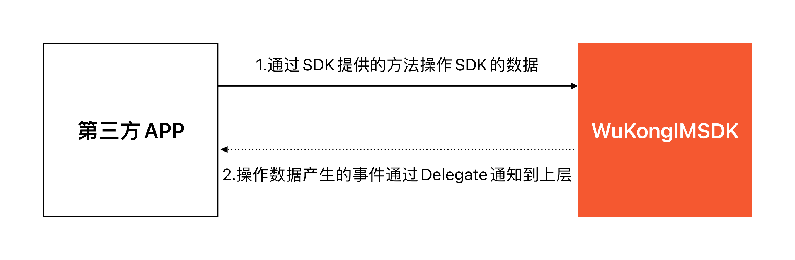

## Design Philosophy

Like designing a book's table of contents, we design APIs through `WKSDK.shared.xxxManager` to access all needed functionality, for example sending messages `[WKSDK.shared.chatManager sendMessage:xxx]`

## Architecture Overview


```objc
// Chat Manager
// Responsible for message-related CRUD operations like sending messages, deleting messages, 
// recalling messages, listening to chat messages, etc.
WKSDK.shared.chatManager

// Connection Manager
// Responsible for establishing or disconnecting connections with IM, 
// monitoring IM connection status, etc.
WKSDK.shared.connectionManager

// Channel Manager
// Responsible for channel data retrieval, caching and channel settings 
// like pinning, do not disturb, muting, etc.
WKSDK.shared.channelManager

// Conversation Manager
// Responsible for maintaining recent conversation data like unread counts, 
// drafts, @mentions, last messages, etc.
WKSDK.shared.conversationManager

// Reaction Manager
// Responsible for maintaining like/reaction data
WKSDK.shared.reactionManager

// CMD Manager
// Responsible for listening to command-type messages sent from the server
WKSDK.shared.cmdManager

// Receipt Manager
// Responsible for maintaining read/unread status of messages
WKSDK.shared.receiptManager

// Reminder Manager
// Responsible for reminder items in recent conversations like @mentions, 
// group join requests, etc. Also supports custom reminders like WeChat's 
// [Red Packet] [Transfer] list reminders
WKSDK.shared.reminderManager

// Media Manager
// Responsible for uploading and downloading multimedia files in messages 
// like images, videos, and other messages with attachments
WKSDK.shared.mediaManager
```

## SDK Integration with Existing Apps



The overall flow of SDK integration with existing apps is: Existing APP calls SDK methods → Data changes occur → Notify existing APP through delegate callbacks

For example, common message sending → Message status changes → Notify existing APP to update UI send status indicators

```objc
// Send message through chatManager
[WKSDK.shared.chatManager sendMessage:xxx]

// Listen to message status changes through chatManager's delegate
-(void) onMessageUpdate:(WKMessage*) message  {
    if(message.status == SUCCESS) {
      [self updateItemUIWithSuccess:message];
    }else {
       [self updateItemUIWithFail:message];
    }
}
```

## Core Functionality Modules

### Chat Management (ChatManager)
- Message sending, receiving, deletion
- Message recall and editing
- Message status monitoring
- Historical message queries

### Connection Management (ConnectionManager)
- IM connection establishment and disconnection
- Connection status monitoring
- Network status handling
- Automatic reconnection mechanism

### Channel Management (ChannelManager)
- Channel information retrieval and caching
- Channel settings (pinning, do not disturb, muting)
- Channel member management
- Channel status synchronization

### Conversation Management (ConversationManager)
- Recent conversation list maintenance
- Unread message counting
- Conversation draft management
- @mention reminders

### Media Management (MediaManager)
- Image, video, audio upload and download
- File transfer progress monitoring
- Media file cache management
- Thumbnail generation

## Development Advantages

- **Unified Entry Point**: Access all functionality through `WKSDK.shared`
- **Modular Design**: Clear separation of functional modules for easy maintenance
- **Event-Driven**: Event callbacks based on delegate pattern
- **High Performance**: Local database caching reduces network requests
- **Easy Integration**: Clean API design for quick integration into existing projects

## Next Steps

After understanding the overall architecture of iOS SDK, you can:

1. [SDK Integration](/en/sdk/wukongim/ios/integration) - Start integrating WuKongIM iOS SDK
2. [Connection Management](/en/sdk/wukongim/ios/connection) - Learn how to establish and manage connections
3. [Chat Management](/en/sdk/wukongim/ios/chat) - Implement message sending and receiving functionality
4. [Channel Management](/en/sdk/wukongim/ios/channel) - Manage channels and members
5. [Conversation Management](/en/sdk/wukongim/ios/conversation) - Handle conversation lists and unread messages
