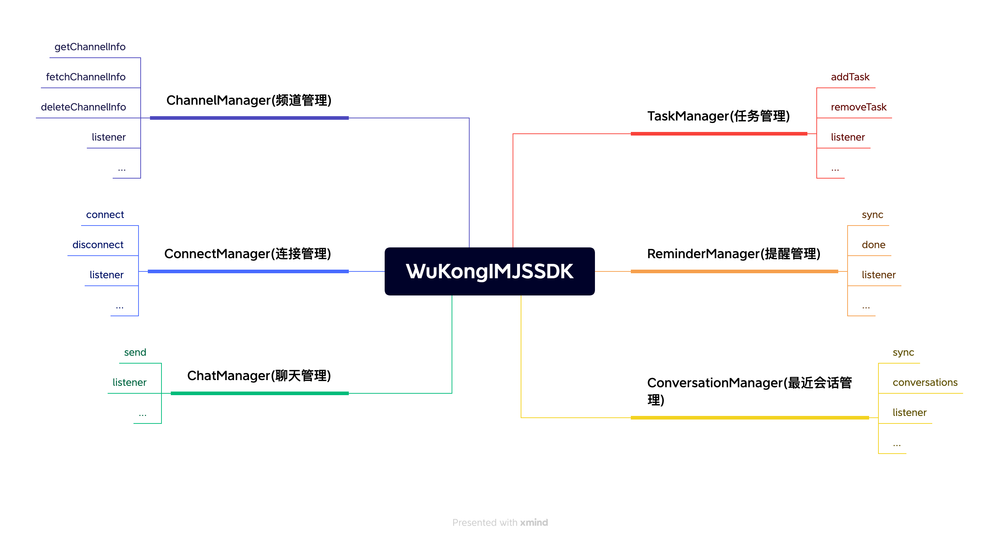

## Design Philosophy

Like designing a book's table of contents, we design APIs through `WKSDK.shared().xxxManager` to access all needed functionality, for example sending messages `WKSDK.shared().chatManager.send(xxx)`

## Architecture Overview



```js
// Chat Manager
// Responsible for message-related CRUD operations like sending messages, deleting messages, 
// recalling messages, listening to chat messages, etc.
WKSDK.shared().chatManager;

// Connection Manager
// Responsible for establishing or disconnecting connections with IM, 
// monitoring IM connection status, etc.
WKSDK.shared().connectionManager;

// Channel Manager
// Responsible for channel data retrieval, caching and channel settings 
// like pinning, do not disturb, muting, etc.
WKSDK.shared().channelManager;

// Conversation Manager
// Responsible for maintaining recent conversation data like unread counts, 
// drafts, @mentions, last messages, etc.
WKSDK.shared().conversationManager;

// Reminder Manager
// Responsible for maintaining reminder items in recent conversations
WKSDK.shared().reminderManager;
```

## Core Functionality Modules

### Chat Management (ChatManager)
- Message sending, receiving, deletion
- Message recall and editing functionality
- Chat message listening
- Historical message queries
- Message status management

### Connection Management (ConnectionManager)
- Establish WebSocket connection with IM server
- Connection disconnection and reconnection mechanism
- Connection status monitoring
- Network status handling
- Heartbeat keep-alive mechanism

### Channel Management (ChannelManager)
- Channel data retrieval and caching
- Channel settings management (pinning, do not disturb, muting, etc.)
- Channel information synchronization
- Channel member management
- Channel status monitoring

### Conversation Management (ConversationManager)
- Recent conversation data maintenance
- Unread message count statistics
- Conversation draft management
- @mention reminders
- Last message display
- Conversation sorting and filtering

### Reminder Management (ReminderManager)
- Recent conversation reminder item maintenance
- Custom reminder types
- Reminder status management
- Reminder message handling

## Platform Support

### Browser Environment
- Modern browser WebSocket support
- Local storage (localStorage/indexedDB)
- File upload and download
- Notification API support

### Node.js Environment
- Server-side WebSocket connections
- File system operations
- Database integration
- Server-side push notifications

### Framework Integration
- **React**: Provides React Hooks support
- **Vue**: Provides Vue Composition API support
- **Angular**: Provides Angular service support
- **Mini Programs**: Supports WeChat Mini Programs and other platforms

## Development Advantages

- **Unified Entry Point**: Access all functionality through `WKSDK.shared()`
- **Modular Design**: Clear separation of functional modules for easy maintenance
- **Event-Driven**: Asynchronous programming pattern based on event listening
- **Cross-Platform**: Supports both browser and Node.js environments
- **Lightweight**: Small core library size with on-demand loading
- **TypeScript Support**: Complete type definitions
- **Modern**: Supports ES6+ syntax and Promise/async-await

## Technical Features

### WebSocket Connection
- Automatic reconnection mechanism
- Connection status management
- Heartbeat detection
- Disconnection and reconnection

### Data Storage
- Browser local storage
- Message local caching
- Offline message support
- Data synchronization mechanism

### Message Processing
- Real-time message push
- Message deduplication
- Message sorting
- Message status synchronization

### File Handling
- File upload and download
- Image compression
- File type detection
- Upload progress monitoring

## Use Cases

### Web Applications
- Online customer service systems
- Social chat applications
- Collaborative office platforms
- Online education platforms

### Mobile H5
- Mobile web chat
- Hybrid app development
- PWA applications
- WeChat Official Accounts

### Server Applications
- Message push services
- Chat bots
- Data synchronization services
- API gateway integration

## Browser Compatibility

| Browser | Version | WebSocket | Local Storage | File API |
|---------|---------|-----------|---------------|----------|
| Chrome | 60+ | ✅ | ✅ | ✅ |
| Firefox | 55+ | ✅ | ✅ | ✅ |
| Safari | 11+ | ✅ | ✅ | ✅ |
| Edge | 79+ | ✅ | ✅ | ✅ |
| IE | 11 | ⚠️ | ✅ | ⚠️ |

## Installation Methods

### NPM Installation
```bash
npm install wukongim-js-sdk
```

### CDN Integration
```html
<script src="https://unpkg.com/wukongim-js-sdk@latest/dist/wukongim.min.js"></script>
```

### ES6 Modules
```javascript
import WKSDK from 'wukongim-js-sdk';
```

### CommonJS
```javascript
const WKSDK = require('wukongim-js-sdk');
```

## Quick Start Example

```javascript
// Initialize SDK
const sdk = WKSDK.shared();

// Configure connection
sdk.config({
  addr: "ws://your-server.com:5200",
  apiURL: "http://your-api-server.com",
  uid: "user123",
  token: "user-token"
});

// Listen for messages
sdk.chatManager.addMessageListener((message) => {
  console.log('New message:', message);
});

// Connect to server
await sdk.connectionManager.connect();

// Send message
await sdk.chatManager.send({
  channel_id: "friend_user_id",
  channel_type: 1,
  content: "Hello from JavaScript SDK!"
});
```

## Next Steps

After understanding the overall architecture of JavaScript SDK, you can:

1. [SDK Integration](/en/sdk/wukongim/javascript/integration) - Start integrating WuKongIM JavaScript SDK
2. [Basic Features](/en/sdk/wukongim/javascript/base) - Learn basic SDK configuration and usage
3. [Chat Management](/en/sdk/wukongim/javascript/chat) - Implement message sending and receiving functionality
4. [Channel Management](/en/sdk/wukongim/javascript/channel) - Manage channels and members
5. [Conversation Management](/en/sdk/wukongim/javascript/conversation) - Handle conversation lists and unread messages
