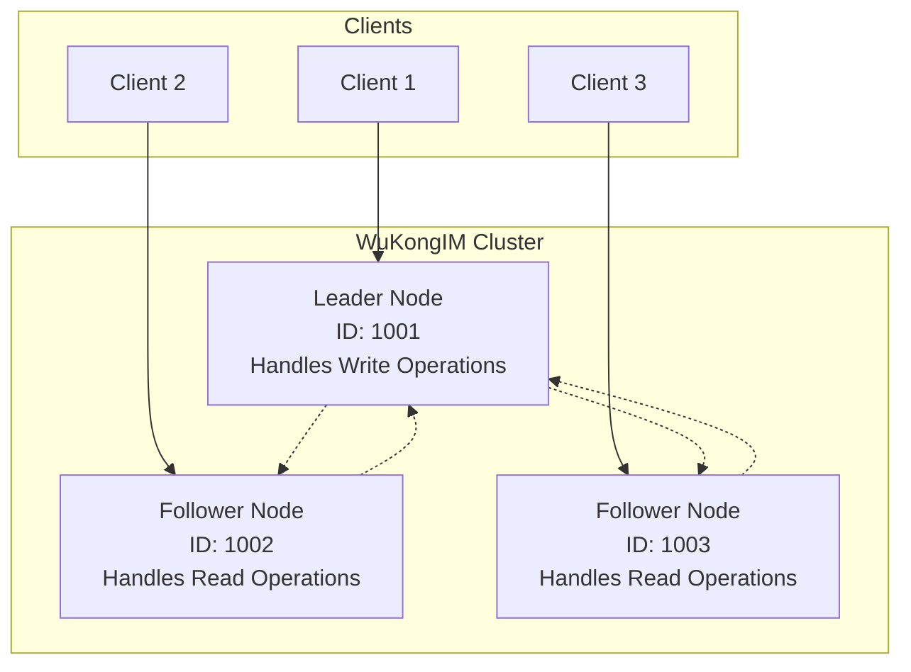

WuKongIM supports cluster mode deployment, providing high availability, load distribution and automatic failover capabilities. This guide details cluster configuration and management.

## Cluster Architecture

WuKongIM cluster is based on the Raft consensus algorithm, ensuring data consistency and high availability:



### Core Features
- **Raft Consensus Algorithm**: Ensures data consistency
- **Automatic Failover**: Automatically elects new Leader when Leader fails
- **Read-Write Separation**: Leader handles write operations, Followers handle read operations
- **Data Replication**: All data automatically replicated to all nodes
- **Online Scaling**: Supports dynamic node addition

## Basic Cluster Configuration

### 1. Node Configuration

Each node requires unique configuration:

```yaml
# Node 1 Configuration (wk-node1.yaml)
mode: "release"
cluster:
  nodeId: 1001                                    # Unique node ID
  serverAddr: "192.168.1.101:11110"             # Internal cluster communication address
  initNodes:                                      # Initial cluster node list
    - "1001@192.168.1.101:11110"
    - "1002@192.168.1.102:11110"
    - "1003@192.168.1.103:11110"
  heartbeatTick: 1                               # Heartbeat interval (seconds)
  electionTick: 10                               # Election timeout (multiples of heartbeat interval)

# External access configuration
external:
  ip: "192.168.1.101"                           # External IP
  tcpAddr: "192.168.1.101:5100"                # TCP connection address
  wsAddr: "ws://192.168.1.101:5200"            # WebSocket address
  apiUrl: "http://192.168.1.101:5001"          # API address

# Data storage
rootDir: "./wukongim-node1"                     # Data directory
```

```yaml
# Node 2 Configuration (wk-node2.yaml)
mode: "release"
cluster:
  nodeId: 1002                                    # Different node ID
  serverAddr: "192.168.1.102:11110"             # Different server address
  initNodes:                                      # Same initial node list
    - "1001@192.168.1.101:11110"
    - "1002@192.168.1.102:11110"
    - "1003@192.168.1.103:11110"
  heartbeatTick: 1
  electionTick: 10

external:
  ip: "192.168.1.102"
  tcpAddr: "192.168.1.102:5100"
  wsAddr: "ws://192.168.1.102:5200"
  apiUrl: "http://192.168.1.102:5001"

rootDir: "./wukongim-node2"
```

```yaml
# Node 3 Configuration (wk-node3.yaml)
mode: "release"
cluster:
  nodeId: 1003
  serverAddr: "192.168.1.103:11110"
  initNodes:
    - "1001@192.168.1.101:11110"
    - "1002@192.168.1.102:11110"
    - "1003@192.168.1.103:11110"
  heartbeatTick: 1
  electionTick: 10

external:
  ip: "192.168.1.103"
  tcpAddr: "192.168.1.103:5100"
  wsAddr: "ws://192.168.1.103:5200"
  apiUrl: "http://192.168.1.103:5001"

rootDir: "./wukongim-node3"
```

### 2. Start Cluster

Start all nodes in sequence:

```bash
# Start on node 1
./wukongim --config wk-node1.yaml

# Start on node 2
./wukongim --config wk-node2.yaml

# Start on node 3
./wukongim --config wk-node3.yaml
```

<Note>
**Startup Order**: It's recommended to start in node ID order, but not mandatory. The cluster will automatically perform Leader election.
</Note>

## Advanced Cluster Configuration

### 1. Raft Parameter Tuning

```yaml
cluster:
  # Basic configuration
  nodeId: 1001
  serverAddr: "192.168.1.101:11110"
  
  # Raft algorithm parameters
  heartbeatTick: 1                    # Heartbeat interval (seconds)
  electionTick: 10                    # Election timeout (multiples of heartbeat interval)
  maxSizePerMsg: 1048576             # Maximum message size (bytes)
  maxInflightMsgs: 256               # Maximum in-flight messages
  checkQuorum: true                   # Enable Quorum checking
  preVote: true                       # Enable pre-vote
  
  # Log configuration
  maxLogSize: 1073741824             # Maximum log size (1GB)
  logCompactThreshold: 10000         # Log compaction threshold
  
  # Snapshot configuration
  snapshotEntries: 10000             # Snapshot interval (log entries)
  compactionOverhead: 5000           # Compaction overhead
```

### 2. Network Configuration

```yaml
cluster:
  # Network timeout configuration
  dialTimeout: "5s"                   # Connection timeout
  requestTimeout: "10s"               # Request timeout
  
  # Connection pool configuration
  maxConnections: 100                 # Maximum connections
  keepAlive: true                     # Enable Keep-Alive
  keepAlivePeriod: "30s"             # Keep-Alive period
  
  # TLS configuration (optional)
  tls:
    enabled: true
    certFile: "/path/to/cluster.crt"
    keyFile: "/path/to/cluster.key"
    caFile: "/path/to/ca.crt"
```

### 3. Performance Optimization

```yaml
cluster:
  # Batch processing configuration
  batchSize: 100                      # Batch size
  batchTimeout: "10ms"                # Batch timeout
  
  # Concurrency configuration
  workerCount: 4                      # Worker thread count
  queueSize: 1000                     # Queue size
  
  # Memory configuration
  maxMemoryUsage: "2GB"               # Maximum memory usage
  gcInterval: "5m"                    # Garbage collection interval
```

## Cluster Management

### 1. View Cluster Status

```bash
# View cluster node information
curl http://192.168.1.101:5001/cluster/nodes

# Response example
{
  "leader": 1001,
  "nodes": [
    {
      "id": 1001,
      "addr": "192.168.1.101:11110",
      "status": "leader",
      "last_heartbeat": "2024-01-20T10:30:00Z"
    },
    {
      "id": 1002,
      "addr": "192.168.1.102:11110",
      "status": "follower",
      "last_heartbeat": "2024-01-20T10:30:01Z"
    },
    {
      "id": 1003,
      "addr": "192.168.1.103:11110",
      "status": "follower",
      "last_heartbeat": "2024-01-20T10:30:02Z"
    }
  ]
}
```

### 2. Add Node

```bash
# Add new node to cluster
curl -X POST http://192.168.1.101:5001/cluster/nodes \
  -H "Content-Type: application/json" \
  -d '{
    "id": 1004,
    "addr": "192.168.1.104:11110"
  }'

# Start service on new node
./wukongim --config wk-node4.yaml
```

### 3. Remove Node

```bash
# Remove node from cluster
curl -X DELETE http://192.168.1.101:5001/cluster/nodes/1004

# Stop service on removed node
# Execute on node 4
pkill wukongim
```

### 4. Manual Failover

```bash
# Force Leader election
curl -X POST http://192.168.1.101:5001/cluster/transfer-leadership \
  -H "Content-Type: application/json" \
  -d '{
    "target_node": 1002
  }'
```

## Load Balancer Configuration

### 1. Nginx Load Balancing

```nginx
# nginx.conf
upstream wukongim_api {
    server 192.168.1.101:5001;
    server 192.168.1.102:5001;
    server 192.168.1.103:5001;
}

upstream wukongim_tcp {
    server 192.168.1.101:5100;
    server 192.168.1.102:5100;
    server 192.168.1.103:5100;
}

upstream wukongim_ws {
    server 192.168.1.101:5200;
    server 192.168.1.102:5200;
    server 192.168.1.103:5200;
}

# HTTP API load balancing
server {
    listen 80;
    location /api/ {
        proxy_pass http://wukongim_api;
        proxy_set_header Host $host;
        proxy_set_header X-Real-IP $remote_addr;
    }
}

# WebSocket load balancing
server {
    listen 8080;
    location / {
        proxy_pass http://wukongim_ws;
        proxy_http_version 1.1;
        proxy_set_header Upgrade $http_upgrade;
        proxy_set_header Connection "upgrade";
    }
}

# TCP load balancing
stream {
    server {
        listen 9100;
        proxy_pass wukongim_tcp;
    }
}
```

### 2. HAProxy Load Balancing

```haproxy
# haproxy.cfg
global
    daemon
    maxconn 4096

defaults
    mode http
    timeout connect 5000ms
    timeout client 50000ms
    timeout server 50000ms

# API load balancing
frontend wukongim_api_frontend
    bind *:80
    default_backend wukongim_api_backend

backend wukongim_api_backend
    balance roundrobin
    server node1 192.168.1.101:5001 check
    server node2 192.168.1.102:5001 check
    server node3 192.168.1.103:5001 check

# WebSocket load balancing
frontend wukongim_ws_frontend
    bind *:8080
    default_backend wukongim_ws_backend

backend wukongim_ws_backend
    balance roundrobin
    server node1 192.168.1.101:5200 check
    server node2 192.168.1.102:5200 check
    server node3 192.168.1.103:5200 check

# TCP load balancing
frontend wukongim_tcp_frontend
    bind *:9100
    mode tcp
    default_backend wukongim_tcp_backend

backend wukongim_tcp_backend
    mode tcp
    balance roundrobin
    server node1 192.168.1.101:5100 check
    server node2 192.168.1.102:5100 check
    server node3 192.168.1.103:5100 check
```

## Monitoring and Alerting

### 1. Cluster Health Monitoring

```bash
#!/bin/bash
# cluster-health-check.sh

NODES=("192.168.1.101" "192.168.1.102" "192.168.1.103")
ALERT_EMAIL="admin@example.com"

for node in "${NODES[@]}"; do
    # Check node health status
    if ! curl -f http://$node:5001/health > /dev/null 2>&1; then
        echo "Node $node is unhealthy" | mail -s "WuKongIM Cluster Alert" $ALERT_EMAIL
    fi

    # Check cluster status
    status=$(curl -s http://$node:5001/cluster/status | jq -r '.status')
    if [ "$status" != "healthy" ]; then
        echo "Cluster status abnormal: $status" | mail -s "WuKongIM Cluster Alert" $ALERT_EMAIL
    fi
done
```

### 2. Prometheus Monitoring Configuration

```yaml
# prometheus.yml
global:
  scrape_interval: 15s

scrape_configs:
  - job_name: 'wukongim-cluster'
    static_configs:
      - targets:
        - '192.168.1.101:5300'
        - '192.168.1.102:5300'
        - '192.168.1.103:5300'
    metrics_path: /metrics
    scrape_interval: 10s
```

## Troubleshooting

### Common Issues

**Cluster Split (Split Brain)**:
Check network connections and time synchronization:
```bash
# Check inter-node network connectivity
for node in 192.168.1.101 192.168.1.102 192.168.1.103; do
    ping -c 3 $node
    telnet $node 11110
done

# Check time synchronization
for node in 192.168.1.101 192.168.1.102 192.168.1.103; do
    ssh $node "date"
done

# Restart cluster
# Stop all nodes, then restart in sequence
```

**Leader Election Failure**:
Check Raft configuration and logs:
```bash
# View Raft status
curl http://192.168.1.101:5001/cluster/raft/status

# Check logs
tail -f /var/log/wukongim/wukongim.log | grep -i raft

# Manually trigger election
curl -X POST http://192.168.1.101:5001/cluster/election
```

**Data Inconsistency**:
Check data synchronization status:
```bash
# Check data version on each node
for node in 192.168.1.101 192.168.1.102 192.168.1.103; do
    echo "Node $node:"
    curl -s http://$node:5001/cluster/data/version
done

# Force data synchronization
curl -X POST http://192.168.1.101:5001/cluster/sync/force
```

## Performance Tuning

### 1. Raft Performance Optimization

```yaml
cluster:
  # Optimize for high throughput
  heartbeatTick: 1                    # Faster heartbeat for quicker failure detection
  electionTick: 5                     # Shorter election timeout
  maxSizePerMsg: 2097152             # Larger message size (2MB)
  maxInflightMsgs: 512               # More in-flight messages

  # Batch optimization
  batchSize: 500                      # Larger batch size
  batchTimeout: "5ms"                 # Shorter batch timeout
```

### 2. Network Optimization

```yaml
cluster:
  # Connection optimization
  maxConnections: 200                 # More connections
  keepAlivePeriod: "15s"             # Shorter keep-alive period
  dialTimeout: "3s"                   # Faster connection timeout
  requestTimeout: "5s"                # Faster request timeout
```

### 3. Memory and Storage Optimization

```yaml
cluster:
  # Memory optimization
  maxMemoryUsage: "4GB"               # More memory for larger clusters
  gcInterval: "2m"                    # More frequent GC

  # Storage optimization
  snapshotEntries: 5000               # More frequent snapshots
  logCompactThreshold: 5000           # More aggressive log compaction
```

## Security Configuration

### 1. TLS Configuration

```yaml
cluster:
  tls:
    enabled: true
    certFile: "/etc/wukongim/certs/cluster.crt"
    keyFile: "/etc/wukongim/certs/cluster.key"
    caFile: "/etc/wukongim/certs/ca.crt"
    clientAuth: true                   # Require client certificates
    minVersion: "1.2"                  # Minimum TLS version
    cipherSuites:                      # Allowed cipher suites
      - "TLS_ECDHE_RSA_WITH_AES_256_GCM_SHA384"
      - "TLS_ECDHE_RSA_WITH_AES_128_GCM_SHA256"
```

### 2. Authentication Configuration

```yaml
cluster:
  auth:
    enabled: true
    method: "token"                    # Authentication method
    tokenFile: "/etc/wukongim/cluster-token"
    tokenRotationInterval: "24h"       # Token rotation interval
```

## Backup and Recovery

### 1. Cluster Backup

```bash
#!/bin/bash
# cluster-backup.sh

BACKUP_DIR="/backup/wukongim/$(date +%Y%m%d_%H%M%S)"
NODES=("192.168.1.101" "192.168.1.102" "192.168.1.103")

mkdir -p $BACKUP_DIR

for node in "${NODES[@]}"; do
    echo "Backing up node $node..."

    # Create snapshot
    curl -X POST http://$node:5001/cluster/snapshot

    # Copy data directory
    rsync -av $node:/path/to/wukongim-data/ $BACKUP_DIR/node-$node/
done

echo "Backup completed: $BACKUP_DIR"
```

### 2. Cluster Recovery

```bash
#!/bin/bash
# cluster-recovery.sh

BACKUP_DIR="$1"
NODES=("192.168.1.101" "192.168.1.102" "192.168.1.103")

if [ -z "$BACKUP_DIR" ]; then
    echo "Usage: $0 <backup_directory>"
    exit 1
fi

for node in "${NODES[@]}"; do
    echo "Restoring node $node..."

    # Stop node
    ssh $node "pkill wukongim"

    # Restore data
    rsync -av $BACKUP_DIR/node-$node/ $node:/path/to/wukongim-data/

    # Start node
    ssh $node "cd /path/to/wukongim && ./wukongim --config wk-node.yaml -d"
done

echo "Recovery completed"
```

## Next Steps

<CardGroup cols={2}>
  <Card
    title="Performance Optimization"
    icon="gauge-high"
    href="/en/getting-started/stress-report"
  >
    Performance testing and optimization guide
  </Card>
  <Card
    title="Server Configuration"
    icon="shield-check"
    href="/en/server/configuration"
  >
    Server security and configuration options
  </Card>
  <Card
    title="Monitoring Setup"
    icon="chart-line"
    href="/en/installation/linux/monitoring"
  >
    Cluster monitoring and alerting configuration
  </Card>
  <Card
    title="Installation Guide"
    icon="wrench"
    href="/en/installation/docker/multi-node"
  >
    Multi-node deployment and troubleshooting
  </Card>
</CardGroup>
