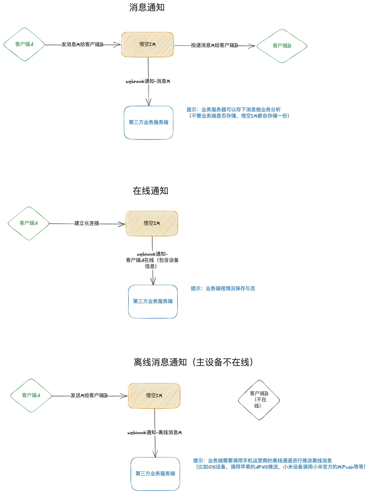

# Webhook

**悟空 IM**的一些数据将通过 webhook 的形式回调给第三方应用服务，比如用户在线状态，需要推送的消息，所有消息等等，所有 webhook 都是 POST 请求，事件名通过 query 参数传入，
比如 第三方的服务器提供的 webhook 地址为 http://example/webhook 那么在线状态的 webhook 为

```
http://example/webhook?event=user.onlinestatus

body的数据类似为： [uid1-0-1,uid2-1-0]

```

图解webhook

	

以下为具体 webhook 详情

## 用户在线状态通知

每个用户的上线和下线都会通过此 webhook 通知给第三方服务器

`事件名：user.onlinestatus`

事件数据：[用户 UID-设备标识-在线状态-连接 ID-设备标识对应的设备在线数量-用户总个设备在线数量] 例如 [uid1-1-0-1001-2-4,uid2-0-0-1001-1-2]

数据说明：

```
设备标识： 0.为app 1.为web端
在线状态： 0.离线 1.在线
连接ID：为当前设备在服务器的建立连接的ID
设备标识对应的设备在线数量:  比如web端，同一个用户uid有4个web设备同时在线，那么这个值就是4
用户总个设备在线数量： 一个用户下所有在线设备的数量 比如web设备4个，app设备2个 那么这个值就是6
```

## 离线消息通知

离线消息通知主要是将需要通过离线推送的消息通知给第三方服务器，第三方服务器收到此 webhook 后需要将此消息内容调用手机厂商推送接口，将消息推给 ToUIDs 列表的用户

`事件名：msg.offline`

事件数据：消息数组

```go

type MessageResp struct {
	Header       MessageHeader `json:"header"`        // 消息头
	Setting      uint8         `json:"setting"`       // 设置
	MessageID    int64         `json:"message_id"`    // 服务端的消息ID(全局唯一)
	MessageIDStr string        `json:"message_idstr"` // 字符串类型服务端的消息ID(全局唯一)
	ClientMsgNo  string        `json:"client_msg_no"` // 客户端消息唯一编号
	MessageSeq   uint32        `json:"message_seq"`   // 消息序列号 （用户唯一，有序递增）
	FromUID      string        `json:"from_uid"`      // 发送者UID
	ChannelID    string        `json:"channel_id"`    // 频道ID
	ChannelType  uint8         `json:"channel_type"`  // 频道类型
	Timestamp    int32         `json:"timestamp"`     // 服务器消息时间戳(10位，到秒)
	Payload      []byte        `json:"payload"`       // base64消息内容
    ToUIDs       []string      `json:"to_uids"`       // 接收用户列表
}

```

## 所有消息通知

**悟空 IM**服务端会将所有消息推送给第三方服务器（为了降低第三方服务器的压力，并不是一条一条推送，做了延迟处理，默认是 500 毫秒（`webhook.msgNotifyEventPushInterval`）批量推送一次，这个可自己视情况配置），第三方服务器可视情况保存或不保存（有一些业务需要保存，比如将消息存入 ElasticSearch，给客户端做搜索使用）不管保不保存，**悟空 IM**服务端都会保存用户的消息。

`事件名：msg.notify`

数据说明： 消息数组

```go

type MessageResp struct {
	Header       MessageHeader `json:"header"`        // 消息头
	Setting      uint8         `json:"setting"`       // 设置
	MessageID    int64         `json:"message_id"`    // 服务端的消息ID(全局唯一)
	MessageIDStr string        `json:"message_idstr"` // 字符串类型服务端的消息ID(全局唯一)
	ClientMsgNo  string        `json:"client_msg_no"` // 客户端消息唯一编号
	MessageSeq   uint32        `json:"message_seq"`   // 消息序列号 （用户唯一，有序递增）
	FromUID      string        `json:"from_uid"`      // 发送者UID
	ChannelID    string        `json:"channel_id"`    // 频道ID
	ChannelType  uint8         `json:"channel_type"`  // 频道类型
	Timestamp    int32         `json:"timestamp"`     // 服务器消息时间戳(10位，到秒)
	Payload      []byte        `json:"payload"`       // base64消息内容
}

```
