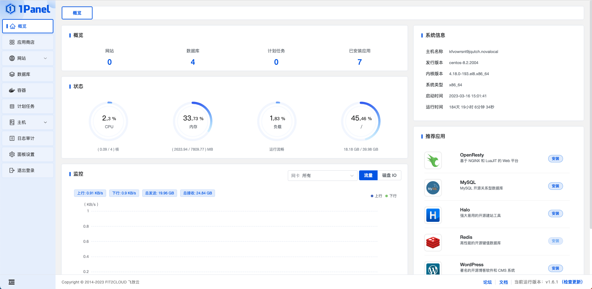
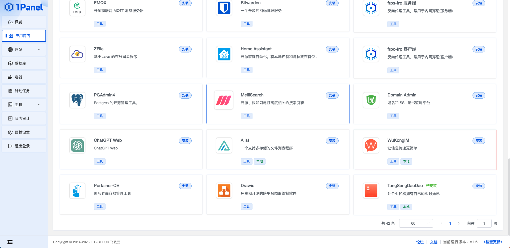
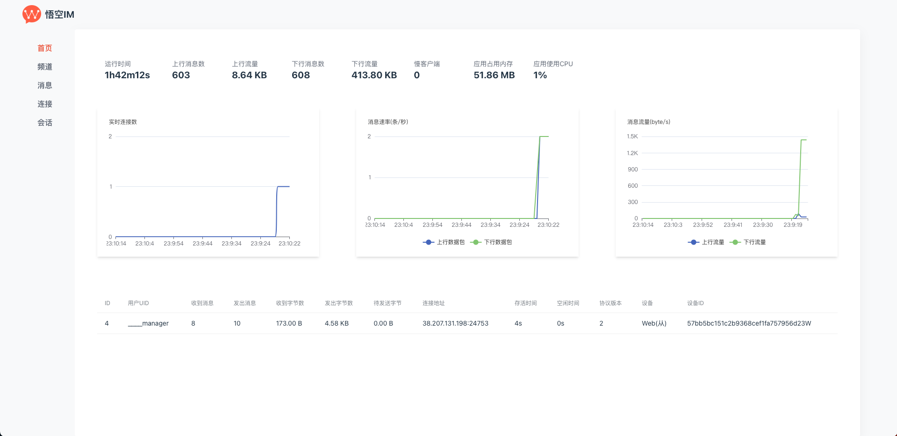
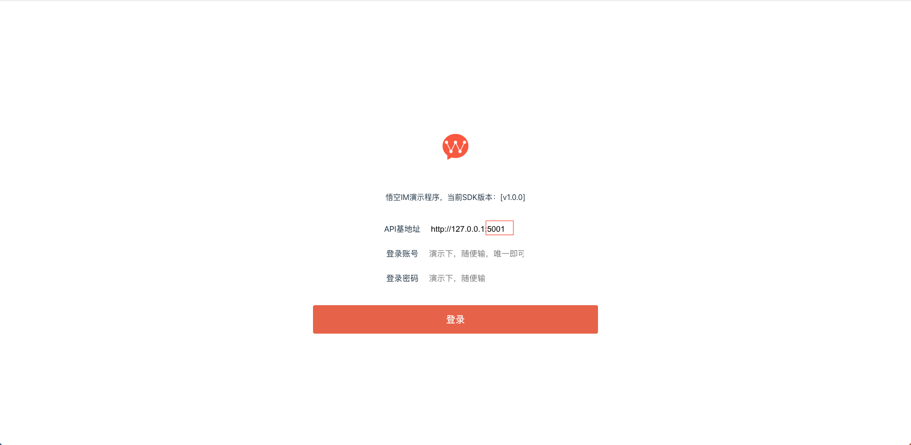
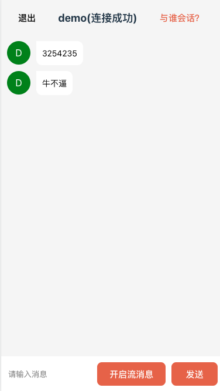
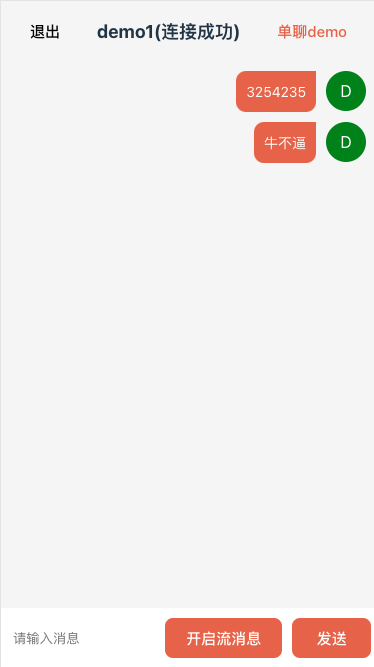

# 1Panle 部署

## 安装1Panle

关于 1Panel 的安装部署与基础功能介绍，请参考 [1Panel 官方文档](https://1panel.cn/)。在完成了 1Panel 的安装部署后，根据提示网址打开浏览器进入 1Panel，如下界面。

## 安装WuKongIM

在应用商店中选择 安装WuKongIM 点击安装

## 访问 安装WuKongIM

1. 访问悟空IM监控系统

2. 访问悟空IM Demo

