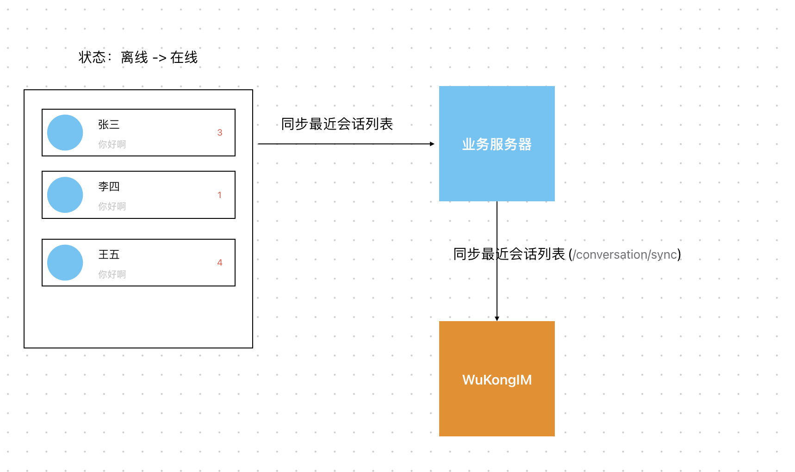

# 离线消息

*悟空IM* 采用读扩散模式, 什么是读扩散和写扩散？ 参考文章：[链接](https://blog.csdn.net/m0_53246313/article/details/122674197)

*悟空IM*开启最近会话配置后，*悟空IM*会在服务端为每个用户维护一份属于自己的最近会话列表。([什么是最近会话？](/guide/initialize.html#%E6%9C%80%E8%BF%91%E4%BC%9A%E8%AF%9D))

1. 应用由离线变成在线后，需要同步最近会话列表，如下图

2. 应用在线后，应用应该在线维护最近会话列表。

3. 当点击某个会话（频道）进入到聊天界面时，需要同步该会话（频道）的消息，如下图（同时需要将最近会话的红点数清空 `/conversations/setUnread`）

