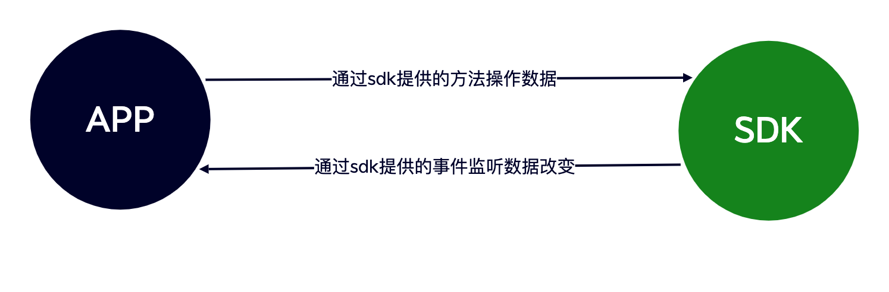
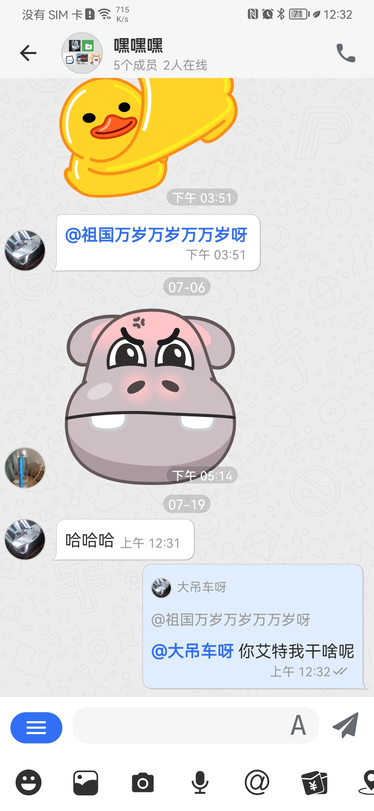

# Android

## 设计理念

为了让开发者更快更方便的使用 SDK，悟空 SDK 提供了一个唯一的入口来访问 SDK 中的所有功能。就像书籍的目录一样可以通过目录查找对应的内容。如连接 IM `WKIM.getInstance().getConnectionManager().connection()`

## 结构说明

 SDK 常用功能介绍

```java

// 消息管理器
// 负责消息的增删改查、新消息监听、刷新消息监听、消息入库、发送消息回执监听、监听同步某个聊天数据等
WKIM.getInstance().getMsgManager()

// 连接管理
// 负责IM的连接、断开、退出登录、监听连接状态、监听获取连接IP等
WKIM.getInstance().getConnectionManager()

// 频道管理
// 可获取Channel的信息，刷新Channel缓存，监听Channel更改[置顶、免打扰、禁言]、搜索Channel等
WKIM.getInstance().getChannelManager()

// 最近会话管理
// 获取最近聊天记录、刷新最近会话[新增聊天、红点改变]、监听移除某个会话、监听同步最近会话等
WKIM.getInstance().getConversationManager()

// 频道成员管理
// 获取Channel成员列表、设置成员备注、保存修改成员数据、监听刷新成员和移除成员等
WKIM.getInstance().getChannelMembersManager()

// 提醒管理
// 获取某个会话的提醒如：[有人@我] [入群申请] 等。还可自定义提醒项，如像 红包未领取，转账和语音未读 等
WKIM.getInstance().getReminderManager()

// 命令管理
// 负责监听服务器下发的命令消息
WKIM.getInstance().getCMDManager()

// 机器人管理
// 可以获取机器人菜单、同步机器人菜单，查询菜单等
WKIM.getInstance().getRobotManager()
```

## 集成

## 快速入门

**Gradle**

[](https://jitpack.io/#WuKongIM/WuKongIMAndroidSDK)

```
implementation 'com.github.WuKongIM:WuKongIMAndroidSDK:1.0.2'
```

jitpack 还需在主程序的`build.gradle`文件中添加：

```
allprojects {
    repositories {
        ...
        maven { url 'https://jitpack.io' }
    }
}
```

由于 sdk 内使用了 sqlcipher 加密数据库和 curve25519 加密算法，需将库添加到项目中

```
implementation "net.zetetic:android-database-sqlcipher:4.5.3"
implementation "androidx.sqlite:sqlite-ktx:2.3.1"
implementation 'org.whispersystems:curve25519-android:0.5.0'
implementation 'org.whispersystems:signal-protocol-android:2.8.1'
```

**混淆**

```
-dontwarn com.xinbida.wukongim.**
-keep class com.xinbida.wukongim.**{*;}

#数据库加密
-keep,includedescriptorclasses class net.sqlcipher.** { *; }
-keep,includedescriptorclasses interface net.sqlcipher.** { *; }

#--------- 混淆dh curve25519-------
-keep class org.whispersystems.curve25519.**{*;}
-keep class org.whispersystems.** { *; }
-keep class org.thoughtcrime.securesms.** { *; }
```

### SDK 与 APP 交互原则

 sdk 与 app 交互流程就是 app 调用 sdk 提供的方法，sdk 处理完数据后通过事件将数据回调给 app。如发送消息流程：app 调用发送消息方法，sdk 将入库后的消息 push 给 app

```java
// 发送消息
WKIM.getInstance().getMsgManager().sendMessag(textContent,channelID,channelType)
// 监听入库返回
WKIM.getInstance().getMsgManager().addOnSendMsgCallback("key", new ISendMsgCallBackListener() {
            @Override
            public void onInsertMsg(WKMsg wkMsg) {
                // 可以在这里将保存在数据库的消息`wkMsg`展示在UI上
                // ...
            }
        });
```

## 基础使用

事件监听说明[事件监听](/sdk/android#说明)

### 初始化

在 Application 的 onCreate 方法中初始化 SDK

`Java`

```java
/**
*  初始化IM
* @param context Application Context
* @param uid 登录用户ID（业务服务端在IM通讯端登记了的uid））
* @param token 登录用户token（业务服务端在IM通讯端登记了的token）
*/
WKIM.getInstance().init(context, uid, token);
```

`Kotlin`

```kotlin
WKIM.getInstance().init(context,uid,token)
```

监听获取连接服务器 IP 和 Port 的事件

`Java`

```java
WKIM.getInstance().getConnectionManager().addOnGetIpAndPortListener(new IGetIpAndPort() {
            @Override
            public void getIP(IGetSocketIpAndPortListener iGetSocketIpAndPortListener) {
                // 返回连接IP和端口
                iGetSocketIpAndPortListener.onGetSocketIpAndPort("xxx",xxx);
            }
        });
```

`Kotlin`

```kotlin
WKIM.getInstance().connectionManager.addOnGetIpAndPortListener { p0 ->
    p0!!.onGetSocketIpAndPort(
        "172.0.0.0",
        6666
    )
}
```

- <font color="#999" font-size=2>返回 IM 通信端的 IP 和 IM 通信端的 TCP 端口。<font color="#FF0000">分布式可调用接口获取 IP 和 Port 后返回</font></font>

### 连接与断开

#### 连接与断开 IM

`Java`

```java
// 连接IM
WKIM.getInstance().getConnectionManager().connection();

// 断开IM
WKIM.getInstance().getConnectionManager().disconnect(isLogout);
```

`Kotlin`

```kotlin
// 连接IM
WKIM.getInstance().connectionManager.connection()

// 断开IM
WKIM.getInstance().connectionManager.disconnect(isLogout)
```

- <font color='#999'>isLogout: true：SDK 将不再进行重连 false：SDK 保持重连机制</font>

##### 连接状态监听

`Java`

```java
 WKIM.getInstance().getConnectionManager().addOnConnectionStatusListener("key", new IConnectionStatus() {
            @Override
            public void onStatus(int status, String reason) {
                if(status == WKConnectStatus.success){
                  // 连接成功
                }
            }
        });
```

`Kotlin`

```kotlin
 WKIM.getInstance().connectionManager.addOnConnectionStatusListener(
            "key"
        ) { code, reason ->
           if (code == WKConnectStatus.success){
               // 连接成功
           }
        }
```

- <font color='#999' size=2>更多连接状态请查看[状态码](/sdk/android#状态码)</font>

### 在线消息收发

#### 发送消息

`Java`

```java
/**
*
* @param textContent 消息正文
* @param channelID 投递的频道ID
* @param channelType 投递的频道类型（个人频道，群频道，客服频道等等）
*/
WKIM.getInstance().getMsgManager().sendMessage(textContent,channelID, channelType);
```

`Kotlin`

```kotlin
WKIM.getInstance().msgManager.sendMessage(textContent,channelID, channelType)
```

- <font size=2 color="#999">sdk 内置频道类型可通过`WKChannelType`查看</font>

如给用户`A`发送一条文本消息。构建文本消息正文

`Java`

```java
WKTextContent textContent = new WKTextContent("你好，悟空");
```

`Kotlin`

```kotlin
val textContent = WKTextContent("你好，悟空")
```

将消息发送给用户`A`

`Java`

```java
WKIM.getInstance().getMsgManager().sendMessage(textContent,"A",WKChannelType.PERSONAL);
```

`Kotlin`

```kotlin
WKIM.getInstance().msgManager.sendMessage(textContent,"A",WKChannelType.PERSONAL)
```

#### 消息入库返回（并不是消息发送状态）

在发送消息时，sdk 将消息保存在本地数据库后就会触发入库回调。此时消息并未进行发送，可在此监听中将消息展示在 UI 上

`Java`

```java
WKIM.getInstance().getMsgManager().addOnSendMsgCallback("key", new ISendMsgCallBackListener() {
            @Override
            public void onInsertMsg(WKMsg wkMsg) {
                // 可以在这里将保存在数据库的消息`wkMsg`展示在UI上
                // ...
            }
        });
```

`Kotlin`

```kotlin
WKIM.getInstance().msgManager.addOnSendMsgCallback("key") { wkMsg ->
     // 将消息wkMsg展示在UI上
    }
```

- <font color='#999' size=2>关于事件是否传入唯一 key 说明请查看[事件监听](/sdk/android#说明)</font>

#### 收到新消息监听

`Java`

```java
WKIM.getInstance().getMsgManager().addOnNewMsgListener("key", new INewMsgListener() {
            @Override
            public void newMsg(List<WKMsg> list) {
                // list:接收到的消息
            }
        });
```

`Kotlin`

```kotlin
WKIM.getInstance().msgManager.addOnNewMsgListener("key") { list ->
          // list:接收到的消息
}
```

- <font color='#999' size=2>如果在聊天页面内收到新消息时需判断该消息是否属于当前会话，可通过消息对象`WKMsg`的`channelID`和`channelType`判断</font>

#### 刷新消息监听

在 sdk 更新过消息时，如：消息发送状态，有人点赞消息，消息已读回执，消息撤回，消息被编辑等等，sdk 都将回调以下事件。UI 可通过消息对象`WKMsg`的`clientMsgNO`来判断具体是哪条消息发生了更改。

`Java`

```java
WKIM.getInstance().getMsgManager().addOnRefreshMsgListener("key", new IRefreshMsg() {
            @Override
            public void onRefresh(WKMsg wkMsg, boolean isEnd) {
                // wkMsg：刷新的消息对象
                // isEnd：为了避免频繁刷新UI导致卡顿，当isEnd为true时在刷新UI
            }
        });
```

`Kotlin`

```kotlin
WKIM.getInstance().msgManager.addOnRefreshMsgListener("") { wkMsg, isEnd ->
   // wkMsg：刷新的消息对象
  // isEnd：为了避免频繁刷新UI导致卡顿，当isEnd为true时在刷新UI
}
```

- <font color='#999'>更多消息发送状态请查看[状态码](/sdk/android/#状态码)</font>

##### 消息类核心属性

```java
public class WKMsg {
  // 服务器消息ID(全局唯一，无序)
  public String messageID;
  // 本地唯一ID
  public String clientMsgNO;
  // 服务器时间 (10位时间戳)
  public long timestamp;
  // 消息来源发送者
  public String fromUID;
  // 聊天频道ID
  public String channelID;
  // 聊天频道类型
  public byte channelType;
  // 消息正文
  public WKMessageContent baseContentMsgModel;
  // 消息头
  public WKMsgHeader header;
  // 本地扩展字段
  public HashMap localExtraMap;
  // 远程扩展
  public WKMsgExtra remoteExtra;
  ...
}
```

##### 消息正文核心属性

```java
public class WKMessageContent {
  // 消息内容类型
  public int type;
  // 消息中的@提醒信息
  public WKMentionInfo mentionInfo;
  // 消息回复对象
  public WKReply reply;
  // 编码消息 上层需实现该方法并编码
  public JSONObject encodeMsg() {
      return new JSONObject();
  }
  // 解码消息 上层需实现该方法并解码
  public WKMessageContent decodeMsg(JSONObject jsonObject) {
      return this;
  }
  ...
}
```

### 离线消息接收

因为悟空 IM 是支持消息永久存储，所以会产生海量的离线消息。对此我们采用了按需拉取的机制，如 10 个会话一个会话 10 万条消息，悟空 IM 不会把这个 10\*10 万=100 万条消息都拉取到本地。 而是采用拉取这 10 个会话的信息和对应的最新 20 条消息，也就是实际只拉取了 200 条消息 相对 100 万条消息来说大大提高了离线拉取速度。用户点进对应的会话才会去按需拉取这个会话的消息。 这些机制 SDK 内部都已做好了封装，使用者其实不需要关心。使用者只需要关心最近会话的变化和监听获取数据的回调即可。

##### 监听同步最近会话

在打开应用时需同步最近会话列表，获取某个 channel 的未读数量、消息提醒、最后一条消息等

`Java`

```java
WKIM.getInstance().getConversationManager().addOnSyncConversationListener(new ISyncConversationChat() {
            @Override
            public void syncConversationChat(String last_msg_seqs, int msg_count, long version, ISyncConversationChatBack iSyncConversationChatBack) {
               /**
                * 同步会话
                *
                * @param last_msg_seqs     最近会话列表msg_seq集合
                * @param msg_count         会话里面消息同步数量
                * @param version           最大版本号
                * @param iSyncConvChatBack 回调
                */
            }
        });
```

`Kotlin`

```kotlin
WKIM.getInstance().conversationManager.addOnSyncConversationListener { last_msg_seqs, msg_count, version, iSyncConversationChatBack ->
    // todo 同步最近会话数据
}
```

当在聊天页面中时用户可以上拉下拉，或者搜索查看聊天数据，对此悟空 sdk 提供了如下方法

#### 查看某个频道的聊天信息

`Java`

```java
/**
  * 查询或同步某个频道消息
  *
  * @param channelId                频道ID
  * @param channelType              频道类型
  * @param oldestOrderSeq           最后一次消息大orderSeq 第一次进入聊天传入0
  * @param contain                  是否包含 oldestOrderSeq 这条消息
  * @param dropDown                 是否下拉
  * @param aroundMsgOrderSeq        查询此消息附近消息 如 aroundMsgOrderSeq=20 返回数据则是 [16,17,19,20,21,22,23,24,25]
  * @param limit                    每次获取数量
  * @param iGetOrSyncHistoryMsgBack 请求返还
  */
WKIM.getInstance().getMsgManager().getOrSyncHistoryMessages(String channelId, byte channelType, long oldestOrderSeq, boolean contain, boolean dropDown, int limit, long aroundMsgOrderSeq, final IGetOrSyncHistoryMsgBack iGetOrSyncHistoryMsgBack) {

}
```

`Kotlin`

```kotlin
WKIM.getInstance().msgManager.getOrSyncHistoryMessages(channelId,channelType,oldestOrderSeq,contain,dropDown,limit,aroundMsgOrderSeq,object :IGetOrSyncHistoryMsgBack{
            override fun onResult(list: MutableList<WKMsg>?) {
                // list 获取到的消息 展示到UI
            }
        })
```

- <font color='#999' size=2>获取历史消息并不是同步方法，因为有可能存在非连续性时会往服务器同步数据</font>

如果本地没有该 channel 的聊天记录需同步服务器聊天记录，这时需监听获取 channel 消息事件

#### 监听同步某个频道的消息

`Java`

```java
WKIM.getInstance().getMsgManager().addOnSyncChannelMsgListener(new ISyncChannelMsgListener() {
            @Override
            public void syncChannelMsgs(String channelID, byte channelType,long startMessageSeq, long endMessageSeq, int limit, int pullMode, ISyncChannelMsgBack iSyncChannelMsgBack) {
                /**
                * 同步某个频道的消息
                *
                * @param channelID           频道ID
                * @param channelType         频道类型
                * @param startMessageSeq     开始消息列号（结果包含start_message_seq的消息）
                * @param endMessageSeq       结束消息列号（结果不包含end_message_seq的消息）
                * @param limit               消息数量限制
                * @param pullMode            拉取模式 0:向下拉取 1:向上拉取
                * @param iSyncChannelMsgBack 请求返回
                */
            }
        });
```

`Kotlin`

```kotlin
WKIM.getInstance().msgManager.addOnSyncChannelMsgListener { channelID, channelType, startMessageSeq, endMessageSeq, limit, pullMode, iSyncChannelMsgBack ->
     // 调用接口获取channel历史消息
     // do ...
}
```

### 文本消息

`Java`

```java
public class WKTextContent extends WKMessageContent {

    public WKTextContent(String content) {
        this.content = content;
        this.type = WKMsgContentType.WK_TEXT;
    }
}
```

### 图片消息

```java
public class WKImageContent extends WKMediaMessageContent {
  public int width; // 宽度
  public int height; // 高度
  public WKImageContent(String localPath) {
        this.localPath = localPath;
        this.type = WKMsgContentType.WK_IMAGE;
  }
}
```

- <font color="#999" size=2>在构建图片消息正文时，无需传递图片的高宽。sdk 会自动获取图片高宽</font>

### 语音消息

```java
public class WKVoiceContent extends WKMediaMessageContent {
    public int timeTrad; // 语音时长
    public String waveform; // 音频波浪数据 （可选参数）

    public WKVoiceContent(String localPath, int timeTrad) {
        this.type = WKMsgContentType.WK_VOICE;
        this.timeTrad = timeTrad;
        this.localPath = localPath;
    }
}
```

### 小视频消息

```java
public class WKVideoContent extends WKMediaMessageContent {
    public String cover; // 封面网络地址
    public String coverLocalPath; // 封面本地地址
    public long size; // 视频大小
    public int width; // 封面宽度
    public int height; // 封面高度
    public long second; //视频时长
}
```

### CMD 消息

CMD(命令)消息只能是服务器下发客户端进行解析

```java
public class WKCMD {
    // 命令类型
    public String cmdKey;
    // 命令参数
    public JSONObject paramJsonObject;

    public WKCMD(String cmdKey, JSONObject paramJsonObject) {
        this.cmdKey = cmdKey;
        this.paramJsonObject = paramJsonObject;
    }
}
```

- <font color='#999' size=2>SDK 内置 cmd 类型 可通过 `WKCMDKeys` 查看</font>

### 最近会话

在同步完最近会话或者修改过最近会话内容时，sdk 会将更新或新增的最近会话 push 给 UI。app 需监听以下方法

#### 监听最近会话刷新

`Java`

```java
 WKIM.getInstance().getConversationManager().addOnRefreshMsgListener("key", new IRefreshConversationMsg() {
            @Override
            public void onRefreshConversationMsg(WKUIConversationMsg wkUIConversationMsg, boolean isEnd) {
                // wkUIConversationMsg 最近会话消息内容 UI上已有该会话需进行更新，反之添加到UI上
                // isEnd 为了防止频繁刷新UI，当isEnd为true可刷新UI
            }
        });
```

`Kotlin`

```kotlin
 WKIM.getInstance().conversationManager.addOnRefreshMsgListener(
            "key"
        ) { wkUIConversationMsg, isEnd ->
            // wkUIConversationMsg 最近会话消息内容 UI上已有该会话需进行更新，反之添加到UI上
            // isEnd 为了防止频繁刷新UI，当isEnd为true可刷新UI
        }
```

#### 监听移除最近会话

在删除某个最近会话时会回调此方法

`Java`

```java
WKIM.getInstance().getConversationManager().addOnDeleteMsgListener("key", new IDeleteConversationMsg() {
            @Override
            public void onDelete(String channelID, byte channelType) {
                // channelID 聊天频道ID
                // channelType 聊天频道类型
            }
        });
```

`Kotlin`

```kotlin
WKIM.getInstance().conversationManager.addOnDeleteMsgListener(
            "key"
        ) { channelID, channelType ->
            // channelID 聊天频道ID
            // channelType 聊天频道类型
        }
```

WKUIConversationMsg 类核心数据

```java
public class WKUIConversationMsg {
  // 最后一条消息时间
  public long lastMsgTimestamp;
  // 消息频道 频道资料，可能为空，如果为空可以调用 WKChannelManager 的 fetchChannelInfo(channelID, channelType); 触发频道信息变更
  private WKChannel wkChannel;
  // 消息正文
  private WKMsg wkMsg;
  // 未读消息数量
  public int unreadCount;
  // 远程扩展
  private WKConversationMsgExtra remoteMsgExtra()
  // 本地扩展字段
  public HashMap<String, Object> localExtraMap;
  //  最近会话提醒项 如[有人@你][群内审核]等
  public List<WKReminder> getReminderList(){
    // ...
  }
  // 获取远程扩展
  public WKConversationMsgExtra getRemoteMsgExtra(){
    // ...
  }
  // 会话channel信息
  public WKChannel getWkChannel(){
    // ...
  }
}
```

#### 数据操作

`Java`

```java
// 查询所有最近会话
WKIM.getInstance().getConversationManager().getAll();

// 修改消息红点
WKIM.getInstance().getConversationManager().updateRedDot(String channelID, byte channelType, int redDot);

// 删除某个会话
WKIM.getInstance().getConversationManager().deleteMsg(String channelId, byte channelType);
```

`Kotlin`

```kotlin
// 查询所有最近会话
WKIM.getInstance().conversationManager.getAll()

// 修改消息红点
WKIM.getInstance().conversationManager.updateRedDot( channelID, channelType, redDot)

// 删除某个会话
WKIM.getInstance().conversationManager.deleteMsg( channelId, channelType)
```

### 频道管理(置顶,免打扰等等)

频道(Channel)悟空 IM 中是一个比较抽象的概念。发送消息都是先发送给频道，频道根据自己的配置规则进行投递消息，频道分频道和频道详情。 更多介绍请移步[什么是频道](/guide/initialize#频道)

#### 频道属性

```java
public class WKChannel {
    // 频道ID
    public String channelID;
    // 频道类型 1.为单聊 2.为群聊
    public byte channelType;
    // 频道名称
    public String channelName;
    // 频道备注(频道的备注名称，个人的话就是个人备注，群的话就是群别名)
    public String channelRemark;
    // 频道头像
    public String avatar;
    // 是否置顶
    public int top;
    // 免打扰
    public int mute;
    // 是否禁言
    public int forbidden;
    // 远程扩展
    public HashMap remoteExtraMap;
    // 本地扩展字段
    public HashMap extraMap;
}
```

#### 数据操作

`Java`

```java
// 获取channel信息 先获取内存 如果没有再从数据库获取
WKIM.getInstance().getChannelManager().getChannel(String channelID, byte channelType)

// 从远程服务器获取channel信息
WKIM.getInstance().getChannelManager().fetchChannelInfo(String channelID, byte channelType)

// 批量导入频道信息 该方法会触发channel刷新事件
WKIM.getInstance().getChannelManager().addOrUpdateChannels(List<WKChannel> list);
```

`Kotlin`

```kotlin
// 获取channel信息 先获取内存 如果没有再从数据库获取
WKIM.getInstance().channelManager.getChannel(channelID,channelType)

// 从远程服务器获取channel信息
WKIM.getInstance().channelManager.fetchChannelInfo(channelID,channelType)

// 批量导入频道信息 该方法会触发channel刷新事件
WKIM.getInstance().channelManager.addOrUpdateChannels(list)
```

##### 数据监听

`Java`

```java
// 监听channel刷新事件
WKIM.getInstance().getChannelManager().addOnRefreshChannelInfo("key", new IRefreshChannel() {
            @Override
            public void onRefreshChannel(WKChannel channel, boolean isEnd) {
                //
            }
        });

// 监听获取channel信息
WKIM.getInstance().getChannelManager().addOnGetChannelInfoListener(new IGetChannelInfo() {
            @Override
            public WKChannel onGetChannelInfo(String channelID, byte channelType, IChannelInfoListener iChannelInfoListener) {
              // 获取个人资料还是群资料可通过 channelType 区分
              // 如果app本地有该channel信息可直接返回数据，反之可获取网络数据后通过 iChannelInfoListener 返回
                return null;
            }
        });
```

`Kotlin`

```kotlin
// 监听channel刷新事件
WKIM.getInstance().channelManager.addOnRefreshChannelInfo(
    "key"
) { channel, isEnd ->
    // 更新UI
}

// 监听获取channel信息
WKIM.getInstance().channelManager.addOnGetChannelInfoListener { channelID, channelType, iChannelInfoListener ->
    // 获取个人资料还是群资料可通过 channelType 区分
    // 如果app本地有该channel信息可直接返回数据，反之可获取网络数据后通过 iChannelInfoListener 返回
    null
}
```

- <font color='#999' size=2>SDK 内置频道类型 可通过 `WKChannelType` 查看</font>

## 进阶使用

### 自定义普通消息

在悟空 IM 中所有的消息类型都是自定义消息。下面我们以名片消息举例

#### 第一步 定义消息

定义消息对象并继承 `WKMessageContent` 并在构造方法中指定消息类型

- <font color='#999' size=2>SDK 内置消息类型可通过 `WKMsgContentType` 查看</font>

`Java`

```java
public class WKCardContent extends WKMessageContent {

    public WKCardContent() {
        type = 3; //指定消息类型
    }
    // 定义需发送给对方的字段
    public String uid; // 用户ID
    public String name; // 名称
    public String avatar; // 头像
}
```

`Kotlin`

```kotlin
class WKCardContent : WKMessageContent() {
    var uid: String = ""
    var name: String = ""
    var avatar: String = ""

    init {
        type = 3; //指定消息类型
    }
}
```

- <strong><font color='red'>注意：自定义消息对象必须提供无参数的构造方法</font></strong>

#### 第二步 编码和解码消息

我们需要将`uid`,`name`,`avatar`三个字段信息发送给对方，最终传递的消息内容为

```json
{
  "type": 3,
  "uid": "xxxx",
  "name": "xxx",
  "avatar": "xxx"
}
```

重写`WKMessageContent`的`encodeMsg`方法开始编码

`Java`

```java
@Override
public JSONObject encodeMsg() {
    JSONObject jsonObject = new JSONObject();
    try {
        jsonObject.put("uid", uid);
        jsonObject.put("name", name);
        jsonObject.put("avatar", avatar);
    } catch (JSONException e) {
        e.printStackTrace();
    }
    return jsonObject;
}
```

`Kotlin`

```kotlin
override fun encodeMsg(): JSONObject {
    val jsonObject = JSONObject()
    jsonObject.put("uid", uid)
    jsonObject.put("name", name)
    jsonObject.put("avatar", avatar)
    return jsonObject
}
```

重写`WKMessageContent`的`decodeMsg`方法开始解码

`Java`

```java
@Override
public WKMessageContent decodeMsg(JSONObject jsonObject) {
    uid = jsonObject.optString("uid");
    name = jsonObject.optString("name");
    avatar = jsonObject.optString("avatar");
    return this;
}
```

`Kotlin`

```kotlin
override fun decodeMsg(jsonObject: JSONObject): WKMessageContent {
    this.uid = jsonObject.optString("uid")
    this.name = jsonObject.optString("name")
    this.avatar = jsonObject.optString("avatar")
    return this
}
```

- <font color='#999' size=2>解码和编码消息时无需将 `type` 字段考虑其中，sdk 内部会自动处理</font>

如果您想控制该自定义消息在获取时显示的内容可重写 `getDisplayContent` 方法

`Java`

```java
@Override
public String getDisplayContent() {
    return "[名片消息]";
}
```

`Kotlin`

```kotlin
override fun getDisplayContent(): String {
        return "[名片消息]"
    }
```

如果你想在全局搜索时能搜索到该类型的消息，可重写`getSearchableWord` 方法

`Java`

```java
@Override
public String getSearchableWord() {
    return "[名片]";
}
```

`Kotlin`

```
 override fun getSearchableWord(): String {
        return "[名片]"
    }
```

#### 第三步 注册消息

`Java`

```java
WKIM.getInstance().getMsgManager().registerContentMsg(WKCardContent.class);
```

`Kotlin`

```kotlin
 WKIM.getInstance().msgManager.registerContentMsg(WKCardContent::class.java)
```

对此通过这三步自定义普通消息就已完成。在收到消息时`WKMsg`中的type为3就表示该消息是名片消息，其中`baseContentMsgModel`则为自定义的`WKCardContent`，这时可将`baseContentMsgModel`强转为`WKCardContent`并渲染到UI上

### 自定义附件消息

我们在发送消息的时候有时需发送带附件的消息。悟空 IM 也提供自定义附件消息，自定义附件消息和普通消息区别不大。下面我们已地理位置消息举例

#### 第一步 定义消息

值得注意的是自定义附件消息需继承`WKMediaMessageContent`而不是`WKMessageContent`

`Java`

```java
public class WKLocationContent extends WKMediaMessageContent {
    // 定义需发送给对方的字段
    public double longitude; // 经度
    public double latitude; // 纬度
    public String address; // 地址详细信息
    public WKLocationContent(double longitude, double latitude,  String address) {
        type = 6;
        this.longitude = longitude;
        this.latitude = latitude;
        this.address = address;
    }
    // 这里必须提供无参数的构造方法
    public WKLocationContent() {
        type = 6;
    }
}
```

`Kotlin`

```kotlin

class WKLocationContent(var longitude: Double, var latitude: Double, var address: String) :
    WKMediaMessageContent() {

    init {
        type = 6 //指定消息类型
    }
}
```

- <font color='#999' size=2>`WKMediaMessageContent`提供了`url`，`localPath`字段，自定义消息无需在定义网络地址和本地地址字段</font>

#### 第二步 编码和解码

我们需要将`longitude`,`latitude`,`address`,`url`信息发送给对方，最终传递的消息内容为

```json
{
  "type": 6,
  "longitude": 115.25,
  "latitude": 39.26,
  "url": "xxx",
  "address": "xxx"
}
```

重写`WKMessageContent`的`encodeMsg`方法开始编码

`Java`

```java
@Override
  public JSONObject encodeMsg() {
      JSONObject jsonObject = new JSONObject();
      try {
          jsonObject.put("address", address);
          jsonObject.put("latitude", latitude);
          jsonObject.put("longitude", longitude);
          jsonObject.put("url", url); // 位置截图
          jsonObject.put("localPath", localPath);
      } catch (JSONException e) {
          e.printStackTrace();
      }
      return jsonObject;
  }
```

`Kotlin`

```kotlin
override fun encodeMsg(): JSONObject {
    val jsonObject = JSONObject()
    jsonObject.put("longitude", longitude)
    jsonObject.put("latitude", latitude)
    jsonObject.put("address", address)
    jsonObject.put("url", url)
    jsonObject.put("localPath", localPath)
    return jsonObject
}
```

- <font color='#999' size=2>编码消息可以写入`localPath`本地字段，sdk 在保存完消息时发送给对方的消息是不包含该字段的</font>

重写`WKMessageContent`的`decodeMsg`方法开始解码

`Java`

```java
@Override
public WKMessageContent decodeMsg(JSONObject jsonObject) {
  latitude = jsonObject.optDouble("latitude");
  longitude = jsonObject.optDouble("longitude");
  address = jsonObject.optString("address");
  url = jsonObject.optString("url");
  if (jsonObject.has("localPath"))
      localPath = jsonObject.optString("localPath");
  return this;
}
```

`Kotlin`

```kotlin
override fun decodeMsg(jsonObject: JSONObject): WKMessageContent {
    this.latitude = jsonObject.optDouble("latitude")
    this.longitude = jsonObject.optDouble("longitude")
    this.address = jsonObject.optString("address")
    this.url = jsonObject.optString("url")
    if (jsonObject.has("localPath"))
        this.localPath = jsonObject.optString("localPath")
    return this
}
```

- <font color='#999' size=2>在解码消息时如果是解码本地字段需判断该字段是否存在，因为收到的消息并没有本地字段。如`localPath`在收到消息时是没有的</font>

#### 第三步 注册消息

`Java`

```java
WKIM.getInstance().getMsgManager().registerContentMsg(WKLocationContent.class);
```

`Kotlin`

```kotlin
WKIM.getInstance().msgManager.registerContentMsg(WKLocationContent::class.java)
```

### 消息附件管理

在自定义附件消息的时候发送给对方的消息是将网络地址发送给对方，并不是实际的文件。这个时候我们就需监听附件的上传

#### 监听上传附件

`Java`

```java
WKIM.getInstance().getMsgManager().addOnUploadAttachListener(new IUploadAttachmentListener() {
            @Override
            public void onUploadAttachmentListener(WKMsg wkMsg, IUploadAttacResultListener listener) {
                // 在这里将未上传的文件上传到服务器并返回给sdk
                if(wkMsg.type == 6){
                    WKMediaMessageContent mediaMessageContent = (WKMediaMessageContent) wkMsg.baseContentMsgModel;
                    if (TextUtils.isEmpty(mediaMessageContent.url)) {
                        // todo 上传文件
                        // ...
                        mediaMessageContent.url = "xxxxxx"; // 设置网络地址并返回给sdk
                        listener.onUploadResult(true, mediaMessageContent);
                    }
                }
            }
        });
```

`Kotlin`

```kotlin
WKIM.getInstance().msgManager.addOnUploadAttachListener { wkMsg, listener ->
    // 在这里将未上传的文件上传到服务器并返回给sdk
    if (wkMsg.type == 6) {
        val mediaMessageContent = wkMsg.baseContentMsgModel as WKMediaMessageContent
        if (TextUtils.isEmpty(mediaMessageContent.url)) {
            // todo 上传文件
            // ...
            mediaMessageContent.url = "xxxxxx" // 设置网络地址并返回给sdk
            listener.onUploadResult(true, mediaMessageContent)
        }
    }
}
```

#### 附件下载

sdk 中不会主动下载消息的附件。在收到带有附件的消息时需要 app 自己按需下载。在 app 下载完成后可改文件本地地址，避免重复下载

`Java`

```java
/**
  * 修改消息内容体
  *
  * @param clientMsgNo       客户端消息ID
  * @param messageContent    消息module 将本地地址保存在 messageContent 中
  * @param isRefreshUI       是否通知UI刷新对应消息
  */
WKIM.getInstance().getMsgManager().updateContent(String clientMsgNo, WKMessageContent messageContent, boolean isRefreshUI);
```

`Kotlin`

```kotlin
WKIMWKIM.getInstance().msgManager.updateContent(clientMsgNo,  messageContent)
```

### 消息扩展

随着业务的发展应用在聊天中的功能也日益增多，为了满足绝大部分的需求 悟空 IM 中增加了消息扩展功能。消息扩展分`本地扩展`和`远程扩展`，本地扩展只针对 app 本地使用卸载 app 后将丢失，远程扩展是服务器保存卸载重装后数据将恢复

#### 本地扩展

本地扩展就是消息对象`WKMsg`中的`localExtraMap`字段

`Java`

```java
/**
  * 修改消息本地扩展
  *
  * @param clientMsgNo 客户端ID
  * @param hashExtra   扩展字段
  */
WKIM.getInstance().getMsgManager().updateLocalExtraWithClientMsgNo(String clientMsgNo, HashMap<String, Object> hashExtra);
```

`Kotlin`

```kotlin
WKIM.getInstance().msgManager.updateLocalExtraWithClientMsgNo( clientMsgNo,hashExtra)
```

- <font color='#999' size=2>更新成功后 sdk 会触发刷新消息回调</font>

#### 远程扩展

远程扩展就是消息对象`WKMsg`中的`remoteExtra`字段

`Java`

```java
 /**
  * 保存远程扩展
  * @param channel 某个channel信息
  * @param list 远程扩展数据
  */
WKIM.getInstance().getMsgManager().saveRemoteExtraMsg(WKChannel channel, List<WKSyncExtraMsg> list);
```

`Kotlin`

```kotlin
WKIM.getInstance().msgManager.saveRemoteExtraMsg(channel,  list)
```

- <font color='#999' size=2>更新成功后 sdk 会触发刷新消息回调</font>

### 消息编辑

当我们给对方发送消息发现发送内容有错误时，这时无需撤回重发只需要将消息编辑即可

<video controls height='30%' width='30%' src="/video/msgedit.mp4"></video>

#### 设置编辑内容

`Java`

```java
/**
  * 修改编辑内容
  * @param msgID 消息服务器ID
  * @param channelID 频道ID
  * @param channelType 频道类型
  * @param content 编辑后的内容
  */
WKIM.getInstance().getMsgManager().updateMsgEdit(String msgID, String channelID, byte channelType, String content);
```

`Kotlin`

```kotlin
WKIM.getInstance().msgManager.updateMsgEdit(msgID,channelID,channelType,content)
```

更改 sdk 消息编辑内容后需将编辑后的内容上传到服务器,则需要监听上传消息扩展

##### 监听上传消息扩展

`Java`

```java
//监听上传消息扩展
WKIM.getInstance().getMsgManager().addOnUploadMsgExtraListener(new IUploadMsgExtraListener() {
          @Override
          public void onUpload(WKMsgExtra msgExtra) {
              // 上传到自己的服务器
          }
      });
```

`Kotlin`

```kotlin
WKIM.getInstance().msgManager.addOnUploadMsgExtraListener(object :IUploadMsgExtraListener{
    override fun onUpload(msgExtra: WKMsgExtra) {
        // 上传到服务器
    }
})
```

如果自己或者别人编辑了消息，都会触发 cmd(命令)消息`syncMessageExtra`，收到此消息后去同步消息扩展即可 app 需监听消息更新的事件完成对 UI 的刷新

##### 监听刷新消息

`Java`

```java
WKIM.getInstance().getMsgManager().addOnRefreshMsgListener("key", new IRefreshMsg() {
            @Override
            public void onRefresh(WKMsg wkMsg, boolean isEnd) {
                // wkMsg.remoteExtra.contentEdit 编辑后的内容
                // wkMsg.remoteExtra.contentEditMsgModel 编辑后的消息体
                // wkMsg.remoteExtra.editedAt 编辑时间戳
                // ... 刷新UI
            }
        });
```

`Kotlin`

```kotlin
WKIM.getInstance().msgManager.addOnRefreshMsgListener("key",object :IRefreshMsg{
    override fun onRefresh(wkMsg: WKMsg, isEnd: Boolean) {
            // wkMsg.remoteExtra.contentEdit 编辑后的内容
            // wkMsg.remoteExtra.contentEditMsgModel 编辑后的消息体
            // wkMsg.remoteExtra.editedAt 编辑时间戳
    }
})
```

### 消息回复

在聊天中如果消息过多，发送消息回复就会显得消息很乱无章可循。这时就需要对某条消息进行特定的回复，即消息回复，如以下效果 

在发送消息时，只需将消息正文`WKMessageContent`中的`WKReply`对象赋值就能对达到消息回复效果

`WKReply` 对象核心字段

```java
public class WKReply {
    // 被回复的消息根ID，多级回复时的第一次回复的消息ID
    public String root_mid;
    // 被回复的消息ID
    public String message_id;
    // 被回复的MessageSeq
    public long message_seq;
    // 被回复者uid
    public String from_uid;
    // 被回复者名称
    public String from_name;
    // 被回复的消息体
    public WKMessageContent payload;
    // 被回复消息编辑后的内容
    public String contentEdit;
    // 被回复消息编辑后的消息实体
    public WKMessageContent contentEditMsgModel;
    // 编辑时间
    public long editAt;
}
```

### 消息回应(点赞)

如果你不理解消息回应请查看[什么是消息回应](/unifying.html#什么是消息回应)

当自己或者别人对消息回应(点赞)时，都会触发 cmd(命令)消息`syncMessageReaction`。app 需监听同步消息回应事件

#### 同步消息回应

`Java`

```java
 WKIM.getInstance().getMsgManager().addOnSyncMsgReactionListener(new ISyncMsgReaction() {
            @Override
            public void onSyncMsgReaction(String channelID, byte channelType, long maxSeq) {
                // 请求接口获取最新消息回应
            }
        });
```

`Kotlin`

```kotlin
WKIM.getInstance().msgManager.addOnSyncMsgReactionListener { channelID, channelType, maxSeq ->
    // 请求接口获取最新消息回应
}
```

请求到最新消息回应后将数据设置到 sdk

#### 操作数据

`Java`

```java
/**
  * 保存消息回应
  * @param list 回应数据
  */
WKIM.getInstance().getMsgManager().saveMessageReactions(List<WKSyncMsgReaction> list);
```

`Kotlin`

```kotlin
WKIM.getInstance().msgManager.saveMessageReactions(list)
```

- <font color='#999' size=2>同一个用户对同一条消息只能做出一条回应。重复进行消息不同 emoji 的回应会做为修改回应，重复进行相同 emoji 的回应则做为删除回应</font> sdk 更新消息回应后会触发消息刷新的事件。app 需监听此事件并对 UI 进行刷新

#### 监听刷新消息

`Java`

```java
WKIM.getInstance().getMsgManager().addOnRefreshMsgListener("key", new IRefreshMsg() {
            @Override
            public void onRefresh(WKMsg wkMsg, boolean isEnd) {
                // wkMsg.reactionList 最新消息的回应
                // ... 刷新UI
            }
        });
```

`Kotlin`

```kotlin
WKIM.getInstance().msgManager.addOnRefreshMsgListener("key") { wkMsg, isEnd ->
    // wkMsg.reactionList 最新消息的回应
    // ... 刷新UI
}
```

### 已读未读管理

消息的已读未读又称消息回执。消息回执功能可通过 setting 进行设置

#### 发送带回执的消息

`Java`

```java
WKMsgSetting setting = new WKMsgSetting();
setting.receipt = 1; // 开启回执
// 发送消息
WKIM.getInstance().getMsgManager().sendMessage(wkBaseContentMsgModel, setting, channelID, channelType);
```

`Kotlin`

```kotlin
val setting = WKMsgSetting()
setting.receipt = 1 // 开启回执
// 发送消息
WKIM.getInstance().msgManager.sendMessage(
    wkBaseContentMsgModel,
    setting,
    channelID,
    channelType
)
```

当登录用户浏览过对方发送的消息时，如果对方开启了消息回执这时需将查看过的消息上传到服务器标记该消息已读。当对方或者自己上传过已读消息这时服务器会下发同步消息扩展的 cmd(命令)消息`syncMessageExtra`,此时需同步最新消息扩展保存到 sdk 中

#### 数据操作

`Java`

```java
 /**
  * 保存同步后的消息扩展
  * @param channel 属于某个channel的扩展
  * @param list 消息扩展
  */
WKIM.getInstance().getMsgManager().saveRemoteExtraMsg(WKChannel channel, List<WKSyncExtraMsg> list);
```

`Kotlin`

```kotlin
WKIM.getInstance().msgManager.saveRemoteExtraMsg(channel, list)
```

app 需监听消息更新的事件完成对 UI 的刷新

`Java`

```java
WKIM.getInstance().getMsgManager().addOnRefreshMsgListener("key", new IRefreshMsg() {
            @Override
            public void onRefresh(WKMsg wkMsg, boolean isEnd) {
                // wkMsg.remoteExtra.readedCount 已读数量
                // wkMsg.remoteExtra.unreadCount 未读数量
                // ... 刷新UI
            }
        });
```

`Kotlin`

```kotlin
WKIM.getInstance().msgManager.addOnRefreshMsgListener(
            "key"
        ) { wkMsg, isEnd ->
            // wkMsg.remoteExtra.readedCount 已读数量
            // wkMsg.remoteExtra.unreadCount 未读数量
            // ... 刷新UI
        }
```

### 端对端加密

#### 开启端对端加密

`Java`

```java
WKMsgSetting setting = new WKMsgSetting();
setting.signal = 1; // 开启加密
// 发送加密消息
WKIM.getInstance().getMsgManager().sendMessage(wkBaseContentMsgModel, setting, channelID, channelType);
```

`Kotlin`

```kotlin
val setting = WKMsgSetting()
setting.signal = 1 // 开启加密
// 发送加密消息
WKIM.getInstance().msgManager.sendMessage(
    wkBaseContentMsgModel,
    setting,
    channelID,
    channelType
)
```

在收到消息时可通过`WKMsg`对象的`WKMsgSetting`中的`signal`判断该消息是否开启了加密

```java
if(wkMsg.setting.signal == 1){
  // 开启了加密
}
```

### 会话提醒管理

会话提醒目前只支持服务器下发指令。客户端只需监听同步会话提醒和监听刷新会话消息即可

#### 会话提醒核心属性

```java
public class WKReminder {
    public long reminderID; //提醒ID
    public String messageID; // 消息ID
    public String channelID; // 频道ID
    public byte channelType; // 频道类型
    public long messageSeq; // 消息序列号（用户唯一，有序）
    public int type; // 提醒类型[1、有人@你][2、群内审核] 等
    public int isLocate; // 是否需要进行消息定位
    public String text; // 提醒文本
    public Map data; // 数据
    public long version;
    public int done; // 用户是否完成提醒
    public int needUpload;
}
```

#### 操作数据

`Java`

```java
/**
  * 保存消息提醒
  * @param list 提醒数据
  */
WKIM.getInstance().getReminderManager().saveReminders(result);
```

`Kotlin`

```kotlin
WKIM.getInstance().reminderManager.saveReminders(result)
```

当 sdk 更新了会话提醒会触发最近会话的刷新事件，此时需监听刷新最近会话事件

#### 监听刷新最近会话

`Java`

```java
WKIM.getInstance().getConversationManager().addOnRefreshMsgListener("key", new IRefreshConversationMsg() {
            @Override
            public void onRefreshConversationMsg(WKUIConversationMsg wkUIConversationMsg, boolean isEnd) {
              // wkUIConversationMsg.getReminderList() 最新消息提醒
              // 更新最近会话UI
            }
        });
```

`Kotlin`

```kotlin
 WKIM.getInstance().conversationManager.addOnRefreshMsgListener("key") { wkUIConversationMsg, isEnd ->
    // wkUIConversationMsg.getReminderList() 最新消息提醒
    // 更新最近会话UI
}
```

#### 监听刷新

`Java`

```java
WKIM.getInstance().getReminderManager().addOnNewReminderListener("key", new INewReminderListener() {
            @Override
            public void newReminder(List<WKReminder> list) {
                // 新提醒
            }
        })
```

`Kotlin`

```kotlin
WKIM.getInstance().reminderManager.addOnNewReminderListener("key",object :INewReminderListener{
    override fun newReminder(list: MutableList<WKReminder>) {
    }
})
```

### 状态码

#### 连接状态码

连接 IM 后会返回连接状态，连接状态可通过`WKConnectStatus`查看。具体状态码如下

```java
0：失败
1：成功
2：被踢或认证失败
3：同步消息中
4：连接中
5：网络异常
```

- <font color='#999' size=2>当返回状态码为 2，监听连接状态`reason` 为`ReasonConnectKick`时表示被踢（其他设备登录），`reason`为`ReasonAuthFail`表示认证失败（token 不对）</font>

#### 发送消息状态码

发送消息时不会在发送消息方法返回发送结果，需通过监听消息刷新事件来获取发送结果。具体状态码如下：

```java
0：发送中
1：成功
2：发送失败
3：订阅者在频道内不存在
4：在黑名单列表里
14：未在白名单内
```

- <font color='#999' size=2>具体返回状态可通过`WKSendMsgResult`查看</font>

### 资源下载

<a href="https://github.com/WuKongIM/WuKongIMAndroidDemo" target="_blank">demo</a>

<a href="https://github.com/WuKongIM/WuKongIMAndroidSDK" target="_blank">sdk 源码</a>

### 说明

#### 事件监听

sdk 内提供的事件监听分为两种：

1、需要传入`key`的监听。这类监听可以在多个地方监听数据变化，并且可通过传入的`key`进行移除监听。如新消息监听和取消监听：

```java
// 开始监听
WKIM.getInstance().getMsgManager().addOnNewMsgListener("new_msg_key", new INewMsgListener() {
    @Override
    public void newMsg(List<WKMsg> list) {

    }
});
// 移除监听
WKIM.getInstance().getMsgManager().removeNewMsgListener("new_msg_key");
```

- <font color='#999' size=2>一般在退出聊天页面时需移除新消息监听</font>

2、不含`key`的监听。这类监听在应用内只能有一个监听，并且不能移除监听。多次调用会覆盖上一次监听回调只会以最后一次监听为准。常见的有 获取 channel 资料、获取 ip port 等。


### 其他

#### 日志
sdk在重要信息里输出了相关logcat，并将日志保存在手机的`sdcard/Android/data/APP包名/files/WKLoggerV1.0.0.log`目录下，需开启debug模式才能查看日志信息。

`java`
```java
WKIM.getInstance().setDebug(true);
```

`kotlin`
```kotlin
WKIM.getInstance().isDebug = true
```

#### 附件缓存
sdk在处理附件消息时会将附件copy到sdcard中，这时app可指定缓存目录。如指定文件夹名为`wkIM`，则缓存目录为：`sdcard/Android/data/APP包名/files/wkIM` 并且sdk会通过`channel`来划分附件保存位置

`java`
```java
WKIM.getInstance().setFileCacheDir("wkIM");
```

`kotlin`
```kotlin
WKIM.getInstance().setFileCacheDir("wkIM")
```

