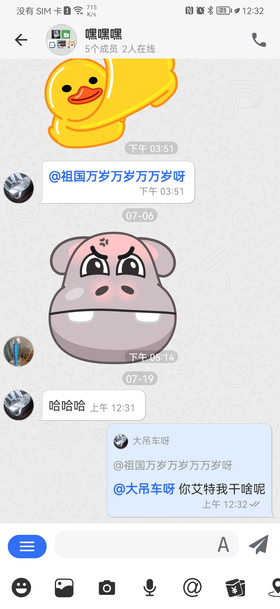

# 高级功能

### 自定义消息
在WuKongIM 中所有的消息类型都是自定义消息
#### 自定义普通消息
下面我们以名片消息举例

##### 第一步 定义消息

定义消息对象并继承 `WKMessageContent` 并在构造方法中指定消息类型

- <font color='#999' size=2>SDK 内置消息类型可通过 `WKMsgContentType` 查看</font>

`Java`

```java
public class WKCardContent extends WKMessageContent {

    public WKCardContent() {
        type = 3; //指定消息类型
    }
    // 定义需发送给对方的字段
    public String uid; // 用户ID
    public String name; // 名称
    public String avatar; // 头像
}
```

`Kotlin`

```kotlin
class WKCardContent : WKMessageContent() {
    var uid: String = ""
    var name: String = ""
    var avatar: String = ""

    init {
        type = 3; //指定消息类型
    }
}
```

- <strong><font color='red'>注意：自定义消息对象必须提供无参数的构造方法</font></strong>

##### 第二步 编码和解码

我们需要将`uid`,`name`,`avatar`三个字段信息发送给对方，最终传递的消息内容为

```json
{
  "type": 3,
  "uid": "xxxx",
  "name": "xxx",
  "avatar": "xxx"
}
```

重写`WKMessageContent`的`encodeMsg`方法开始编码

`Java`

```java
@Override
public JSONObject encodeMsg() {
    JSONObject jsonObject = new JSONObject();
    try {
        jsonObject.put("uid", uid);
        jsonObject.put("name", name);
        jsonObject.put("avatar", avatar);
    } catch (JSONException e) {
        e.printStackTrace();
    }
    return jsonObject;
}
```

`Kotlin`

```kotlin
override fun encodeMsg(): JSONObject {
    val jsonObject = JSONObject()
    jsonObject.put("uid", uid)
    jsonObject.put("name", name)
    jsonObject.put("avatar", avatar)
    return jsonObject
}
```

重写`WKMessageContent`的`decodeMsg`方法开始解码

`Java`

```java
@Override
public WKMessageContent decodeMsg(JSONObject jsonObject) {
    uid = jsonObject.optString("uid");
    name = jsonObject.optString("name");
    avatar = jsonObject.optString("avatar");
    return this;
}
```

`Kotlin`

```kotlin
override fun decodeMsg(jsonObject: JSONObject): WKMessageContent {
    this.uid = jsonObject.optString("uid")
    this.name = jsonObject.optString("name")
    this.avatar = jsonObject.optString("avatar")
    return this
}
```

- <font color='#999' size=2>解码和编码消息时无需将 `type` 字段考虑其中，sdk 内部会自动处理</font>

如果您想控制该自定义消息在获取时显示的内容可重写 `getDisplayContent` 方法

`Java`

```java
@Override
public String getDisplayContent() {
    return "[名片消息]";
}
```

`Kotlin`

```kotlin
override fun getDisplayContent(): String {
        return "[名片消息]"
    }
```

如果你想在全局搜索时能搜索到该类型的消息，可重写`getSearchableWord` 方法

`Java`

```java
@Override
public String getSearchableWord() {
    return "[名片]";
}
```

`Kotlin`

```
 override fun getSearchableWord(): String {
        return "[名片]"
    }
```

##### 第三步 注册消息

`Java`

```java
WKIM.getInstance().getMsgManager().registerContentMsg(WKCardContent.class);
```

`Kotlin`

```kotlin
 WKIM.getInstance().msgManager.registerContentMsg(WKCardContent::class.java)
```

对此通过这三步自定义普通消息就已完成。在收到消息时`WKMsg`中的type为3就表示该消息是名片消息，其中`baseContentMsgModel`则为自定义的`WKCardContent`，这时可将`baseContentMsgModel`强转为`WKCardContent`并渲染到UI上

#### 自定义附件消息

我们在发送消息的时候有时需发送带附件的消息。WuKongIM 也提供自定义附件消息，自定义附件消息和普通消息区别不大。下面我们已地理位置消息举例

##### 第一步 定义消息

值得注意的是自定义附件消息需继承`WKMediaMessageContent`而不是`WKMessageContent`

`Java`

```java
public class WKLocationContent extends WKMediaMessageContent {
    // 定义需发送给对方的字段
    public double longitude; // 经度
    public double latitude; // 纬度
    public String address; // 地址详细信息
    public WKLocationContent(double longitude, double latitude,  String address) {
        type = 6;
        this.longitude = longitude;
        this.latitude = latitude;
        this.address = address;
    }
    // 这里必须提供无参数的构造方法
    public WKLocationContent() {
        type = 6;
    }
}
```

`Kotlin`

```kotlin

class WKLocationContent(var longitude: Double, var latitude: Double, var address: String) :
    WKMediaMessageContent() {

    init {
        type = 6 //指定消息类型
    }
}
```

- <font color='#999' size=2>`WKMediaMessageContent`提供了`url`，`localPath`字段，自定义消息无需在定义网络地址和本地地址字段</font>

##### 第二步 编码和解码

我们需要将`longitude`,`latitude`,`address`,`url`信息发送给对方，最终传递的消息内容为

```json
{
  "type": 6,
  "longitude": 115.25,
  "latitude": 39.26,
  "url": "xxx",
  "address": "xxx"
}
```

重写`WKMessageContent`的`encodeMsg`方法开始编码

`Java`

```java
@Override
  public JSONObject encodeMsg() {
      JSONObject jsonObject = new JSONObject();
      try {
          jsonObject.put("address", address);
          jsonObject.put("latitude", latitude);
          jsonObject.put("longitude", longitude);
          jsonObject.put("url", url); // 位置截图
          jsonObject.put("localPath", localPath);
      } catch (JSONException e) {
          e.printStackTrace();
      }
      return jsonObject;
  }
```

`Kotlin`

```kotlin
override fun encodeMsg(): JSONObject {
    val jsonObject = JSONObject()
    jsonObject.put("longitude", longitude)
    jsonObject.put("latitude", latitude)
    jsonObject.put("address", address)
    jsonObject.put("url", url)
    jsonObject.put("localPath", localPath)
    return jsonObject
}
```

- <font color='#999' size=2>编码消息可以写入`localPath`本地字段，sdk 在保存完消息时发送给对方的消息是不包含该字段的</font>

重写`WKMessageContent`的`decodeMsg`方法开始解码

`Java`

```java
@Override
public WKMessageContent decodeMsg(JSONObject jsonObject) {
  latitude = jsonObject.optDouble("latitude");
  longitude = jsonObject.optDouble("longitude");
  address = jsonObject.optString("address");
  url = jsonObject.optString("url");
  if (jsonObject.has("localPath"))
      localPath = jsonObject.optString("localPath");
  return this;
}
```

`Kotlin`

```kotlin
override fun decodeMsg(jsonObject: JSONObject): WKMessageContent {
    this.latitude = jsonObject.optDouble("latitude")
    this.longitude = jsonObject.optDouble("longitude")
    this.address = jsonObject.optString("address")
    this.url = jsonObject.optString("url")
    if (jsonObject.has("localPath"))
        this.localPath = jsonObject.optString("localPath")
    return this
}
```

- <font color='#999' size=2>在解码消息时如果是解码本地字段需判断该字段是否存在，因为收到的消息并没有本地字段。如`localPath`在收到消息时是没有的</font>

##### 第三步 注册消息

`Java`

```java
WKIM.getInstance().getMsgManager().registerContentMsg(WKLocationContent.class);
```

`Kotlin`

```kotlin
WKIM.getInstance().msgManager.registerContentMsg(WKLocationContent::class.java)
```

### 消息扩展

随着业务的发展应用在聊天中的功能也日益增多，为了满足绝大部分的需求 WuKongIM 中增加了消息扩展功能。消息扩展分`本地扩展`和`远程扩展`，本地扩展只针对 app 本地使用卸载 app 后将丢失，远程扩展是服务器保存卸载重装后数据将恢复

#### 本地扩展

本地扩展就是消息对象`WKMsg`中的`localExtraMap`字段

`Java`

```java
/**
  * 修改消息本地扩展
  *
  * @param clientMsgNo 客户端ID
  * @param hashExtra   扩展字段
  */
WKIM.getInstance().getMsgManager().updateLocalExtraWithClientMsgNo(String clientMsgNo, HashMap<String, Object> hashExtra);
```

`Kotlin`

```kotlin
WKIM.getInstance().msgManager.updateLocalExtraWithClientMsgNo( clientMsgNo,hashExtra)
```

- <font color='#999' size=2>更新成功后 sdk 会触发刷新消息回调</font>

#### 远程扩展

远程扩展就是消息对象`WKMsg`中的`remoteExtra`字段

`Java`

```java
 /**
  * 保存远程扩展
  * @param channel 某个channel信息
  * @param list 远程扩展数据
  */
WKIM.getInstance().getMsgManager().saveRemoteExtraMsg(WKChannel channel, List<WKSyncExtraMsg> list);
```

`Kotlin`

```kotlin
WKIM.getInstance().msgManager.saveRemoteExtraMsg(channel,  list)
```

- <font color='#999' size=2>更新成功后 sdk 会触发刷新消息回调</font>
##### 数据结构说明
```java
public class WKMsgExtra  {
    public String messageID;         // 消息ID
    public String channelID;         // 频道ID
    public byte channelType;         // 频道类型
    public int readed;              // 是否已读
    public int readedCount;         // 消息已读数量
    public int unreadCount;         // 消息未读数量
    public int revoke;              // 消息是否撤回
    public int isMutualDeleted;     // 是否删除
    public String revoker;          // 消息撤回者uid
    public long extraVersion;       // 版本号
    public long editedAt;           // 消息编辑时间
    public String contentEdit;      // 消息编辑内容
    public int needUpload;          // 是否需要上传(这里指业务服务器)
    public int isPinned;            // 是否置顶
    public WKMessageContent contentEditMsgModel; // 消息编辑内容体
}
```
### 消息已读未读

消息的已读未读又称消息回执。消息回执功能可通过 setting 进行设置

`Java`

```java
WKMsgSetting setting = new WKMsgSetting();
setting.receipt = 1; // 开启回执

WKSendOptions options = new WKSendOptions();
options.setting = setting;
// 发送消息
WKIM.getInstance().getMsgManager().sendWithOptions(@NonNull WKMessageContent contentModel, @NonNull WKChannel channel, @NonNull WKSendOptions options);
```

`Kotlin`

```kotlin
val setting = WKMsgSetting()
setting.receipt = 1 // 开启回执
val options = WKSendOptions()
options.setting = setting
// 发送消息
WKIM.getInstance().msgManager.sendWithOptions(
    wkBaseContentMsgModel,channel,options
)
```

当登录用户浏览过对方发送的消息时，如果对方开启了消息回执这时需将查看过的消息上传到服务器标记该消息已读。当对方或者自己上传过已读消息这时服务器会下发同步消息扩展的 cmd(命令)消息`syncMessageExtra`,此时需同步最新消息扩展保存到 sdk 中


### 消息编辑
当我们给对方发送消息发现发送内容有错误时，这时无需撤回重发只需要将消息编辑即可

<video controls height='30%' width='30%' src="/video/msgedit.mp4"></video>


#### 设置编辑内容

`Java`

```java
/**
  * 修改编辑内容
  * @param msgID 消息服务器ID
  * @param channelID 频道ID
  * @param channelType 频道类型
  * @param content 编辑后的内容
  */
WKIM.getInstance().getMsgManager().updateMsgEdit(String msgID, String channelID, byte channelType, String content);
```

`Kotlin`

```kotlin
WKIM.getInstance().msgManager.updateMsgEdit(msgID,channelID,channelType,content)
```

更改 sdk 消息编辑内容后需将编辑后的内容上传到服务器,则需要监听上传消息扩展

#### 监听上传消息扩展

`Java`

```java
//监听上传消息扩展
WKIM.getInstance().getMsgManager().addOnUploadMsgExtraListener(new IUploadMsgExtraListener() {
          @Override
          public void onUpload(WKMsgExtra msgExtra) {
              // 上传到自己的服务器
          }
      });
```

`Kotlin`

```kotlin
WKIM.getInstance().msgManager.addOnUploadMsgExtraListener(object :IUploadMsgExtraListener{
    override fun onUpload(msgExtra: WKMsgExtra) {
        // 上传到服务器
    }
})
```

### 消息回复

在聊天中如果消息过多，发送消息回复就会显得消息很乱无章可循。这时就需要对某条消息进行特定的回复，即消息回复，如以下效果 

在发送消息时，只需将消息正文`WKMessageContent`中的`WKReply`对象赋值就能对达到消息回复效果

`WKReply` 对象核心字段

```java
public class WKReply {
    // 被回复的消息根ID，多级回复时的第一次回复的消息ID
    public String root_mid;
    // 被回复的消息ID
    public String message_id;
    // 被回复的MessageSeq
    public long message_seq;
    // 被回复者uid
    public String from_uid;
    // 被回复者名称
    public String from_name;
    // 被回复的消息体
    public WKMessageContent payload;
    // 被回复消息编辑后的内容
    public String contentEdit;
    // 被回复消息编辑后的消息实体
    public WKMessageContent contentEditMsgModel;
    // 编辑时间
    public long editAt;
}
```

### 消息回应(点赞)

#### 保存
`java`
```java
// 保存消息回应
WKIM.getInstance().getMsgManager().saveMessageReactions(List<WKSyncMsgReaction> list)
```
`kotlin`
```kotlin
// 保存消息回应
WKIM.getInstance().msgManager.saveMessageReactions(list)
```

- <font color='#999' size=2>同一个用户对同一条消息只能做出一条回应。重复进行消息不同 emoji 的回应会做为修改回应，重复进行相同 emoji 的回应则做为删除回应</font> sdk 更新消息回应后会触发消息刷新的事件。app 需监听此事件并对 UI 进行刷新

#### 获取
`java`
```java
// 获取某条消息的回应
WKIM.getInstance().getMsgManager().getMsgReactions(String messageID);
```
`kotlin`
```kotlin
// 获取某条消息的回应
WKIM.getInstance().msgManager.getMsgReactions(messageID)
```

#### 数据结构说明
```java

public class WKMsgReaction {
    public String messageID;    // 消息ID
    public String channelID;    // 频道ID
    public byte channelType;    // 频道类型
    public String uid;          // 用户ID
    public long seq;            // 消息序列号
    public String emoji;        // 表情
    public int isDeleted;       // 是否删除
    public String createdAt;    // 创建时间
}
```

