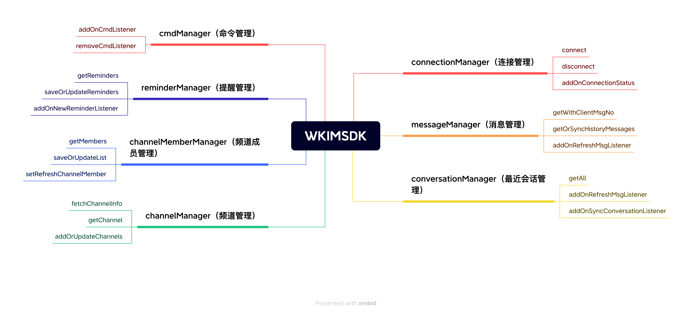

# Flutter

## 设计理念

为了让开发者更快更方便的使用 SDK，悟空 SDK 提供了一个唯一的入口来访问 SDK 中的所有功能。就像书籍的目录一样可以通过目录查找对应的内容。如连接 IM `WKIM.shared.connectionManager.connect();`

## 结构说明



SDK 常用功能介绍

```dart
// 消息管理器
// 负责消息的增删改查、新消息监听、刷新消息监听、消息入库、监听同步某个聊天数据等
WKIM.shared.messageManager

// 最近会话管理
// 获取最近聊天记录、刷新最近会话[新增聊天、红点改变]、监听移除某个会话、监听同步最近会话等
WKIM.shared.conversationManager

// 连接管理
// 负责IM的连接、断开、退出登录、监听连接状态、监听获取连接IP等
WKIM.shared.connectionManager

// 频道管理
// 可获取Channel的信息，刷新Channel缓存，监听Channel更改[置顶、免打扰、禁言]等
WKIM.shared.channelManager

// 频道成员管理
// 获取Channel成员列表、设置成员备注、保存修改成员数据、监听刷新成员和移除成员等
WKIM.shared.channelMemberManager

// 提醒项管理
// 获取某个会话的提醒如：[有人@我] [入群申请] 等。还可自定义提醒项，如像 语音未读 等
WKIM.shared.reminderManager

// 命令管理
// 负责监听服务器下发的命令消息
WKIM.shared.cmdManager
```

## 集成

## 快速入门
#### 安装
```
dependencies:
  wukongimfluttersdk: ^1.0.4
```
#### 引入
```dart
import 'package:wukongimfluttersdk/wkim.dart';
```
### SDK 与 APP 交互原则

 sdk 与 app 交互流程就是 app 调用 sdk 提供的方法，sdk 处理完数据后通过事件将数据回调给 app。如发送消息流程：app 调用发送消息方法，sdk 将入库后的消息 push 给 app

**初始化sdk**
```dart
// uid 登录用户ID（业务服务端在IM通讯端登记了的uid））
// token 登录用户token（业务服务端在IM通讯端登记了的token）
WKIM.shared.setup(Options.newDefault('uid', 'token'));
```
**初始化IP**
```dart
WKIM.shared.options.getAddr = (Function(String address) complete) async {
      // 可通过接口获取后返回
      complete('xxxxx:5100');
    };
```
- <font color="#999" font-size=2>返回 IM 通信端的 IP 和 IM 通信端的 TCP 端口。<font color="#FF0000">分布式可调用接口获取 IP 和 Port 后返回</font></font>

### 连接与断开
##### 连接
```dart
WKIM.shared.connectionManager.connect();
```
#### 断开
```dart
// isLogout true：退出并不再重连 false：退出保持重连
WKIM.shared.connectionManager.disconnect(isLogout)
```
#### 连接状态监听
```dart
WKIM.shared.connectionManager.addOnConnectionStatus('home',
        (status, reason) {
      if (status == WKConnectStatus.connecting) {
        // 连接中
      } else if (status == WKConnectStatus.success) {
        // 成功
      } else if (status == WKConnectStatus.noNetwork) {
        // 网络异常
      } else if (status == WKConnectStatus.syncMsg) {
        //同步消息中
      }
    });
```

### 消息收发
#### 发送消息
```dart
WKIM.shared.messageManager.sendMessage(WKTextContent('我是文本消息'), WKChannel('uid_1', WKChannelType.personal));
```

- <font size=2 color="#999">sdk 内置频道类型可通过`WKChannelType`查看</font>

如给用户`A`发送一条文本消息。构建文本消息正文

```dart
WKTextContent textContent = new WKTextContent("你好，悟空");
```

将消息发送给用户`A`

```dart
WKIM.shared.messageManager.sendMessage(textContent,WKChannel('A', WKChannelType.personal));
```

#### 消息入库返回（并不是消息发送状态）
在发送消息时，sdk 将消息保存在本地数据库后就会触发入库回调。此时消息并未进行发送，可在此监听中将消息展示在 UI 上

监听消息入库事件
```dart
WKIM.shared.messageManager.addOnMsgInsertedListener((wkMsg) {
      // 展示在UI
    });
```

#### 新消息
监听新消息事件

```dart
WKIM.shared.messageManager.addOnNewMsgListener('chat', (msgs) {
      // todo 展示在UI上
    });
```
- <font color='#999' size=2>如果在聊天页面内收到新消息时需判断该消息是否属于当前会话，可通过消息对象`WKMsg`的`channelID`和`channelType`判断</font>


#### 刷新消息监听

在 sdk 更新过消息时，如：消息发送状态，有人点赞消息，消息已读回执，消息撤回，消息被编辑等等，sdk 都将回调以下事件。UI 可通过消息对象`WKMsg`的`clientMsgNO`来判断具体是哪条消息发生了更改。

监听刷新消息事件
```dart
WKIM.shared.messageManager.addOnRefreshMsgListener('chat', (wkMsg) {
      // todo 刷新消息
    });
```

##### 消息类核心属性
```dart
class WKMsg {
  // 消息头 redDot：是否显示红点 noPersist：是否不存储 syncOnce：是否只同步一次
  MessageHeader header = MessageHeader();
  // 消息设置  receipt：是否回执，topic：是否话题聊天，stream：是否流消息;
  Setting setting = Setting();
  // 服务器消息ID(全局唯一，无序)
  String messageID = "";
  // 服务器消息ID(有序)
  int messageSeq = 0;
  // 本地消息有序ID
  int clientSeq = 0;
  // 10位时间戳
  int timestamp = 0;
  // 本地唯一ID
  String clientMsgNO = "";
  // 发送者
  String fromUID = "";
  // 所属频道ID
  String channelID = "";
  // 所属频道类型
  int channelType = WKChannelType.personal;
  // 消息正文类型 如 1:【文本】2:【图片】...
  int contentType = 0;
  // 消息负载
  String content = "";
  // 消息状态 0.发送中 1.成功
  int status = 0;
  // 是否被删除 1.是
  int isDeleted = 0;
  // 发送者的资料 
  WKChannel? _from;
  // 所属频道资料
  WKChannel? _channelInfo;
  // 发送者在频道内类型资料（群消息才有值）
  WKChannelMember? _memberOfFrom;
  // 排序号
  int orderSeq = 0;
  // 本地扩展字段
  dynamic localExtraMap;
  // 远程扩展字段，服务器维护
  WKMsgExtra? wkMsgExtra;
  // 本条消息回应数据
  List<WKMsgReaction>? reactionList;
  // 消息正文体 contentType==1.WKTextContent contentType==2.WKImageConent
  WKMessageContent? messageContent;
}
```

### 离线消息接收

因为悟空 IM 是支持消息永久存储，所以会产生海量的离线消息。对此我们采用了按需拉取的机制，如 10 个会话一个会话 10 万条消息，悟空 IM 不会把这个 10\*10 万=100 万条消息都拉取到本地。 而是采用拉取这 10 个会话的信息和对应的最新 20 条消息，也就是实际只拉取了 200 条消息 相对 100 万条消息来说大大提高了离线拉取速度。用户点进对应的会话才会去按需拉取这个会话的消息。 这些机制 SDK 内部都已做好了封装，使用者其实不需要关心。使用者只需要关心最近会话的变化和监听获取数据的回调即可。

##### 监听同步最近会话

在打开应用时需同步最近会话列表，获取某个 channel 的未读数量、消息提醒、最后一条消息等
```dart
WKIM.shared.conversationManager
        .addOnSyncConversationListener((lastSsgSeqs, msgCount, version, back) {
        // 请求网络后返回到sdk
        back(conversation);
    });
```

当在聊天页面中时用户可以上拉下拉，或者搜索查看聊天数据，对此悟空 sdk 提供了如下方法
#### 查看某个频道的聊天信息
```dart
/*
    * 查询或同步某个频道消息
    *
    * @param channelId                频道ID
    * @param channelType              频道类型
    * @param oldestOrderSeq           最后一次消息大orderSeq 第一次进入聊天传入0
    * @param contain                  是否包含 oldestOrderSeq 这条消息
    * @param pullMode                 拉取模式 0:向下拉取 1:向上拉取
    * @param aroundMsgOrderSeq        查询此消息附近消息 如 aroundMsgOrderSeq=20 返回数据则是 [16,17,19,20,21,22,23,24,25]
    * @param limit                    每次获取数量
    * @param iGetOrSyncHistoryMsgBack 请求返还
    * @param syncBack 同步消息时回掉，可通过此回掉显示加载中
    */
WKIM.shared.messageManager.getOrSyncHistoryMessages(
        channelID, channelType, oldestOrderSeq, contain, pullMode, limit, aroundMsgOrderSeq,  Function(List<WKMsg>)){
            
        },Function() syncBack);
```

- <font color='#999' size=2>获取历史消息并不是同步方法，因为有可能存在非连续性时会往服务器同步数据</font>

如果本地没有该 channel 的聊天记录需同步服务器聊天记录，这时需监听获取 channel 消息事件

#### 监听同步某个频道的消息

```dart
WKIM.shared.messageManager.addOnSyncChannelMsgListener((channelID,
        channelType, startMessageSeq, endMessageSeq, limit, pullMode, back) {
        /*
        * 同步某个频道的消息
        *
        * @param channelID           频道ID
        * @param channelType         频道类型
        * @param startMessageSeq     开始消息列号（结果包含start_message_seq的消息）
        * @param endMessageSeq       结束消息列号（结果不包含end_message_seq的消息）
        * @param limit               消息数量限制
        * @param pullMode            拉取模式 0:向下拉取 1:向上拉取
        * @param iSyncChannelMsgBack 请求返回
        */
        // todo 请求接口后需返回给sdk
    });
```

### 文本消息
```dart
class WKTextContent extends WKMessageContent {
    WKTextContent(content) {
    contentType = WkMessageContentType.text;
    this.content = content;
  }
}
```
### 图片消息

```dart
class WKImageContent extends WKMediaMessageContent {
  int width;
  int height;
  WKImageContent(this.width, this.height) {
    contentType = WkMessageContentType.image;
  }
}
```
### 名片消息

```dart
class WKCardContent extends WKMessageContent {
  String name; // 名片用户名
  String uid;  // 用户uid
  String? vercode; // 加好友所需验证码
  WKCardContent(this.uid, this.name) {
    contentType = WkMessageContentType.card;
  }
}
```

### 语音消息

```dart
class WKVoiceContent extends WKMediaMessageContent {
  int timeTrad; // 语音秒长
  String? waveform; // 语音波纹 base64编码
  WKVoiceContent(this.timeTrad) {
    contentType = WkMessageContentType.voice;
  }
}
```

### 视频消息

```dart

class WKVideoContent extends WKMediaMessageContent {
  String cover = ''; // 封面地址
  String coverLocalPath = ''; // 封面本地地址
  int second = 0; // 视频时长
  int size = 0; // 视频大小
  int width = 0; // 封面宽度
  int height = 0; // 封面高度
  WKVideoContent() {
    contentType = WkMessageContentType.video;
  }
}
```

### 最近会话

在同步完最近会话或者修改过最近会话内容时，sdk 会将更新或新增的最近会话 push 给 UI。app 需监听以下方法

#### 监听最近会话刷新
```dart
WKIM.shared.conversationManager.addOnRefreshMsgListener('chat_conversation',
        (msg, isEnd) {
        // msg 最近会话消息内容 UI上已有该会话需进行更新，反之添加到UI上
        // isEnd 为了防止频繁刷新UI，当isEnd为true可刷新UI
    });
```
#### 监听删除最近会话
```dart
WKIM.shared.conversationManager.addOnDeleteMsgListener('chat_conversation',
        (chanelId, channelType) {
        // 可通过channelId/channelType删除对应的数据
    });
```

WKUIConversationMsg 类核心数据

```dart
class WKUIConversationMsg {
  // 最后一条消息的msgseq
  int lastMsgSeq = 0;
  String clientMsgNo = '';
  //频道ID
  String channelID = '';
  //频道类型
  int channelType = 0;
  //最后一条消息时间
  int lastMsgTimestamp = 0;
  //消息频道
  WKChannel? _wkChannel;
  //消息正文
  WKMsg? _wkMsg;
  //未读消息数量
  int unreadCount = 0;
  // 是否被删除
  int isDeleted = 0;
  // 远程扩展
  WKConversationMsgExtra? _remoteMsgExtra;
  //高亮内容[{type:1,text:'[有人@你]'}]
  List<WKReminder>? _reminderList;
  //本地扩展字段
  dynamic localExtraMap;
}
```
#### 数据操作
```dart
// 查询所有最近会话
WKIM.shared.conversationManager.getAll();

// 删除某条会话
WKIM.shared.conversationManager.deleteMsg(channelId,channelType);
```

### 频道管理(置顶,免打扰等等)

频道(Channel)悟空 IM 中是一个比较抽象的概念。发送消息都是先发送给频道，频道根据自己的配置规则进行投递消息，频道分频道和频道详情。 更多介绍请移步[什么是频道](/guide/initialize#频道)

#### 频道属性
```dart

class WKChannel {
  // 频道ID
  String channelID = "";
  // 频道类型
  int channelType = WKChannelType.personal;
  // 频道名称
  String channelName = "";
  //频道备注(频道的备注名称，个人的话就是个人备注，群的话就是群别名)
  String channelRemark = "";
  int showNick = 0;
  //是否置顶
  int top = 0;
  //是否保存在通讯录
  int save = 0;
  //免打扰
  int mute = 0;
  //禁言
  int forbidden = 0;
  //邀请确认
  int invite = 0;
  //频道状态[1：正常2：黑名单]
  int status = 1;
  //是否已关注 0.未关注（陌生人） 1.已关注（好友）
  int follow = 0;
  //是否删除
  int isDeleted = 0;
  //创建时间
  String createdAt = "";
  //修改时间
  String updatedAt = "";
  //频道头像
  String avatar = "";
  //版本
  int version = 0;
  //扩展字段
  dynamic localExtra;
  //是否在线
  int online = 0;
  //最后一次离线时间
  int lastOffline = 0;
  // 最后一次离线设备标识
  int deviceFlag = 0;
  //是否回执消息
  int receipt = 0;
  // 机器人
  int robot = 0;
  //分类[service:客服]
  String category = "";
  // 头像缓存
  String avatarCacheKey = "";
  // 远程扩展
  dynamic remoteExtraMap;

  WKChannel(this.channelID, this.channelType);
}

```
#### 数据操作
```dart
// 获取某个channel资料
WKIM.shared.channelManager.getChannel(String channelID,int channelType);

// 从远程服务器获取channel信息
WKIM.shared.channelManager.fetchChannelInfo(String channelID, int channelType)

// 批量导入频道信息 该方法会触发channel刷新事件
WKIM.shared.channelManager.addOrUpdateChannels(List<WKChannel> list);

```
#### 数据监听
```dart
//  监听channel刷新事件
WKIM.shared.channelManager.addOnRefreshListener('key',(wkChannel){
    // 刷新对应channel 信息
});

//  监听获取channel信息
WKIM.shared.channelManager.addOnGetChannelListener((channelId, channelType, back) {
    // 获取到资料后 通过back返回
    // 或调用 WKIM.shared.channelManager.addOrUpdateChannel()方法更新sdk中channel资料
});
```

### 进阶使用

### 自定义普通消息

在悟空 IM 中所有的消息类型都是自定义消息。下面我们以`gif`消息举例

#### 第一步 定义消息

定义消息对象并继承 `WKMessageContent` 并在构造方法中指定消息类型

- <font color='#999' size=2>SDK 内置消息类型可通过 `WkMessageContentType` 查看</font>

##### 继承 `WKMessageContent` 和定义 gif 消息的正文结构
```dart
class GifContent extends WKMessageContent{
    int width=0; // 宽度
    int height=0; // 高度
    String url; // 远程地址
    GifContent(this.url){
        // 指定消息类型
        contentType = WkMessageContentType.gif;
    }
}
```
#### 编码解码
```dart
class GifContent extends WKMessageContent{
    int c=0; // 宽度
    int height=0; // 高度
    String url; // 远程地址
    GifContent(this.url){
        // 指定消息类型
        contentType = WkMessageContentType.gif;
    }

  @override
  WKMessageContent decodeJson(Map<String, dynamic> json) {
    url = readString(json, 'url');
    width = readInt(json, 'width');
    height = readInt(json, 'height');
    return this;
  }

  @override
  Map<String, dynamic> encodeJson() {
    return {'url': url, 'width': width, 'height': height};
  }
 // 如果需要获取可显示内容可重写

  @override
  String displayText() {
    return "[动态图片]";
  }
}
```

#### 注册消息
```dart
WKIM.shared.messageManager.registerMsgContent(WkMessageContentType.gif,
        (dynamic data) {
      return GifContent('').decodeJson(data);
    });
```

对此通过这三步自定义普通消息就已完成。在收到消息时`WKMsg`中的type为3就表示该消息是名片消息，其中`messageContent`则为自定义的`GifContent`，这时可将`messageContent`强转为`GifContent`并渲染到UI上


### 自定义附件消息

我们在发送消息的时候有时需发送带附件的消息。悟空 IM 也提供自定义附件消息，自定义附件消息和普通消息区别不大。下面我们图片消息举例

#### 第一步 定义消息

值得注意的是自定义附件消息需继承`WKMediaMessageContent`而不是`WKMessageContent`


```dart

class WKImageContent extends WKMediaMessageContent {
  int width; // 图片宽度
  int height; // 图片高度
  WKImageContent(this.width, this.height) {
    contentType = WkMessageContentType.image;
  }
}
```

#### 第二步编码解码
```dart
class WKImageContent extends WKMediaMessageContent {
  int width; // 图片宽度
  int height; // 图片高度
  WKImageContent(this.width, this.height) {
    contentType = WkMessageContentType.image;
  }

  @override
  Map<String, dynamic> encodeJson() {
    return {'width': width, 'height': height, 'url': url};
  }

  @override
  WKMessageContent decodeJson(Map<String, dynamic> json) {
    width = readInt(json, 'width');
    height = readInt(json, 'height');
    url = readString(json, 'url');
    localPath = readString(json, 'localPath');
    return this;
  }

}
```
#### 第三步 注册
```dart
WKIM.shared.messageManager.registerMsgContent(WkMessageContentType.image,
        (dynamic data) {
      return WKImageContent(
        0,
        0,
      ).decodeJson(data);
    });
```


### 消息附件管理

在自定义附件消息的时候发送给对方的消息是将网络地址发送给对方，并不是实际的文件。这个时候我们就需监听附件的上传

#### 监听上传附件
```dart
 // 监听上传消息附件
    WKIM.shared.messageManager.addOnUploadAttachmentListener((wkMsg, back) {
      if (wkMsg.contentType == WkMessageContentType.image) {
        // todo 上传附件
        WKImageContent imageContent = wkMsg.messageContent! as WKImageContent;
        imageContent.url = 'xxxxxx';
        wkMsg.messageContent = imageContent;
        back(wkMsg);
      }
      if (wkMsg.contentType == WkMessageContentType.voice) {
        // todo 上传语音
        WKVoiceContent voiceContent = wkMsg.messageContent! as WKVoiceContent;
        voiceContent.url = 'xxxxxx';
        wkMsg.messageContent = voiceContent;
        back(wkMsg);
      } else if (wkMsg.contentType == WkMessageContentType.video) {
        WKVideoContent videoContent = wkMsg.messageContent! as WKVideoContent;
        // todo 上传封面及视频
        videoContent.cover = 'xxxxxx';
        videoContent.url = 'ssssss';
        wkMsg.messageContent = videoContent;
        back(wkMsg);
      }
    });
```

#### 附件下载

sdk 中不会主动下载消息的附件。在收到带有附件的消息时需要 应用 自己按需下载。在 应用 下载完成后可改文件本地地址，避免重复下载

```dart
/**
  * 修改消息内容体
  *
  * @param clientMsgNo       客户端消息ID
  * @param messageContent    消息module 将本地地址保存在 messageContent 中
  * @param isRefreshUI       是否通知UI刷新对应消息
  */
WKIM.shared.messageManager.updateContent(String clientMsgNo, WKMessageContent messageContent, boolean isRefreshUI);
```
### 消息扩展

随着业务的发展应用在聊天中的功能也日益增多，为了满足绝大部分的需求 悟空 IM 中增加了消息扩展功能。消息扩展分`本地扩展`和`远程扩展`，本地扩展只针对 app 本地使用卸载 app 后将丢失，远程扩展是服务器保存卸载重装后数据将恢复

#### 本地扩展

本地扩展就是消息对象`WKMsg`中的`localExtraMap`字段
```dart
// 修改消息本地扩展
WKIM.shared.messageManager.updateLocalExtraWithClientMsgNo(String clientMsgNo,dynamic data);
```
- <font color='#999' size=2>更新成功后 sdk 会触发刷新消息回调</font>

#### 远程扩展

远程扩展就是消息对象`WKMsg`中的`wkMsgExtra`字段
```dart
// 修改消息远程扩展
WKIM.shared.messageManager.saveRemoteExtraMsg(List<WKSyncExtraMsg> list);
```
### 消息编辑
待开发
### 消息回应（点赞）

如果你不理解消息回应请查看[什么是消息回应](/unifying.html#什么是消息回应)

当自己或者别人对消息回应(点赞)时，都会触发 cmd(命令)消息通知到应用。应用在收到同步消息回应的cmd时获取可调用服务器同步接口将获取的回应数据更新到sdk
```dart
// 保存消息回应
WKIM.shared.messageManager.saveMessageReactions(List<WKSyncMsgReaction> list);
```

- <font color='#999' size=2>同一个用户对同一条消息只能做出一条回应。重复进行消息不同 emoji 的回应会做为修改回应，重复进行相同 emoji 的回应则做为删除回应</font> sdk 更新消息回应后会触发消息刷新的事件。app 需监听此事件并对 UI 进行刷新

### 已读未读管理

消息的已读未读又称消息回执。消息回执功能可通过 setting 进行设置

```dart
var setting = Setting();
setting.receipt = 1; // 开启回执
// 发送带有回执的消息
WKIM.shared.messageManager.sendMessageWithSetting(
      WKMessageContent messageContent, WKChannel channel, Setting setting)
```
当用户浏览过对方发送的消息时，如果对方开启了消息回执这时需将查看过的消息上传到服务器标记该消息已读。当对方或者自己上传过已读消息这时服务器会下发同步消息扩展的 cmd(命令)消息,此时需同步最新消息扩展通过`WKIM.shared.messageManager.saveRemoteExtraMsg(List<WKSyncExtraMsg> list)`方法保存到 sdk 中

### 会话提醒管理

会话提醒目前只支持服务器下发指令。客户端只需监听同步会话提醒和监听刷新会话消息即可
```dart
class WKReminder {
  int reminderID = 0; //提醒ID
  String messageID = '';
  String channelID = '';
  int channelType = 0;
  int messageSeq = 0;
  int type = 0; // 提醒类型[1、有人@你][2、群内审核] 等
  int isLocate = 0;
  String uid = '';
  String text = '';
  dynamic data; //  提醒包含的自定义数据
  int version = 0;
  int done = 0;
  int needUpload = 0;
  String publisher = '';
}
```

#### 操作数据
```dart
// 保存提醒项
WKIM.shared.reminderManager.saveOrUpdateReminders(list);
```

- 当 sdk 更新了提醒项，会话提醒会触发最近会话的刷新事件，此时需监听刷新最近会话事件

#### 监听刷新
```dart
WKIM.shared.reminderManager.addOnNewReminderListener('key',(list){
    // 新的提醒项
});
```
