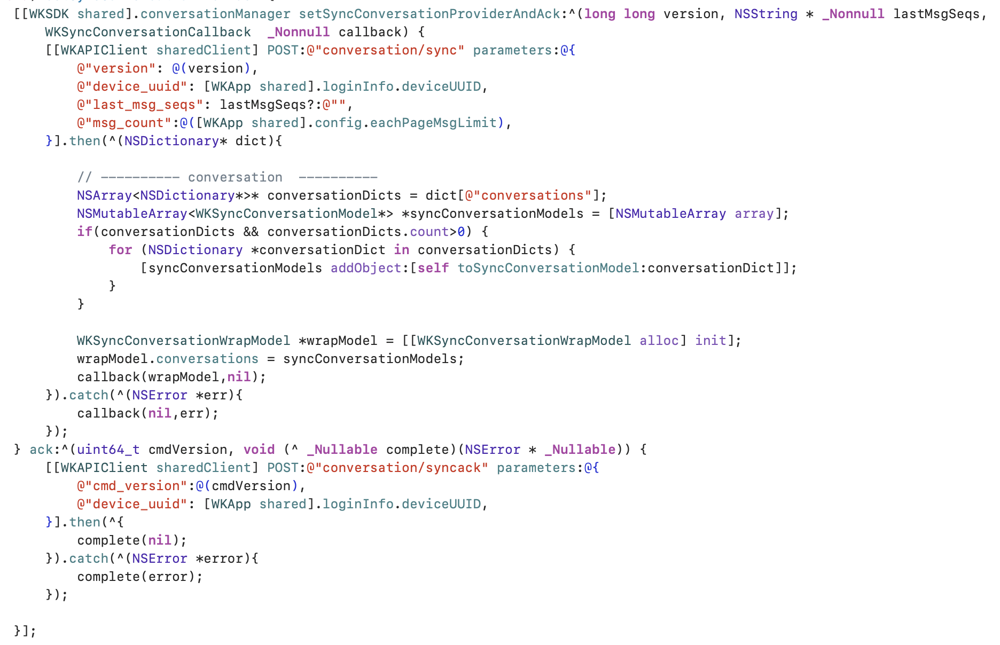

# 最近会话管理

负责最近会话数据的管理，比如：新增最近会话，删除最近会话，未读消息数量等等

文档只介绍核心方法，更多内容查看代码的`[WKSDK shared].conversationManager`接口

## 最近会话列表

### 数据操作

获取本地最近会话列表

```objc
NSArray<WKConversation*> *conversations = [[WKSDK shared].conversationManager getConversationList];
```

### 数据监听

添加`WKConversationManagerDelegate`

```objc
[[WKSDK shared].conversationManager addDelegate:self];
```

WKConversationManagerDelegate说明

```objc   
/**
  当最近会话被新增的时候会调用此方法

 @param conversation 最近会话对象
 @param left 会话剩余数量 UI层可以判断left == 0 的时候才刷新 避免频繁刷新UI导致卡顿
 */
- (void)onConversationAdd:(WKConversation*)conversation left:(NSInteger)left;

/**
 当最近会话对象更新的时候会调用此方法

 @param conversation 最近会话对象
 @param left 会话剩余数量 UI层可以判断left == 0 的时候才刷新 避免频繁刷新UI导致卡顿
 */
- (void)onConversationUpdate:(WKConversation*)conversation left:(NSInteger)left;

/**
 最近会话未读数发送改变

 @param channel 频道
 @param unreadCount 未读数量
 */
- (void)onConversationUnreadCountUpdate:(WKChannel*)channel unreadCount:(NSInteger)unreadCount;


```

### 数据源

`触发时机：当建立连接后，由SDK主动触发拉取离线后的最近会话`

增量同步离线后的最近会话数据

```objc
// version 数据版本号
// lastMsgSeqs 拼接好的最近会话seq关系数据
// callback  当请求服务器获取到消息后，SDK应调用此回调 （注意： 不管请求失败与否都需要调用callback）
[[WKSDK shared].conversationManager setSyncConversationProviderAndAck:^(long long version, NSString * _Nonnull lastMsgSeqs, WKSyncConversationCallback  _Nonnull callback) {
        
} ack:^(uint64_t cmdVersion, void (^ _Nullable complete)(NSError * _Nullable)) {
     // 如果不需要ack回执，直接调用complete(nil);
     complete(nil); 
}];

```

示例:



## 最近会话扩展

通过最近会话扩展属性，可以自定义自己独特的业务属性，比如实现类似微信的草稿功能，并且草稿数据多端同步

### 数据操作

#### 更新扩展

```objc
[[WKSDK shared].conversationManager updateOrAddExtra:(WKConversationExtra*)extra]
```

#### 同步扩展

```objc
[[WKSDK shared].conversationManager syncExtra]
```

### 数据监听

如何最近会话对象的数据变化都会触发`WKConversationManagerDelegate`委托，同理 调用`updateOrAddExtra`也会触发此委托


### 数据源


#### 更新扩展

`触发时机：调用[[WKSDK shared].conversationManager updateOrAddExtra]时触发`

```objc
// extra 更新的扩展数据
// callback 更新完毕后回调给sdk
[[WKSDK shared].conversationManager setUpdateConversationExtraProvider:^(WKConversationExtra * _Nonnull extra, WKUpdateConversationExtraCallback  _Nonnull callback) {
   
}];
```

#### 同步扩展

`触发时机：调用[[WKSDK shared].conversationManager syncExtra]时触发`

```objc
// version 客户端本地存在的最新扩展数据版本
// callback 同步扩展后将数据回调给sdk
[[WKSDK shared].conversationManager setSyncConversationExtraProvider:^(long long version, WKSyncConversationExtraCallback  _Nonnull callback) {

}];
```