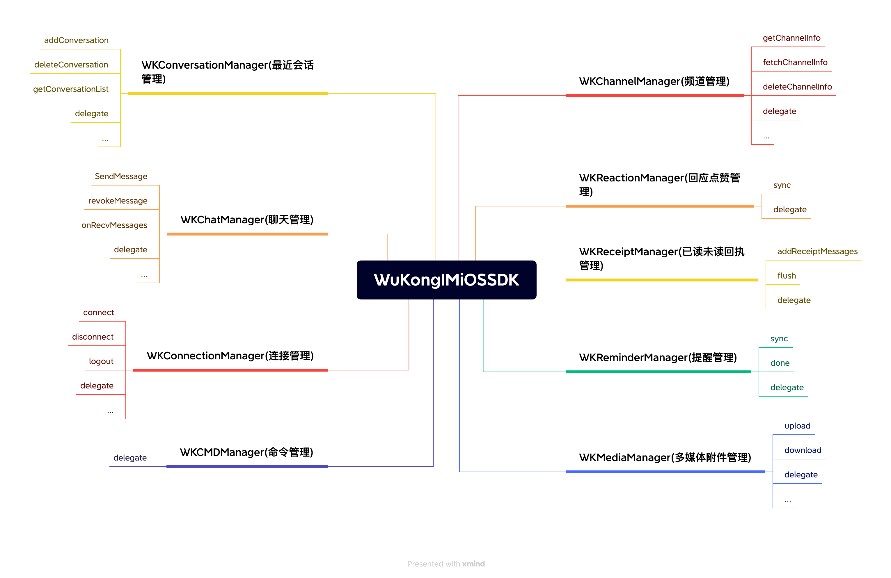

# 说明

## 设计理念

像设计书的目录一样设计 api, 通过 WKSDK.shared.xxxManager 我们可以访问到所有需要的功能，例如发送消息 `[WKSDK.shared.chatManager sendMessage:xxx]`

## 结构说明



```objc

// 聊天管理者
// 负责消息相关的增删改查操作 比如发送消息，删除消息，撤回消息，聊天消息的监听等等
WKSDK.shared.chatManager

// 连接管理者
// 负责与IM建立连接或断开连接 监听IM连接状态等等
WKSDK.shared.connectionManager

// 频道管理者
// 负责频道数据的获取和缓存和一些频道的设置，比如置顶，免打扰，禁言等等
WKSDK.shared.channelManager

// 最近会话管理者
// 负责维护最近会话的相关数据，比如未读数量，草稿，@我，最后一条消息等等
WKSDK.shared.conversationManager

// 回应管理者
// 负责点赞数据的维护
WKSDK.shared.reactionManager

// cmd管理者
// 负责监听服务端下发的命令类的消息
WKSDK.shared.cmdManager

// 消息回执管理者
// 负责维护消息的已读未读状态
WKSDK.shared.receiptManager

// 提醒管理者
// 负责最近会话的提醒项，比如 有人@我，入群申请等等 还可以自定义一些提醒，比如类似微信的 [红包] [转账] 列表都会有提醒
WKSDK.shared.reminderManager

// 多媒体管理者
// 负责消息的多媒体文件的上传下载，比如图片消息，视频消息等等带附件的消息
WKSDK.shared.mediaManager

```

### SDK 与已有 APP 交互原则


sdk 与已有 APP 交互的整体流程就是 已有 APP 调用 SDK 对应的方法->产生数据变化->通过 delegate 回调给已有 APP

比如常用的发送消息->消息状态变化->通知已有 APP 更新 UI 上的发送状态标记

```objc

// 通过操作chatMananger发送消息
[WKSDK.shared.chatManager sendMessage:xxx]

// chatManagerDelegate 通过chatManager的chatManagerDelegate监听消息的状态变化
-(void) onMessageUpdate:(WKMessage*) message  {
    if(message.status == SUCCESS) {
      [self updateItemUIWithSuccess:message];
    }else {
       [self updateItemUIWithFail:message];
    }
}

```