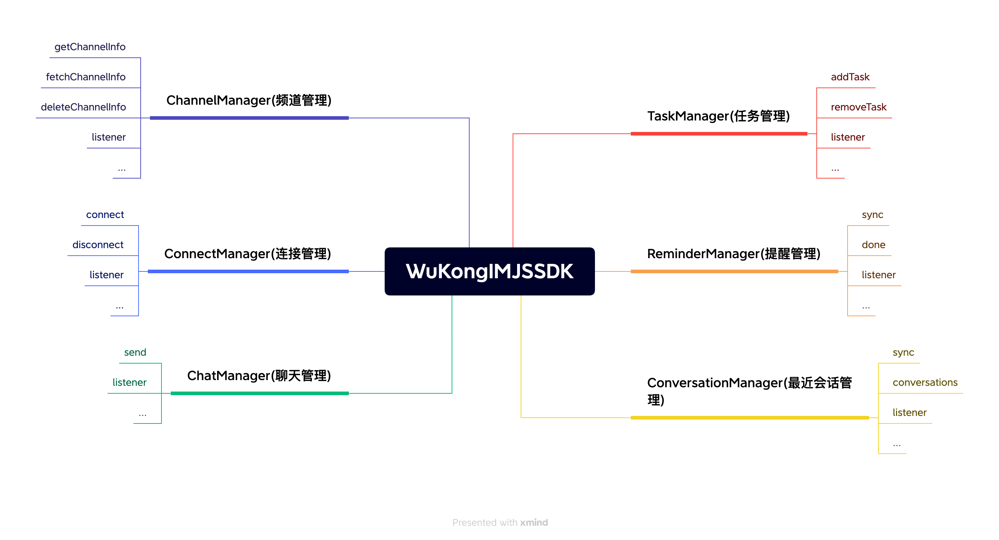

# 说明


## 设计理念
像设计书的目录一样设计 api, 通过 WKSDK.shared().xxxManager 我们可以访问到所有需要的功能，例如发送消息 WKSDK.shared().chatManager.send(xxx)

## 结构说明



``` js
// 聊天管理者
// 负责消息相关的增删改查操作 比如发送消息，删除消息，撤回消息，聊天消息的监听等等
WKSDK.shared().chatManager;

// 连接管理者
// 负责与IM建立连接或断开连接 监听IM连接状态等等
WKSDK.shared().connectionManager;

// 频道管理者
// 负责频道数据的获取和缓存和一些频道的设置，比如置顶，免打扰，禁言等等
WKSDK.shared().channelManager;

// 最近会话管理者
// 负责维护最近会话的相关数据，比如未读数量，草稿，@我，最后一条消息等等
WKSDK.shared().conversationManager;

// 提醒管理者
// 负责最近会话的提醒事项维护
WKSDK.shared().reminderManager;
```