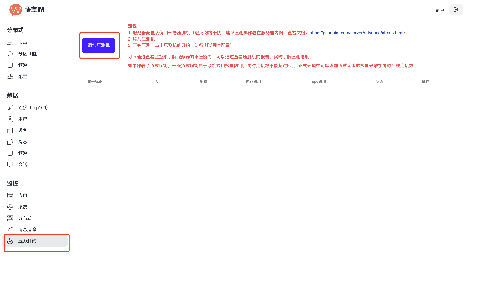
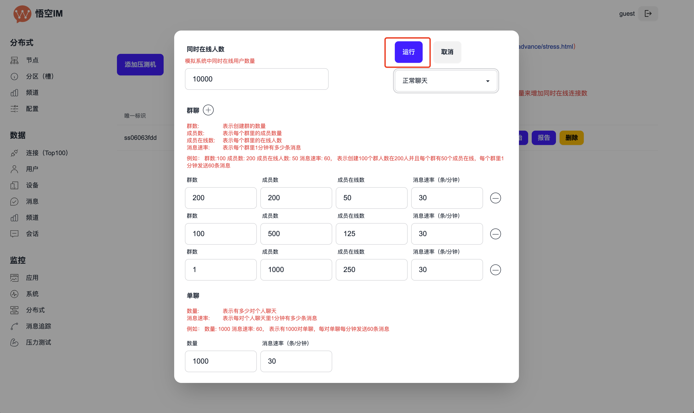
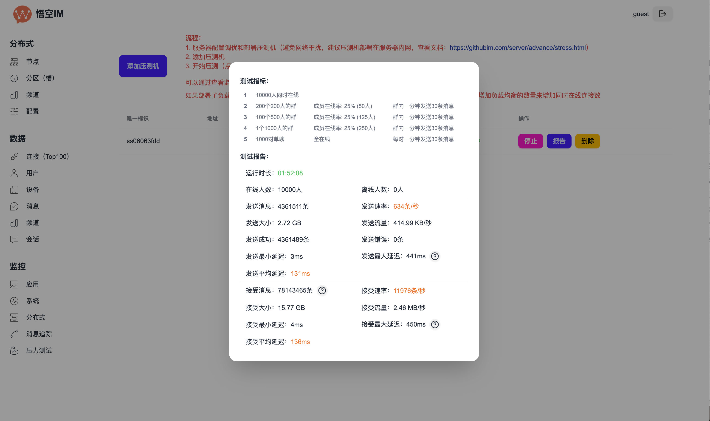

# 压力测试

`WuKongIM压测功能只有大于或等于v2.0.7-20241104的版本才有`

## 服务器开启压力配置

WuKongIM服务新增配置


::: code-group


```yaml[wk.yaml]
...
stress: true
intranet:
    tcpAddr: "ip:port"
...
```

```yaml[environment]
WK_STRESS=true
WK_INTRANET_TCPADDR=ip:port
```

:::


配置说明：

`stress`

> 开启压测配置，只有开启后服务器才能被压测

`intranet.tcpAddr`

> 没配置负载均衡（单机模式）：`tcpAddr` 为WuKongIM服务器的内网ip + 5100端口，例如： 192.168.1.12:5100

> 配置了负载均衡（分布式模式）：`tcpAddr` 为负载均衡的内网ip + 15100端口， 例如：192.168.1.11:15100


## 安装压测机

**配置**

压测机需要内存比较大的服务器，建议4核16G或以上。


**安装**

1. 下载执行文件

::: code-group

``` bash [amd64]
sudo curl -L -o wkstress https://github.com/WuKongIM/StressTester/releases/download/v1.0.0/wkstress-linux-amd64
```

``` bash [arm64]
sudo curl -L -o wkstress https://github.com/WuKongIM/StressTester/releases/download/v1.0.0/wkstress-linux-arm64
```

:::


2. 修改执行文件权限

``` bash
sudo chmod +x wkstress
```

**运行**

```bash
nohup ./wkstress &
```

`端口为：9466`

**停止**

```bash
kill -9 $(lsof -t -i :9466)
```


## 开始压测

1. 添加压测机器

地址为: http://ip:9466  ip为压测机器的`内网ip`，如下图



2. 设置压测指标并运行，如下图




## 查看压测报告



报告字段解释：

**测试指标**

```
表示当前压测机测试的压测数据。
```

**测试报告**

```
运行时长：开始压测的持续时长
在线人数：模拟的同时在线人数
离线人数：模拟的在线人数，已经掉线的人数
发送消息：向服务器发送的消息总数量
发送速率：向服务器发送消息的当前速率
发送大小：发送消息的总大小
发送流量：发送消息的当前带宽实时流量
发送成功：向服务器发送消息后，收到服务器的响应成功的消息数量
发送错误：向服务器发送消息后，收到服务器的响应失败的消息数量
发送最小延迟：发送消息到服务器至收到服务器响应的来回耗时的最小值称为最小延迟
发送最大延迟：发送消息到服务器至收到服务器响应的来回耗时的最大值称为最大延迟
发送平均延迟：发送消息到服务器至收到服务器响应的来回耗时的平均值称为平均延迟
接收消息：收到消息的总数量
接收速率：收到消息的当前速率
接收大小：收到消息的总大小
接收流量：收到消息的当前带宽流量
接收最小延迟：发送消息到订阅者收到消息的最小耗时称为最小延迟
接收最大延迟：发送消息到订阅者收到消息的最大耗时称为最大延迟
接收平均延迟：发送消息到订阅者收到消息的平均耗时称为平均延迟
```

## 报告分析

核心指标分析

### 发送速率

也称之为发送消息并发数

描述：

> 此指标能呈现服务器能同时处理消息的并发能力, 数值越大，服务器的并发能力越强，能同时支持同一秒发送消息的人数越多。

根据如下算法，可以大概推算出`发送速率`和`日活用户数（DAU）`的关系

```
峰值并发数=DAU×峰值活跃用户比例×每用户发送速率
```
假设：
* 每日活跃用户数（DAU）：10万人，
* 峰值在线用户比例：大概是10%～20%。取15%
* 每分钟用户的发送速率 ～= 6条/分钟 = 0.1条/秒

则：

`峰值发消息并发数=100,000×0.15×0.1=1500条/秒`

 结论：

`发送速率在1500条/秒左右，大约能支持10万日活用户数。`

> 通过调整峰值在线用户比例和每用户发送速率大概能推算出自己的峰值发送速率，间接的可以通过压测机来验证服务器是否能达标自己的用户日活要求。

### 接收速率

也称之为接收消息并发数

描述：

> 此指标能呈现服务器能同时投递消息的能力, 数值越大，服务器的并发能力越强，能同时支持的单聊，群聊数越多。

如果是群聊场景或广播场景，一条消息可能会被多个用户接收。因此接收并发数也需要计算：

```
峰值接收消息并发数=峰值活跃群数量×每群的平均在线成员数量×每群内的消息发送频率
```

假设：

* 每日活跃群聊数量：10,000个
* 每群平均在线成员数量：20人
* 峰值活跃群数量：大概是10%～20%。取15%
* 每群内的消息发送频率：0.5条/秒

则：

`峰值接收消息并发数=10,000 × 20 × 0.15 x 0.5 = 15,000条/秒`

结论：

`消息接收速率在15,000条/秒左右，大约能支持日活1万个每群在线成员数20人的群聊`

> 通过此公式 + 压测机 + 日活跃群聊数，能压测出需要的服务器资源配置。

### 发送成功和错误

`发送成功和失败`是指客户端发送消息开始到服务器收到并存储完成后返回给客户端成功与否的结果。

`此指标能体现服务器的健康程度，发送成功率越高说明系统越健康。`


### 发送和接收平均延迟

`此指标能观测出服务器的稳定性`

平均延迟越小系统越稳定。

### 发送成功和期望收到消息数量

`此指标能观测有没有漏消息`

期望收到消息数量，点击接受消息指标旁边的问号就能查看。

当停止压测后，再点击查看报告，如果报告里的发送成功消息数等于期望收到消息数量，则表示消息全部被订阅客户端接收到。

`注意：此指标只有在 发送消息 = 发送成功，的时候期望收到消息的指标才有意义`

### 发送流量和接收流量

`此指标能观测出服务器需要支持的带宽的大小`


## 常见问题

1. 长连接上不去，达到几千后，连接数就不再增加了，是什么原因？

```
 回答：修改WuKongIM和nginx服务器的文件描述符限制

 查看当前文件描述符限制：

ulimit -n

临时修改文件描述符限制：

ulimit -n 100000

永久修改文件描述符限制： 编辑 /etc/security/limits.conf 文件，加入以下行：

* soft nofile 100000
* hard nofile 100000

修改nginx配置里的worker_connections，可以改为40960左右

 ```


