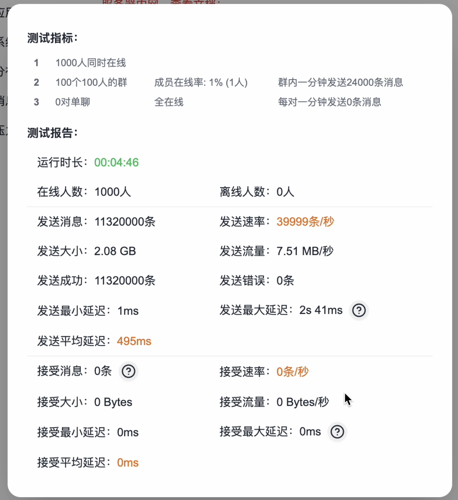
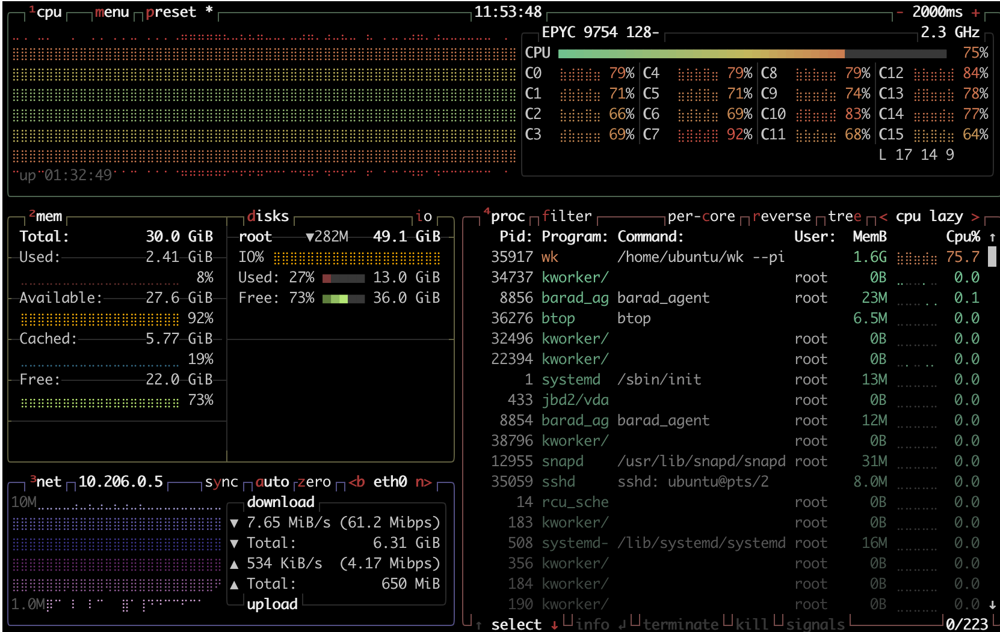
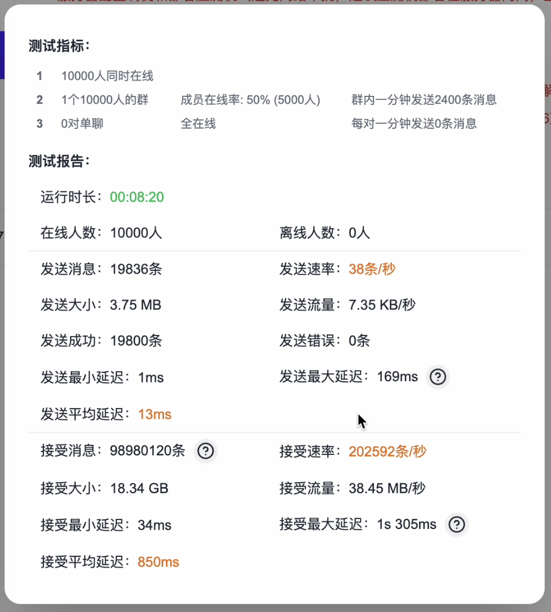
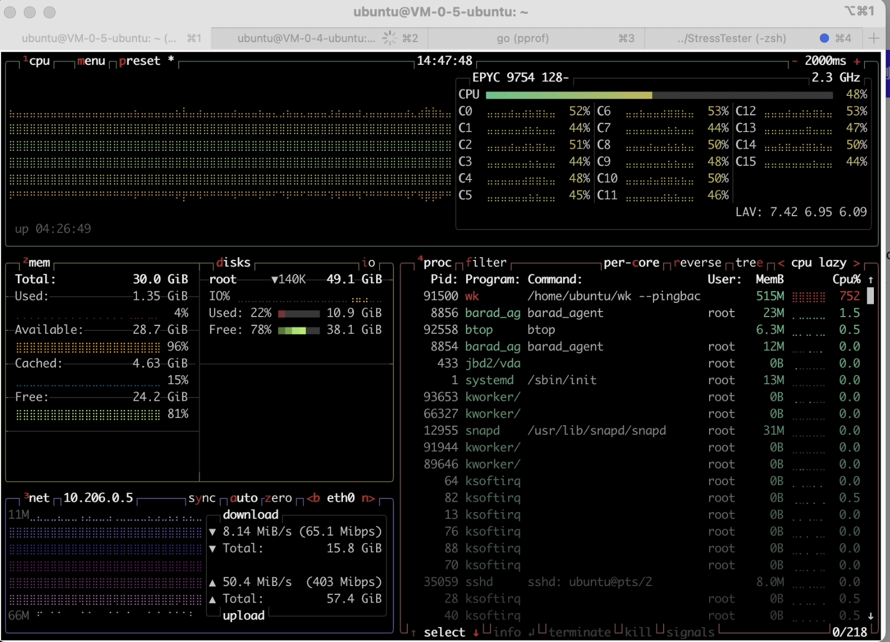
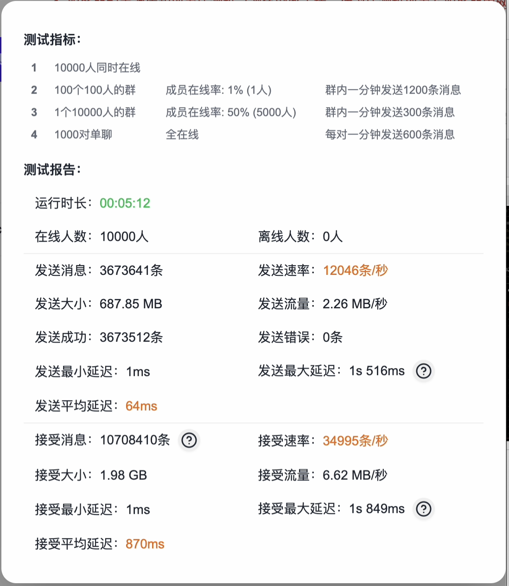
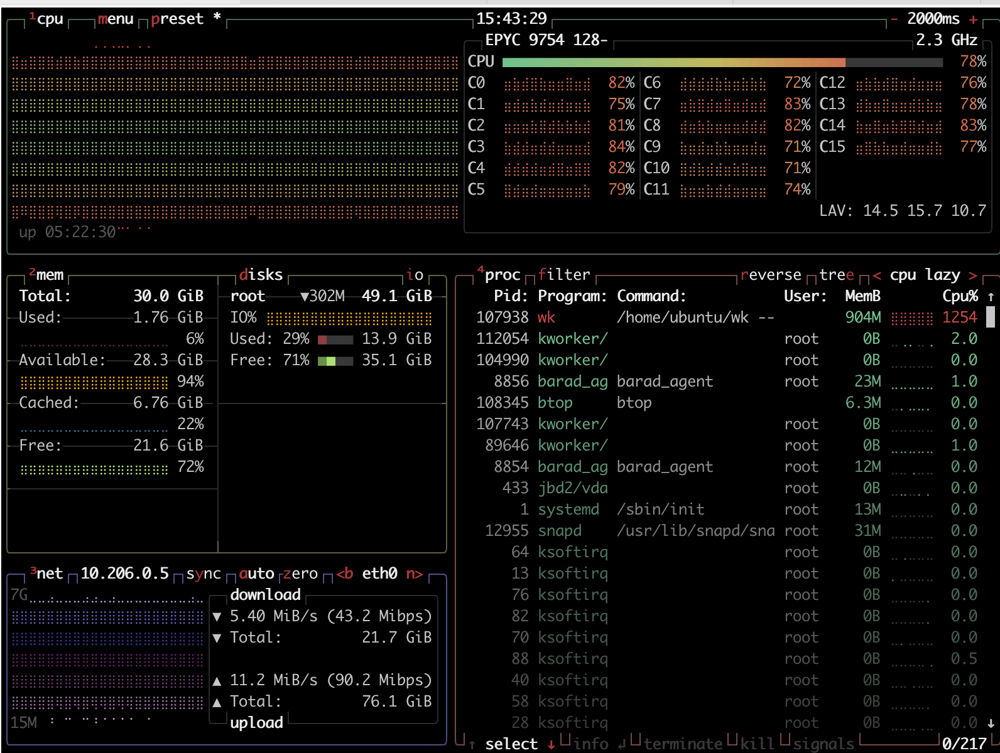
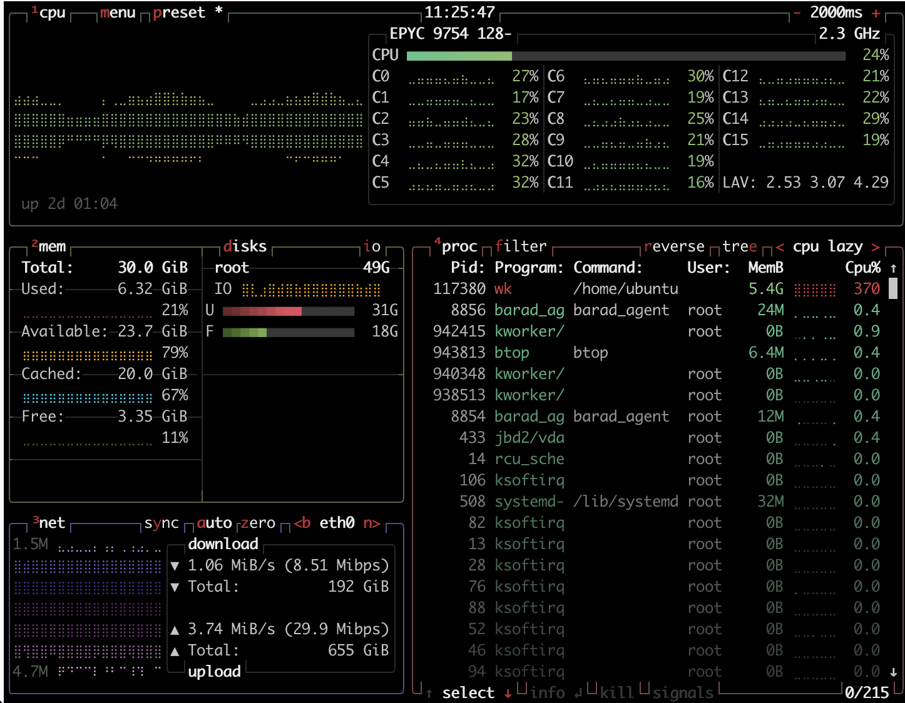
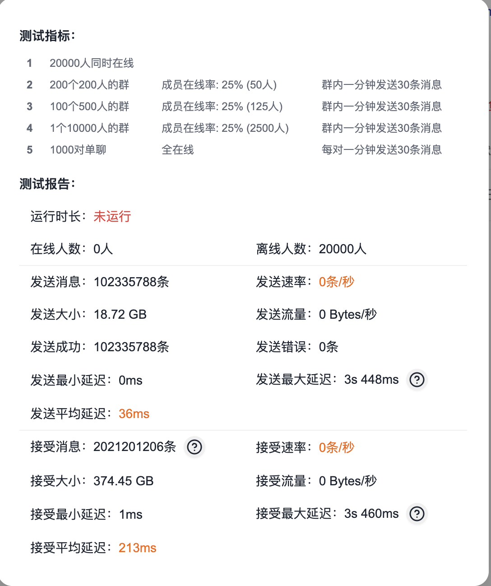

# 压力测试报告 （单机）

## 前序

一个通讯系统是否优秀，主要看四个指标`高性能`,`稳定性`，`可靠性`，`有序性`。

高性能：极限压测消息发送并发和消息接收并发。

稳定性：测试在高并发下长时间运行，cpu，内存是否稳定

可靠性：测试是否丢消息。

有序性：测试消息是否乱序。

## 测试

所有的压测结果按照压测内容和硬件都能在自己服务器上复现。

`WuKongIM测试的版本：v2.1.2-20250120`

### 硬件信息

 | 资源说明          | 硬件   | 数量     |
| :-------------- | :----- | :------- |
| WuKongIM服务端    | Ubuntu 22.04 LTS SA5.4XLARGE32 (标准型SA5, 16核32GB）, 50G增强型SSD云硬盘 基准性能：4300IOPS  | 1台 |
| 压测机 | Ubuntu 22.04 LTS SA5.4XLARGE32 (标准型SA5, 16核32GB）, 50G增强型SSD云硬盘 基准性能：4300IOPS   | 1台 |

### 性能测试

`通讯系统是否高性能核心指标：发送消息并发数和接收消息并发数（通俗讲：系统一秒钟最大能处理多少消息的发送和投递）`

#### 发送速率测试

测试内容

 | 内容          | 在线   | 发送速率     |
| :-------------- | :----- | :------- |  
| 100个100人的群 | 每群1人在线  | 每群一分钟24000条消息 

`总发送速率：100 * (24000/60) = 40000条/秒`

测试截图

 | 测试内容          | 系统top信息     |
| :-------------- | :----- |  
|  |  

<video controls width="600">
  <source src="./send.mp4" type="video/mp4">
  您的浏览器不支持视频播放。
</video>

测试结果：

 | 指标          | 值   | 
| :-------------- | :----- | 
| 发送消息总数 | `2千万条`  |
| 发送消息并发 | `4万/秒`  |
| 发送平均延迟 | `400ms～600ms`  |
| 内存占用 | `1～2G`  |
| CPU占用 | `60～80%`  |

总结：发送并发达到`4万/秒`的情况下，消息发送平均延迟还在毫秒内，内存稳定，CPU预期内，爆赞👍

（如果您对`4万/秒`没概念，拿mysql来说， 16核服务器下写入性能大概3000～8000/秒左右，`4万/秒`接近redis开启AOF模式下的写入性能）

#### 接收速率测试

测试内容

 | 内容          | 在线   | 发送速率     |
| :-------------- | :----- | :------- |
| 1个万人群         | 群成员在线数量5000人（50%）  | 一分钟2400条消息    |

`总接收速率：5000 * (2400/60) = 20万条/秒`

测试截图

 | 测试内容          | 系统top信息     |
| :-------------- | :----- |  
|  |  

<video controls width="600">
  <source src="./收消息性能压测.mp4" type="video/mp4">
  您的浏览器不支持视频播放。
</video>

测试结果：

 | 指标          | 值   | 
| :-------------- | :----- | 
| 接受消息总数 | `1亿条`  |
| 接受消息并发 | `20万/秒`  |
| 接受平均延迟 | `1s以下`  |
| 内存占用 | `1～2G`  |
| CPU占用 | `40～60%`  |

总结：

在压榨服务器的性能下，接收并发达到`20w/s`,性能非常强劲。

#### 混合测试

测试内容

 | 内容          | 在线   | 发送速率     |
| :-------------- | :----- | :------- |
| 1000对单聊        | 1000人在线  | 每对一分钟600条消息    |
| 100个100人的群 | 每群1人在线  | 每群一分钟1200条消息 
| 1个1万人群         | 群成员在线数量5000人  | 一分钟300条消息    |

`总发送速率：1000 * (600/60) + 100 * (1200/60) + 1 * (600/60)  = 12010条/秒`

`总接收速率：1000 * (600/60) + 100 * (600/60) + 1 * 5000 * (300/60) = 36000条/秒`

测试截图

 | 测试内容          | 系统top信息     |
| :-------------- | :----- |  
|  |  

<video controls width="600">
  <source src="./混合测试.mp4" type="video/mp4">
  您的浏览器不支持视频播放。
</video>

测试结果：

 | 指标          | 值   | 
| :-------------- | :----- | 
| 发送消息数 | `～400万条`  |
| 发送并发 | `1.2万条/秒`  |
| 发送平均延迟 | `10～500ms`  |
| 接受消息数 | `～1000万条`  |
| 接受并发 | `3.6万条/秒`  |
| 接受平均延迟 | `1s以下`  |
| 内存占用 | `1～2G`  |
| CPU占用 | `70～80%`  |

总结：

在压榨服务器的性能下，发送并发和接收并发分别达到了 `1.2w/s`和`3.6w/s` 表现非常优秀。

### 稳定性测试 

测试系统是否能在消息低延迟下稳定运行

#### 测试目标

测试在发送和接收并发高频的情况下，系统能够平稳运行，消息平均延迟在理想状态（500ms以下）。

#### 测试内容

`两万人同时在线`

 | 内容          | 在线   | 发送速率     |
| :-------------- | :----- | :------- |
| 1000对单聊        | 1000人在线  | 每对一分钟30条消息    |
| 200个200人的群 | 每群50（25%）人在线  | 每群一分钟30条消息 |
| 100个500人的群         | 每群125（25%）人在线  | 每群一分钟30条消息   |
| 1个1万人群         | 群成员在线数量2500人（25%）  | 每群一分钟30条消息    |

持续时间：24小时

#### 测试结果

结果截图

 | 测试内容          | 系统top信息     |
| :-------------- | :----- |  
|  |  

<video controls width="600">
  <source src="./稳定性测试2.mp4" type="video/mp4">
  您的浏览器不支持视频播放。
</video>

核心指标

 | 内容          | 结果   | 
| :-------------- | :----- | 
| 持续测试时间 | 48小时  |  
| 同时在线    |  20000 |  
| 发送条数        |  1亿 |    
| 接收条数        |  20亿 |    
| 成功率 |   100% |  |
| 发送速率 |  600条/秒左右 |   
| 接收速率 |  15000条/秒左右 |  |
| 发送平均延迟 | 1～30ms  |   
| 接收平均延迟 | 1～200ms  |  
| 内存 | 5G左右  |  
| CPU | 保持在20%左右  |  

总结

16核32G的服务器，在大量群聊和单聊高频发消息的状态下，CPU稳定在20%左右，内存稳定在4-5G左右，消息平均延迟都在毫秒级别内，表现优异

### 可靠性测试

测试消息是否丢失

#### 测试目标

大量收发消息下，所有接收者能全部接收到消息。

#### 测试内容

 | 内容          | 在线   | 发送速率     |
| :-------------- | :----- | :------- |
| 1000对单聊        | 1000人在线  | 每对一分钟30条消息    |
| 200个200人的群 | 每群50（25%）人在线  | 每群一分钟30条消息 |
| 100个500人的群         | 每群125（25%）人在线  | 每群一分钟30条消息   |
| 1个1万人群         | 群成员在线数量2500人（25%）  | 每群一分钟30条消息    |

持续时间：24小时

#### 测试结果

结果截图

 | 测试内容          |  预期收到消息     |
| :-------------- |  :----- |
|  |  

<video controls width="600">
  <source src="./稳定性测试2.mp4" type="video/mp4">
  您的浏览器不支持视频播放。
</video>

核心指标

 | 内容          | 结果   | 
| :-------------- | :----- | 
| 同时在线    | 20000 |  
| 发送条数        |  102335788条 |    
| 接收条数        | 2021201206条|  
| 成功率 |    100%  |  
| 期望接收消息数量 | 2021201206条  |  
| 实际接收消息数量 | 2021201206条 | 

总结：

经过大量消息的收发，实际接收消息数与程序根据测试数据计算出来的接收消息数完全一致。即发送超过1亿条消息，所有在线接收者都完全接收。充分证明了`WuKongIM`的可靠性。

### 有序性测试

测试消息是否乱序

#### 测试目标

在一个频道内快速发送消息，看接收者的顺序是否与发送者的一致

#### 测试内容

 | 内容          | 在线   | 发送速率     |
| :-------------- | :----- | :------- |
| 1对单聊        | 2人在线  | 快速发送消息    |

#### 测试结果

测试视频

<video controls width="600">
  <source src="./顺序性测试.mp4" type="video/mp4">
  您的浏览器不支持视频播放。
</video>

总结

一个用户快速给另外一个用户快速发送消息，接受者与发送者消息顺序完全一致。