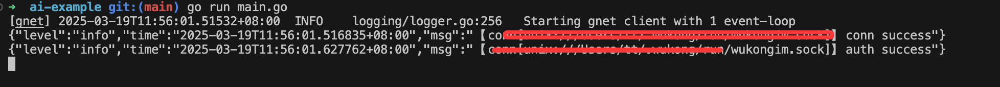

# 插件开发

目前插件开发只支持Go语言

开发插件需要依赖`WuKongIM`的插件库 [Go PDK](https://github.com/WuKongIM/go-pdk)。

## 开发插件

以下内容的完整源码：https://github.com/WuKongIM/plugins/blob/main/ai-example/main.go

### 定义插件结构体

```go
// 定义插件的配置结构体
type Config struct {
	Name string `json:"name" label:"AI名字"` // json为配置项名称，label为WuKongIM后台显示的配置项名称
}

// 插件结构体
type AIExample struct {
	Config Config // 插件的配置，名字必须为Config, 声明了以后，可以在WuKongIM后台配置，WuKongIM后台配置后会自动填充Config的数据，从而在函数里可以直接使用Config里的属性
}

// 创建一个插件对象
func New() interface{} {
	return &AIExample{}
}
```

### 定义插件函数

```go
// 收到消息
func (a *AIExample) Receive(c *pdk.Context) {
    // 获取发送消息内容
	text := a.getText(c)

	// 编码消息
	data, _ := json.Marshal(map[string]interface{}{
		"type":    1,
		"content": fmt.Sprintf("我是%s,收到您的消息：%s", a.Config.Name, text),
	})

    // 回复消息
	c.Reply(data)
}
```
其他函数见下方的函数说明


### 启动插件

```go
func main () {
  pdk.RunServer(New, "wk.plugin.ai-example", pdk.WithVersion("0.0.1"), pdk.WithPriority(1))
}
```

## 调试插件

### 源码启动单机WuKongIM

下载`WuKongIM`源码 https://github.com/WuKongIM/WuKongIM

进入源码根目录，执行:

```go
go run main.go --config exampleconfig/single.yaml
```

### 启动插件

进入插件源码根目录，执行

```go
go run main.go
```
插件出现如下日志说明与`WuKongIM`建立连接成功



### 绑定用户(全局插件不需要此步骤)

在`WuKongIM后台 --> AI --> 添加AI` 即可实现绑定。


给绑定的uid发送消息即可调试插件的`Receive`方法

## 函数说明

### Setup()

插件启动时调用

### Route(c *pdk.Route) 

路由函数，插件可以定义自己的http请求，比如

```go
func (s *Hello) Route(c *pdk.Route) {
	// http://127.0.0.1:5001/plugins/[插件编号]/hello
	c.GET("/hello", s.sayHello)
}
```

通过`http://127.0.0.1:5001/plugins/[插件编号]/hello` 就可以访问到插件提供的http服务

源码参考：https://github.com/WuKongIM/plugins/blob/main/hello/hello.go

### Receive(c *pdk.Context)

收到给插件发送的消息时，`WuKongIM`会调用插件此函数 （此函数只作用于绑定的用户）

### Send(c *pdk.Context)

消息发送前`WuKongIM`会调用插件此函数，可以在此函数里改变消息内容 (全局函数)

### PersistAfter(c *pdk.Context)

消息存储后在扩散前，`WuKongIM`会调用插件的此函数，可以在此函数内对消息做数据分析，比如实现消息搜索功能（全局函数）

### ConfigUpdate()

 配置发生变化时调用

 ### Stop()

插件停止时调用
