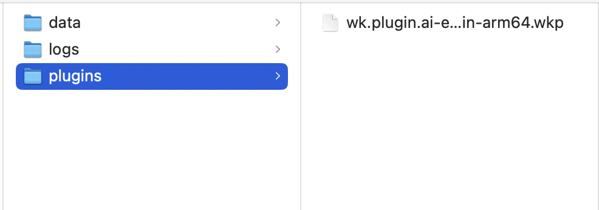
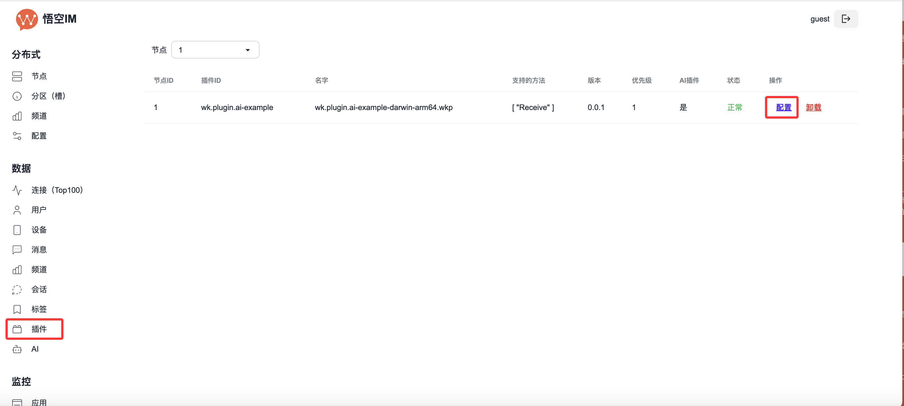
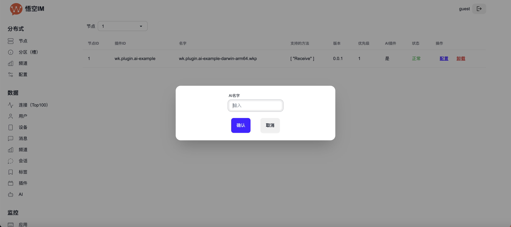
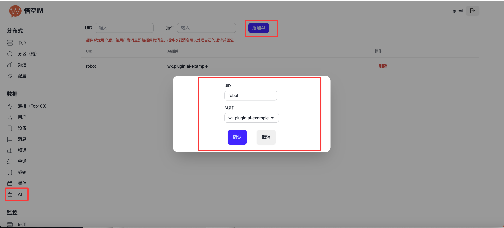
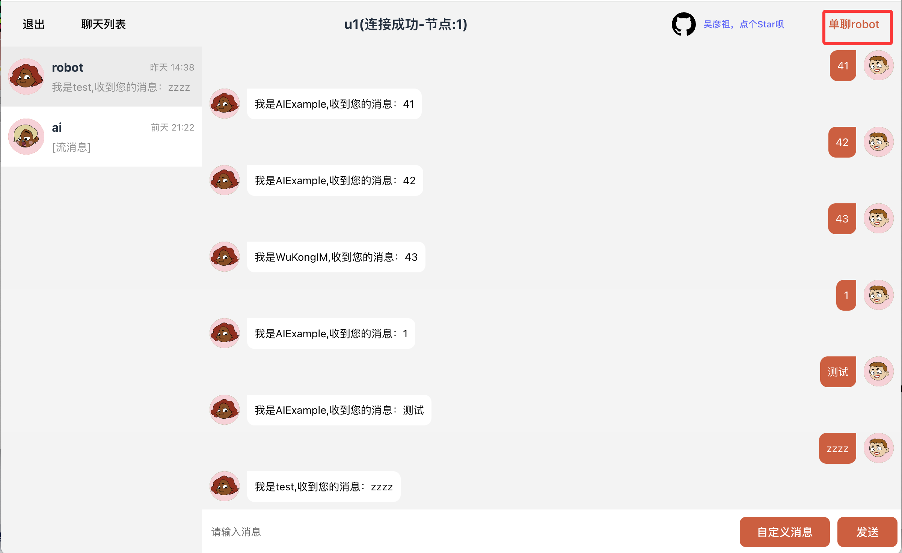
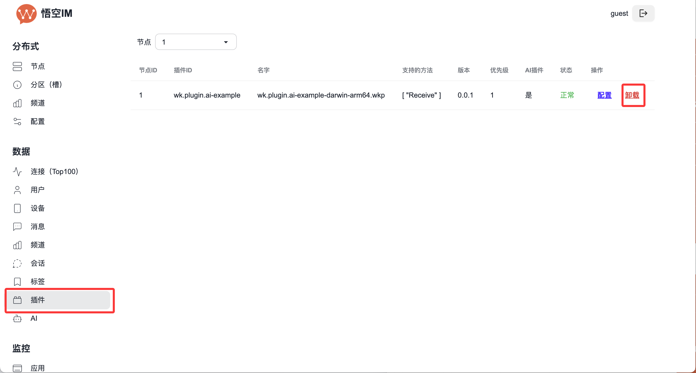

# 插件使用

`插件在WuKongIM 2.1.3或以上版本才支持`

## 安装插件

**下载插件**

从插件市场下载：[链接](/server/plugin/market)

**安装插件**

复制插件到`WuKongIM`数据目录下的`plugins`目录下即可完成安装

如果日志提示： permission denied，执行 `sudo chmod +x 插件名字` 来设置权限

**配置插件**

如果插件需要配置，在`WuKongIM`的管理后台插件列表里的操作将会显示配置按钮，点击按钮即可配置。

`配置内容根据插件不同而不同`

`注意guest用户没有权限配置插件`，权限设置参考文档：https://githubim.com/server/config/auth.html

## 调用插件

如果是全局插件，当系统中有消息发送时，插件就会被调用。

如果是AI插件，需要将AI插件绑定到用户UID上，这里主要讲AI插件怎么绑定用户UID。

在`WuKongIM后台 --> AI --> 添加AI` 即可实现绑定。

插件绑定后，给此用户发消息也会将消息发送给插件，插件可以做出回应。

比如我们绑定，AI案例插件`wk.plugin.ai-example`到用户`robot`,给robot发消息，AI插件即可做出回应。

## 卸载插件

`WuKongIM --> 插件 --> 卸载`

