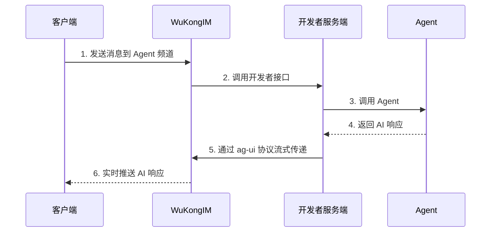

# AI Agent 支持

## 概述

WuKongIM 原生支持 AI Agent 功能，通过集成 [ag-ui 协议](https://docs.ag-ui.com/introduction) 实现流式 AI 对话体验。开发者可以轻松构建智能聊天机器人、AI 助手等应用，为用户提供自然流畅的 AI 交互体验。

## 工作流程

### 流程详解

1. **用户发送消息**：客户端用户向 WuKongIM 的 Agent 频道发送消息
2. **触发回调**：WuKongIM 接收到消息后，调用开发者配置的服务端接口
3. **调用 Agent**：开发者服务端将用户消息发送给 Agent 大模型进行处理
4. **获取响应** Agent 大模型生成 AI 响应内容
5. **流式传递**：开发者服务端通过 WuKongIM 的 ag-ui 协议接口将响应流式传递给客户端
6. **实时展示**：客户端实时接收并展示 AI 响应内容

## ag-ui 协议支持

WuKongIM 原生支持 [ag-ui 协议](https://docs.ag-ui.com/introduction)，这是一个专为 AI 应用设计的用户界面协议。
