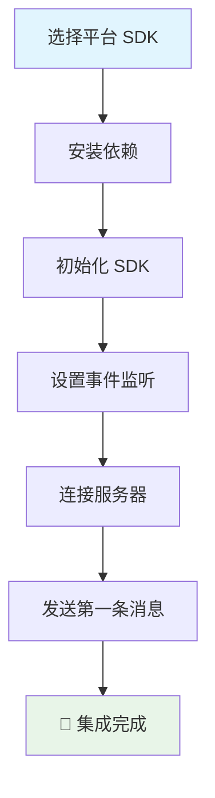

## 什么是 WuKongEasySDK

WuKongEasySDK 是专为快速集成设计的轻量级即时通讯 SDK 系列。它提供了跨平台的统一 API 设计，让开发者能够在 5 分钟内为任何应用添加实时聊天功能。

<Note>
  **设计理念**：简化集成复杂度，专注核心功能，提供开箱即用的聊天体验。
</Note>

## 核心优势

### 🚀 极速集成
- **5分钟上手**：从安装到发送第一条消息只需 5 分钟
- **零配置启动**：开箱即用，无需复杂的初始化配置
- **自动化处理**：内置连接管理、自动重连、消息同步等机制

### 📱 全平台覆盖
- **Web/JavaScript**：支持现代浏览器（Chrome 60+、Firefox 55+、Safari 11+、Edge 79+）
- **iOS**：支持 iOS 12.0 或更高版本，Xcode 12.0+，Swift 5.0+
- **Android**：支持 Android 5.0 (API level 21) 或更高版本，Kotlin 1.5.0+
- **Flutter**：支持 Flutter 3.0.0 或更高版本，Dart 2.17.0+

### 💡 统一设计
- **一致的 API**：所有平台使用相同的方法名和参数结构
- **现代异步模式**：JavaScript Promise、Swift async/await、Kotlin coroutines、Dart async/await
- **事件驱动架构**：统一的事件监听和处理机制


### 集成流程概览



## 跨平台代码示例

以下是各平台的基本集成代码示例，展示了 WuKongEasySDK 的统一 API 设计：

<CodeGroup>
```javascript Web/JavaScript
import { WKIM, WKIMChannelType, WKIMEvent } from 'easyjssdk';

// 1. 初始化 SDK
const im = WKIM.init("ws://your-server.com:5200", {
    uid: "your_user_id",
    token: "your_auth_token"
});

// 2. 监听消息
im.on(WKIMEvent.Message, (message) => {
    console.log("收到新消息:", message);
});

// 3. 连接服务器
await im.connect();

// 4. 发送消息
const result = await im.send("friend_user_id", WKIMChannelType.Person, {
    type: 1,
    content: "Hello from Web!"
});
```

```swift iOS
import WuKongEasySDK

// 1. 初始化 SDK
let config = WuKongConfig(
    serverUrl: "ws://your-server.com:5200",
    uid: "your_user_id",
    token: "your_auth_token"
)
let easySDK = WuKongEasySDK(config: config)

// 2. 监听消息
easySDK.onMessage { message in
    print("收到新消息:", message)
}

// 3. 连接服务器
try await easySDK.connect()

// 4. 发送消息
let result = try await easySDK.send(
    to: "friend_user_id",
    channelType: .person,
    payload: MessagePayload(type: 1, content: "Hello from iOS!")
)
```

```kotlin Android
import com.githubim.easysdk.*

// 1. 初始化 SDK
val config = WuKongConfig.Builder()
    .serverUrl("ws://your-server.com:5200")
    .uid("your_user_id")
    .token("your_auth_token")
    .build()
val easySDK = WuKongEasySDK.getInstance()
easySDK.init(this, config)

// 2. 监听消息
easySDK.addEventListener(WuKongEvent.MESSAGE, object : WuKongEventListener<Message> {
    override fun onEvent(message: Message) {
        Log.d("WuKong", "收到新消息: $message")
    }
})

// 3. 连接服务器
lifecycleScope.launch {
    easySDK.connect()
}

// 4. 发送消息
val result = easySDK.send(
    channelId = "friend_user_id",
    channelType = WuKongChannelType.PERSON,
    payload = MessagePayload(type = 1, content = "Hello from Android!")
)
```

```dart Flutter
import 'package:wukong_easy_sdk/wukong_easy_sdk.dart';

// 1. 初始化 SDK
final config = WuKongConfig(
  serverUrl: "ws://your-server.com:5200",
  uid: "your_user_id",
  token: "your_auth_token",
);
final easySDK = WuKongEasySDK.getInstance();
await easySDK.init(config);

// 2. 监听消息
easySDK.addEventListener(WuKongEvent.message, (Message message) {
  print("收到新消息: $message");
});

// 3. 连接服务器
await easySDK.connect();

// 4. 发送消息
final result = await easySDK.send(
  channelId: "friend_user_id",
  channelType: WuKongChannelType.person,
  payload: MessagePayload(type: 1, content: "Hello from Flutter!"),
);
```
</CodeGroup>

<Note>
  **统一设计**：注意所有平台都使用相同的方法名（init、connect、send）和相似的参数结构，这使得跨平台开发更加容易。
</Note>

## 使用场景指南

### ✅ 推荐使用 WuKongEasySDK 的场景

<Tabs>
  <Tab title="项目类型">
    - **快速原型开发**：需要快速验证聊天功能的原型项目
    - **MVP 项目**：最小可行产品，快速上线验证市场需求
    - **简单聊天应用**：功能需求相对简单的聊天应用
    - **学习和演示**：学习即时通讯开发或产品功能演示
    - **内部工具**：企业内部沟通工具或客服系统
  </Tab>
  <Tab title="技术要求">
    - **开发时间紧张**：需要快速交付的项目
    - **团队技术栈简单**：团队对复杂 SDK 集成经验有限
    - **标准功能需求**：使用标准的聊天功能即可满足需求
    - **跨平台一致性**：需要多平台保持一致的用户体验
    - **维护成本敏感**：希望降低后期维护和升级成本
  </Tab>
</Tabs>


## 立即开始

选择您的开发平台，开始 5 分钟快速集成之旅：

<CardGroup cols={2}>
  <Card title="Web" icon="globe" href="/zh/sdk/easy/javascript/getting-started">
    Web 应用和 H5 页面快速集成
  </Card>
  <Card title="iOS" icon="apple" href="/zh/sdk/easy/ios/getting-started">
    iOS 原生应用快速集成
  </Card>
  <Card title="Android" icon="android" href="/zh/sdk/easy/android/getting-started">
    Android 原生应用快速集成
  </Card>
  <Card title="Flutter" icon="flutter" href="/zh/sdk/easy/flutter/getting-started">
    Flutter 跨平台应用快速集成
  </Card>
</CardGroup>

<Tip>
  **选择建议**：如果您不确定选择哪个平台，建议从 Web EasySDK 开始，它可以快速验证功能并且容易调试。
</Tip>
