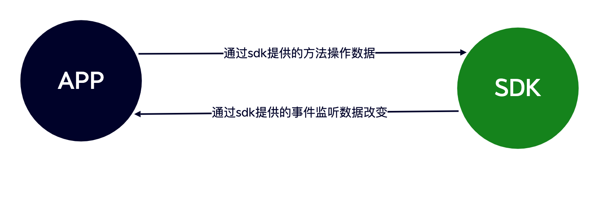

## 设计理念

为了让开发者更快更方便的使用 SDK，悟空 SDK 提供了一个唯一的入口来访问 SDK 中的所有功能。就像书籍的目录一样可以通过目录查找对应的内容。如连接 IM `WKIM.getInstance().getConnectionManager().connection()`

## 结构说明


SDK 常用功能介绍：

```java
// 消息管理器
// 负责消息的增删改查、新消息监听、刷新消息监听、消息入库、发送消息回执监听、监听同步某个聊天数据等
WKIM.getInstance().getMsgManager()

// 连接管理
// 负责IM的连接、断开、退出登录、监听连接状态、监听获取连接IP等
WKIM.getInstance().getConnectionManager()

// 频道管理
// 可获取Channel的信息，刷新Channel缓存，监听Channel更改[置顶、免打扰、禁言]、搜索Channel等
WKIM.getInstance().getChannelManager()

// 最近会话管理
// 获取最近聊天记录、刷新最近会话[新增聊天、红点改变]、监听移除某个会话、监听同步最近会话等
WKIM.getInstance().getConversationManager()

// 频道成员管理
// 获取Channel成员列表、设置成员备注、保存修改成员数据、监听刷新成员和移除成员等
WKIM.getInstance().getChannelMembersManager()

// 提醒管理
// 获取某个会话的提醒如：[有人@我] [入群申请] 等。还可自定义提醒项，如像 语音未读 等
WKIM.getInstance().getReminderManager()

// 命令管理
// 负责监听服务器下发的命令消息
WKIM.getInstance().getCMDManager()

// 机器人管理
// 可以获取机器人菜单、同步机器人菜单，查询菜单等
WKIM.getInstance().getRobotManager()
```

## SDK 与 APP 交互原则



SDK 与 APP 交互流程就是：APP 调用 SDK 提供的方法，SDK 处理完数据后通过事件将数据回调给 APP。如发送消息流程：APP 调用发送消息方法，SDK 将入库后的消息 push 给 APP

## 核心功能模块

### 消息管理 (MsgManager)
- 消息的增删改查操作
- 新消息监听和刷新消息监听
- 消息入库和状态管理
- 发送消息回执监听
- 同步聊天数据监听

### 连接管理 (ConnectionManager)
- IM 连接建立与断开
- 退出登录处理
- 连接状态监听
- 获取连接 IP 监听
- 网络状态处理

### 频道管理 (ChannelManager)
- 获取频道信息
- 刷新频道缓存
- 监听频道更改（置顶、免打扰、禁言）
- 搜索频道功能
- 频道设置管理

### 会话管理 (ConversationManager)
- 获取最近聊天记录
- 刷新最近会话（新增聊天、红点改变）
- 监听移除某个会话
- 监听同步最近会话
- 未读消息计数

### 频道成员管理 (ChannelMembersManager)
- 获取频道成员列表
- 设置成员备注
- 保存修改成员数据
- 监听刷新成员和移除成员
- 成员权限管理

### 提醒管理 (ReminderManager)
- 获取会话提醒（有人@我、入群申请等）
- 自定义提醒项（语音未读等）
- 提醒状态管理
- 提醒消息处理

### 命令管理 (CMDManager)
- 监听服务器下发的命令消息
- 命令消息处理
- 系统通知管理

### 机器人管理 (RobotManager)
- 获取机器人菜单
- 同步机器人菜单
- 查询菜单功能
- 机器人交互处理

## 开发优势

- **统一入口**：通过 `WKIM.getInstance()` 访问所有功能
- **模块化设计**：功能模块清晰分离，便于维护和扩展
- **事件驱动**：基于监听器模式的事件回调机制
- **高性能**：本地数据库缓存，优化网络请求
- **易于集成**：简洁的 API 设计，快速集成到现有 Android 项目
- **完整功能**：涵盖即时通讯的所有核心功能

## 下一步

了解了 Android SDK 的整体架构后，您可以：

1. [集成 SDK](/zh/sdk/wukongim/android/integration) - 开始集成 WuKongIM Android SDK
2. [基础功能](/zh/sdk/wukongim/android/base) - 学习 SDK 的基础配置和使用
3. [消息管理](/zh/sdk/wukongim/android/message) - 实现消息收发功能
4. [频道管理](/zh/sdk/wukongim/android/channel) - 管理频道和成员
5. [会话管理](/zh/sdk/wukongim/android/conversation) - 处理会话列表和未读消息
