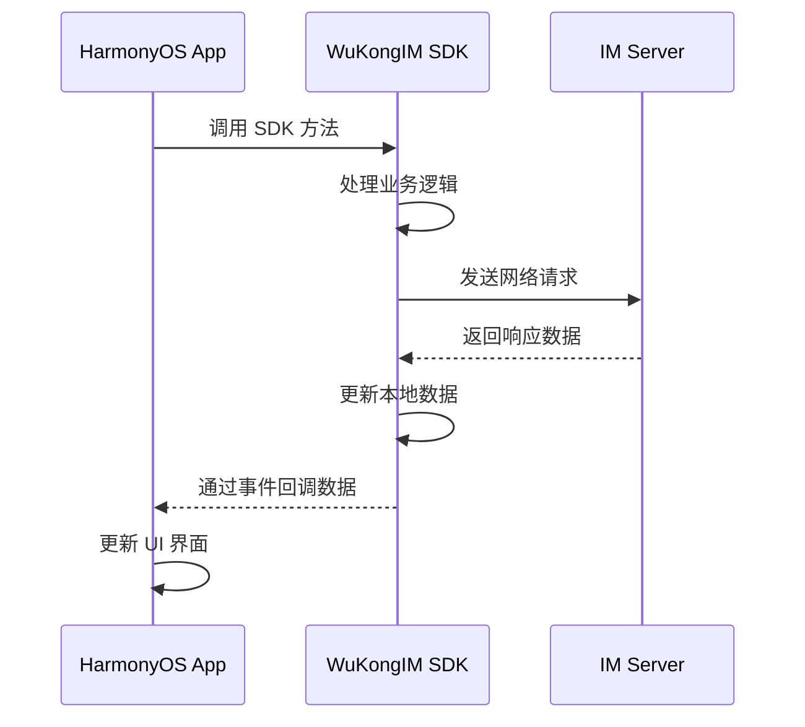

WuKongIM HarmonyOS SDK 为 HarmonyOS 应用提供了完整的即时通讯解决方案，采用模块化设计，让开发者能够快速集成和使用各种 IM 功能。

## 设计理念

为了让开发者更快更方便的使用 SDK，悟空 SDK 提供了一个唯一的入口来访问 SDK 中的所有功能。就像书籍的目录一样可以通过目录查找对应的内容。如连接 IM：

```typescript
WKIM.shared.connectionManager().connection();
```

这种设计让开发者能够：
- **统一入口**：通过 `WKIM.shared` 访问所有功能
- **模块化管理**：每个功能模块职责清晰
- **易于维护**：代码结构清晰，便于调试和维护

## 结构说明

WuKongIM HarmonyOS SDK 采用模块化架构设计，各个模块相互协作，为开发者提供完整的即时通讯功能：

```mermaid
graph TB
    A[WKIM.shared] --> B[MessageManager 消息管理器]
    A --> C[ConversationManager 会话管理器]
    A --> D[ConnectionManager 连接管理器]
    A --> E[ChannelManager 频道管理器]
    A --> F[ChannelMemberManager 频道成员管理器]
    A --> G[ReminderManager 提醒管理器]
    A --> H[CMDManager 命令管理器]
    
    B --> B1[消息收发]
    B --> B2[历史消息]
    B --> B3[消息监听]
    
    C --> C1[会话列表]
    C --> C2[未读消息]
    C --> C3[会话操作]
    
    D --> D1[连接状态]
    D --> D2[网络管理]
    D --> D3[重连机制]
    
    E --> E1[频道信息]
    E --> E2[频道操作]
    E --> E3[频道监听]
    
    F --> F1[成员列表]
    F --> F2[成员操作]
    F --> F3[权限管理]
    
    G --> G1[@提醒]
    G --> G2[自定义提醒]
    G --> G3[提醒管理]
    
    H --> H1[命令监听]
    H --> H2[命令处理]
    H --> H3[系统消息]
```

## 核心功能模块

### 连接管理器 (ConnectionManager)

负责IM的连接、断开、退出登录、监听连接状态等。

```typescript
// 连接管理
WKIM.shared.connectionManager()

// 主要功能
- 建立和维护连接
- 连接状态监听
- 自动重连机制
- 网络状态处理
- 登录登出管理
```

### 消息管理器 (MessageManager)

负责消息的增删改查、新消息监听、刷新消息监听、消息入库等。

```typescript
// 消息管理
WKIM.shared.messageManager()

// 主要功能
- 发送各种类型消息（文本、图片、语音、视频等）
- 接收和处理新消息
- 查询历史消息
- 消息状态管理
- 自定义消息类型
```

### 会话管理器 (ConversationManager)

负责会话的增删改查、会话列表监听、会话消息监听等。

```typescript
// 会话管理
WKIM.shared.conversationManager()

// 主要功能
- 获取会话列表
- 会话排序和筛选
- 未读消息统计
- 会话操作（删除、置顶等）
- 会话状态监听
```

### 频道管理器 (ChannelManager)

可获取Channel的信息，刷新Channel缓存，监听Channel更改[置顶、免打扰、禁言]等。

```typescript
// 频道管理
WKIM.shared.channelManager()

// 主要功能
- 获取频道信息
- 频道设置管理
- 频道状态监听
- 频道缓存管理
- 频道搜索
```

### 频道成员管理器 (ChannelMemberManager)

获取Channel成员列表、设置成员备注、保存修改成员数据、监听刷新成员和移除成员等。

```typescript
// 频道成员管理
WKIM.shared.channelMemberManager()

// 主要功能
- 获取成员列表
- 成员信息管理
- 成员权限控制
- 成员操作监听
- 成员搜索和筛选
```

### 提醒项管理器 (ReminderManager)

获取某个会话的提醒如：[有人@我] [入群申请] 等。还可自定义提醒项，如像 语音未读 等。

```typescript
// 提醒项管理
WKIM.shared.reminderManager()

// 主要功能
- @提醒管理
- 系统通知提醒
- 自定义提醒类型
- 提醒状态管理
- 提醒历史记录
```

### 命令管理器 (CMDManager)

负责监听服务器下发的命令消息。

```typescript
// 命令管理
WKIM.shared.cmdManager()

// 主要功能
- 系统命令监听
- 命令消息处理
- 业务指令分发
- 状态同步命令
- 自定义命令扩展
```

## SDK 与 APP 交互原则

WuKongIM HarmonyOS SDK 采用事件驱动的交互模式，确保数据流的清晰和可控：



### 交互流程说明

SDK 与 APP 交互流程就是 APP 调用 SDK 提供的方法，SDK 处理完数据后通过事件将数据回调给 APP。如发送消息流程：APP 调用发送消息方法，SDK 将入库后的消息 push 给 APP。

1. **APP 调用 SDK 方法**：应用通过 SDK 提供的 API 发起操作
2. **SDK 处理数据**：SDK 内部处理业务逻辑，包括数据验证、格式转换等
3. **网络通信**：SDK 与服务器进行数据交换
4. **事件回调**：SDK 通过事件机制将处理结果回调给应用
5. **UI 更新**：应用根据回调数据更新用户界面

### 事件监听示例

```typescript
@Entry
@Component
struct ChatPage {
  @State private messages: WKMsg[] = [];
  @State private connectionStatus: string = '未连接';
  
  aboutToAppear(): void {
    this.setupListeners();
  }
  
  aboutToDisappear(): void {
    this.removeListeners();
  }
  
  private setupListeners(): void {
    // 监听新消息
    WKIM.shared.messageManager().addNewMsgListener((msgs: WKMsg[]) => {
      this.messages = [...this.messages, ...msgs];
    });
    
    // 监听连接状态
    WKIM.shared.connectionManager().addConnectStatusListener((status: number, reasonCode?: number, connInfo?: ConnectionInfo) => {
      this.updateConnectionStatus(status);
    });
  }
  
  private removeListeners(): void {
    // 移除监听器
    WKIM.shared.messageManager().removeNewMsgListener();
    WKIM.shared.connectionManager().removeConnectStatusListener();
  }
  
  private updateConnectionStatus(status: number): void {
    switch (status) {
      case WKConnectStatus.success:
        this.connectionStatus = '已连接';
        break;
      case WKConnectStatus.connecting:
        this.connectionStatus = '连接中';
        break;
      case WKConnectStatus.fail:
        this.connectionStatus = '连接失败';
        break;
      default:
        this.connectionStatus = '未知状态';
    }
  }
  
  // 发送消息示例
  private sendMessage(text: string): void {
    const textContent = new WKTextContent(text);
    const channel = new WKChannel('channelId', WKChannelType.personal);
    
    // 调用 SDK 方法发送消息
    WKIM.shared.messageManager().send(textContent, channel);
    // SDK 会通过事件回调消息发送结果
  }
  
  build() {
    Column() {
      Text(`连接状态: ${this.connectionStatus}`)
        .fontSize(16)
        .margin({ bottom: 20 })
      
      List() {
        ForEach(this.messages, (message: WKMsg) => {
          ListItem() {
            Text(message.content)
              .padding(10)
          }
        })
      }
      .layoutWeight(1)
      
      Row() {
        TextInput({ placeholder: '输入消息...' })
          .layoutWeight(1)
          .onSubmit((value: string) => {
            this.sendMessage(value);
          })
        
        Button('发送')
          .onClick(() => {
            // 发送消息逻辑
          })
      }
      .padding(10)
    }
    .width('100%')
    .height('100%')
  }
}
```

## 开发优势

### 1. 简单易用
- **统一入口**：所有功能通过 `WKIM.shared` 访问
- **清晰结构**：模块化设计，职责分明
- **丰富示例**：提供完整的使用示例

### 2. 功能完整
- **全平台支持**：专为 HarmonyOS 平台优化
- **消息类型丰富**：支持文本、图片、语音、视频等多种消息类型
- **自定义扩展**：支持自定义消息类型和业务逻辑

### 3. 性能优化
- **本地缓存**：智能缓存机制，减少网络请求
- **增量同步**：只同步变化的数据，提高效率
- **内存管理**：优化内存使用，避免内存泄漏

### 4. 稳定可靠
- **自动重连**：网络异常时自动重连
- **数据一致性**：确保数据的完整性和一致性
- **错误处理**：完善的错误处理机制

### 5. HarmonyOS 特性支持
- **ArkTS 语言**：完全支持 ArkTS 开发语言
- **组件化架构**：与 HarmonyOS 组件化架构完美融合
- **生命周期管理**：与 HarmonyOS 应用生命周期同步
- **权限管理**：遵循 HarmonyOS 权限管理规范

## 快速开始

准备好开始使用 WuKongIM HarmonyOS SDK 了吗？

<CardGroup cols={2}>
  <Card
    title="集成指南"
    icon="rocket"
    href="/zh/sdk/wukongim/harmonyos/integration"
  >
    了解如何在 HarmonyOS 项目中集成 WuKongIM SDK
  </Card>
  <Card
    title="基础功能"
    icon="foundation"
    href="/zh/sdk/wukongim/harmonyos/base"
  >
    掌握连接管理和基础 API 使用
  </Card>
  <Card
    title="消息管理"
    icon="message-circle"
    href="/zh/sdk/wukongim/harmonyos/message"
  >
    学习消息收发和历史消息查询
  </Card>
  <Card
    title="高级功能"
    icon="cog"
    href="/zh/sdk/wukongim/harmonyos/advance"
  >
    探索自定义消息和扩展功能
  </Card>
</CardGroup>
