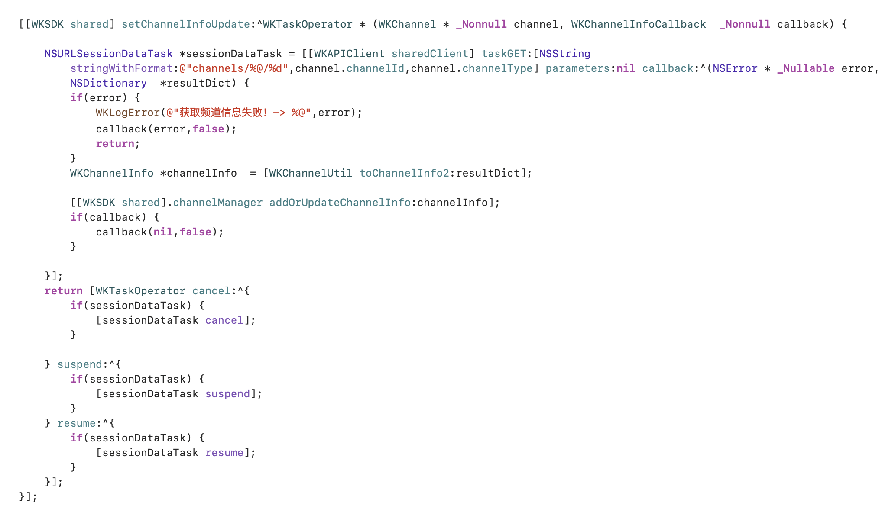

频道管理器负责频道信息数据的增删改查，通过频道管理可以实现用户/群昵称、用户/群头像、用户/群置顶、用户/群免打扰等功能。

<Note>
个人频道、群组频道统称为频道，个人信息、群组信息统称为频道信息
</Note>

<Note>
文档只介绍核心方法，更多内容查看代码的 `[WKSDK shared].channelManager` 接口
</Note>

## 获取频道信息

### 基础获取方法

获取客户端本地的频道信息，如果本地没有则调用 `fetchChannelInfo` 去触发数据源去服务器请求。

当调用 `fetchChannelInfo` 获取到频道信息数据后会触发数据监听，在监听里再重新刷新UI，这时 `[[WKSDK shared].channelManager getChannelInfo:channel]` 就能获取频道信息数据了。

```objc
WKChannelInfo *channelInfo = [[WKSDK shared].channelManager getChannelInfo:channel];
if(!channelInfo) {
    [[WKSDK shared].channelManager fetchChannelInfo:channel];
}
```

### 数据监听

`触发时机：channelInfo数据发生变化时`

添加 `WKChannelManagerDelegate` 委托

```objc
[[WKSDK shared].channelManager addDelegate:self]
```

`WKChannelManagerDelegate` 说明

```objc
// 频道更新
//  @param channelInfo 新频道信息
//  @param oldChannelInfo 旧频道信息
-(void) channelInfoUpdate:(WKChannelInfo*)channelInfo oldChannelInfo:(WKChannelInfo* __nullable)oldChannelInfo {

}
}
```

### 数据源

`触发时机：调用[[WKSDK shared].channelManager fetchChannelInfo]时触发`

频道信息数据源，需要实现请求服务器获取频道信息的逻辑

```objc
// channel 频道
// callback 当请求服务器获取到数据后，应调用此回调 （注意： 不管请求失败与否都需要调用callback）
 [[WKSDK shared] setChannelInfoUpdate:^WKTaskOperator * (WKChannel * _Nonnull channel, WKChannelInfoCallback  _Nonnull callback) {

  }];
```

示例：



## 修改频道

### 数据操作

修改频道资料（同时触发数据监听）

```objc
// 更新频道信息
[[WKSDK shared].channelManager updateChannelInfo:(WKChannelInfo*) channelInfo]

// 添加或更新频道信息
[[WKSDK shared].channelManager addOrUpdateChannelInfo:(WKChannelInfo*) channelInfo]
```

## 类核心属性

```objc
@interface WKChannelInfo : NSObject<NSCopying>
// 频道
@property(nonatomic,strong) WKChannel *channel;
/**
 频道名字
 */
@property(nonatomic,copy) NSString *name;
/**
 频道logo
 */
@property(nonatomic,copy) NSString *logo;
/**
 是否置顶
 */
@property(nonatomic,assign) BOOL stick;
/**
 是否免打扰
 */
@property(nonatomic,assign) BOOL mute;
/// 是否全员禁言
@property(nonatomic,assign) BOOL forbidden;
/**
 是否已关注 0.未关注（陌生人） 1.已关注（好友）
 */
@property(nonatomic,assign) WKChannelInfoFollow follow;
/**
 扩展字段，自定义频道业务属性可以添加到扩展字端内
 */
@property(nonatomic,strong) NSMutableDictionary<WKChannelExtraKey,id> *extra;

...

```

## 下一步

<CardGroup cols={2}>
  <Card
    title="会话管理"
    icon="users"
    href="/zh/sdk/wukongim/ios/conversation"
  >
    学习如何管理会话列表
  </Card>
  <Card
    title="多媒体消息"
    icon="image"
    href="/zh/sdk/wukongim/ios/media"
  >
    处理图片、语音、视频消息
  </Card>
  <Card
    title="聊天管理"
    icon="message-circle"
    href="/zh/sdk/wukongim/ios/chat"
  >
    回到聊天消息管理
  </Card>
  <Card
    title="连接管理"
    icon="link"
    href="/zh/sdk/wukongim/ios/connection"
  >
    管理连接状态
  </Card>
</CardGroup>
