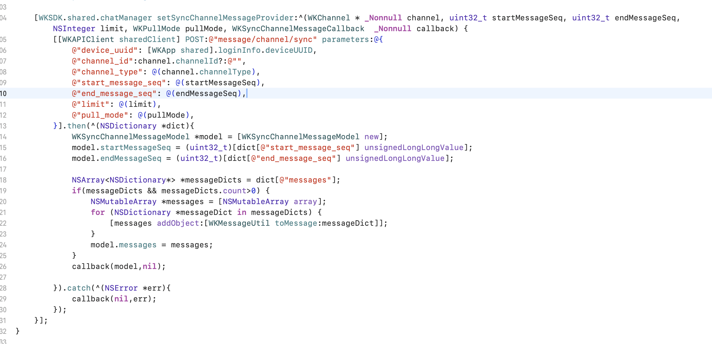

聊天管理器负责消息数据的管理，比如：消息发送、消息接收、消息更新等等。

<Note>
文档只介绍核心方法，更多内容查看代码的 `[WKSDK shared].chatManager` 接口
</Note>

## 在线消息收发

### 发送消息

#### 基础发送方法

```objc
/**
 发送消息 (发送并保存消息)

 @param content 消息正文
 @param channel 投递的频道（个人频道，群频道，客服频道等等）
 */
[[WKSDK shared].chatManager sendMessage:(WKMessageContent*)content channel:(WKChannel*)channel];
```

#### 发送示例

```objc
// 给用户A发送消息hello
WKChannel *channel = [[WKChannel alloc] initWith:@"A" channelType:WK_PERSON];

// 发送给群组 g1
// WKChannel *channel = [[WKChannel alloc] initWith:@"g1" channelType:WK_GROUP];

// 构建一个文本消息对象
WKTextContent *content = [[WKTextContent alloc] initWithContent:@"hello"];

// 发送此文本消息给指定频道
[[WKSDK shared].chatManager sendMessage:content channel:channel];
```

### 消息监听

#### 添加监听器

```objc
[WKSDK.shared.chatManager addDelegate:self]; // WKChatManagerDelegate
```

#### WKChatManagerDelegate 说明

```objc
// ------ WKChatManagerDelegate  ------
/**
 收到消息通知
 @param message 收到的消息
 @param left 消息剩余数量 ，可当left为0时再刷新UI,避免频繁刷新UI导致卡顿
 */
- (void)onRecvMessages:(WKMessage*)message left:(NSInteger)left;

/**
 消息更新通知
 @param message 变化的消息
 */
-(void) onMessageUpdate:(WKMessage*) message;

...
```

## 常用消息类型

SDK内置了一些常用的消息类型，比如文本消息、图片消息、语音消息。

### 文本消息

```objc
@interface WKTextContent : WKMessageContent

- (instancetype)initWithContent:(NSString*)content;

@property(nonatomic,copy) NSString *content; // 消息内容

@property(nonatomic,copy,nullable) NSString *format; // 内容格式 默认为普通文本 html,markdown

@end
```

#### 使用示例

```objc
// 创建文本消息
WKTextContent *textContent = [[WKTextContent alloc] initWithContent:@"Hello World"];

// 设置格式（可选）
textContent.format = @"markdown"; // 支持 html, markdown

// 发送消息
WKChannel *channel = [[WKChannel alloc] initWith:@"user123" channelType:WK_PERSON];
[[WKSDK shared].chatManager sendMessage:textContent channel:channel];
```

### 图片消息

```objc
@interface WKImageContent : WKMediaMessageContent

@property(nonatomic,assign) CGFloat width; // 图片宽度
@property(nonatomic,assign) CGFloat height; // 图片高度

/*!
 初始化图片消息
 @param image   原始图片
 @return        图片消息对象
 */
- (instancetype)initWithImage:(UIImage *)image;

/// 通过data初始化
/// @param data 图片数据
/// @param width 图片宽度
/// @param height 图片高度
- (instancetype)initWithData:(NSData *)data width:(CGFloat)width height:(CGFloat)height;

/// 初始化
/// @param data 原图data
/// @param width 原图宽度
/// @param height 原图高度
/// @param thumbData 缩略图data （如果传了缩略图的data数据，sdk将不再生成缩略图数据）
- (instancetype)initWithData:(NSData *)data width:(CGFloat)width height:(CGFloat)height thumbData:(nullable NSData*)thumbData;

/*!
 是否发送原图
 @discussion 在发送图片的时候，是否发送原图，默认值为NO。
 */
@property (nonatomic, getter=isFull) BOOL full;

@end
```


### 语音消息

```objc
@interface WKVoiceContent : WKMediaMessageContent

/**
 初始化
 @param voiceData 音频数据
 @param second 音频秒长
 @param waveform  音频波浪数据 （可选参数）
 @return 语音消息对象
 */
- (instancetype)initWithData:(NSData *)voiceData second:(int)second waveform:(NSData*)waveform;

// 音频数据
@property(nonatomic,strong) NSData *voiceData;

// 音频长度（单位秒）
@property(nonatomic,assign) NSInteger second;

// 音频波浪数据 （可选参数）
@property(nonatomic,strong) NSData *waveform;

@end
```

### 自定义消息

查看[自定义消息](./advance)

## 消息扩展

一些消息可能需要携带一些额外的信息，比如消息已读状态、消息是否被编辑过等等，这些信息可以通过消息的扩展属性来实现。

### 更新扩展

WKMessage类里有个 `remoteExtra` 属性，当修改这个属性后，需要调用此方法来更新远程扩展：

```objc
[[WKSDK shared].chatManager updateMessageRemoteExtra:(WKMessage*)message];
```

### 同步扩展

增量同步指定频道的所有消息扩展数据（此方法一般点开聊天页面的时候调用一次）：

```objc
// channel 需要同步的频道
[[WKSDK shared].chatManager syncMessageExtra:(WKChannel*)channel 
                                     complete:(void(^_Nullable)(NSError * _Nullable error))complete];
```

### 扩展数据源

#### 更新扩展数据源

触发时机：调用 `[[WKSDK shared].chatManager updateMessageRemoteExtra]` 的时候触发

```objc
// newExtra 新的扩展数据
// oldExtra 旧的扩展数据
[[[WKSDK shared] chatManager] setUpdateMessageExtraProvider:^(WKMessageExtra *newExtra,WKMessageExtra *oldExtra,WKUpdateMessageExtraCallback callback) {

}];
```

#### 同步扩展数据源

触发时机：调用 `[[WKSDK shared].chatManager syncMessageExtra]` 的时候触发

```objc
// channel 同步扩展消息的频道
// extraVersion 当前客户端存在的数据版本
// limit 每次同步数据量
// callback 当请求服务器获取到消息后，应调用此回调 （注意： 不管请求失败与否都需要调用callback）
[[[WKSDK shared] chatManager] setSyncMessageExtraProvider:^(WKChannel * _Nonnull channel, long long extraVersion,NSInteger limit, WKSyncMessageExtraCallback  _Nonnull callback) {

}];
```

## 历史消息

### 查询最新消息

查询某个频道最新的消息（一般是第一次进入会话页面查询首屏消息时调用此方法）：

```objc
/**
 查询某个频道最新的消息
 @param channel 频道
 @param limit 消息数量限制
 @param complete 查询回调
 */
[[WKSDK shared].chatManager pullLastMessages:(WKChannel*)channel 
                                        limit:(int)limit 
                                     complete:(void(^)(NSArray<WKMessage*> *messages, NSError *error))complete];
```

### 下拉加载消息

```objc
/**
 下拉加载消息
 @param channel 频道
 @param startOrderSeq 起始的orderSeq 比如需要查询 100以上的10条消息 那么startOrderSeq就是100 查询出来的数据为 90 91 92 93 94 95 96 97 98 99
 @param limit 消息数量限制
 @param complete 查询回调
 */
[[WKSDK shared].chatManager pullDown:(WKChannel*)channel 
                        startOrderSeq:(uint32_t)startOrderSeq 
                                limit:(int)limit 
                             complete:(void(^)(NSArray<WKMessage*> *messages, NSError *error))complete];
```

### 上拉加载消息

```objc
/**
 上拉加载消息
 @param startOrderSeq 起始的orderSeq 比如需要查询 100以下的10条消息 那么startOrderSeq就是100 查询出来的数据为 101 102 103 104 105 106 107 108 109 110
 @param limit 消息数量限制
 @param complete 查询回调
 */
[[WKSDK shared].chatManager pullUp:(WKChannel*)channel 
                      startOrderSeq:(uint32_t)startOrderSeq 
                              limit:(int)limit 
                           complete:(void(^)(NSArray<WKMessage*> *messages, NSError *error))complete];
```

### 查询周围消息

```objc
/**
 查询指定orderSeq周围的消息 上5条下5条，比如 orderSeq 为 20 则查询 16 17 18 19 20 21 22 23 24 25 主要使用在定位消息
 @param channel 频道
 @param orderSeq 以此OrderSeq查询周围的消息
 */
[[WKSDK shared].chatManager pullAround:(WKChannel*)channel 
                               orderSeq:(uint32_t)orderSeq  
                                  limit:(int)limit 
                               complete:(void(^)(NSArray<WKMessage*> *messages, NSError *error))complete];
```

### 历史消息数据源

`触发时机：获取历史消息并且本地没有此消息时，SDK会调用此方法来补全本地消息`

同步频道消息，当操作请求历史消息的时候，SDK会判断本地是否有消息，如果没有或者缺失，SDK会调用此方法来请求服务器的消息

```objc
// channel 同步消息的频道
// startMessageSeq 开始消息序号
// endMessageSeq 结束消息序号
// limit 消息每次同步数量
// pullMode 拉取消息模式 0:向下拉取 1:向上拉取
// callback 当请求服务器获取到消息后，应调用此回调 （注意： 不管请求失败与否都需要调用callback）
[WKSDK.shared.chatManager setSyncChannelMessageProvider:^(WKChannel * _Nonnull channel, uint32_t startMessageSeq, uint32_t endMessageSeq, NSInteger limit, WKPullMode pullMode, WKSyncChannelMessageCallback  _Nonnull callback) {

}]
```

例子：



## 类属性说明

消息类核心属性

```objc
@interface WKMessage : NSObject

@property(nonatomic,strong) WKMessageHeader *header; // 消息头

@property(nonatomic,strong) WKSetting *setting; // 消息设置

@property(nonatomic,strong) WKChannel *channel; // 聊天频道

@property(nonatomic,copy) NSString *fromUid; // 发送者uid

@property(nonatomic,strong) WKMessageContent *content; // 消息正文

@property(nonatomic,assign) NSInteger timestamp; // 消息时间（服务器时间,单位秒）

@property(nonatomic,strong) NSMutableDictionary *extra; // 消息本地扩展数据

@property(nonatomic,strong) WKMessageExtra *remoteExtra; // 消息远程扩展

...

```

消息正文核心属性

```objc
@interface WKMessageContent : NSObject<NSCopying>

/**
 你自定义的消息类型，在各个平台上需要保持一致
 @return 正文类型
 */

- (NSNumber*) contentType;

// 上层无需实现encode 实现此方法即可
- (NSDictionary*) encodeWithJSON;

// 上层无序实现decode 实现此方法即可
- (void) decodeWithJSON:(NSDictionary*)contentDic;

// 消息中的@提醒信息
@property (nonatomic, strong) WKMentionedInfo *mentionedInfo;


/// 回复内容
@property(nonatomic,strong) WKReply *reply;

...

```

## 下一步

<CardGroup cols={2}>
  <Card
    title="频道管理"
    icon="hash"
    href="/zh/sdk/wukongim/ios/channel"
  >
    学习如何管理频道和群组
  </Card>
  <Card
    title="会话管理"
    icon="users"
    href="/zh/sdk/wukongim/ios/conversation"
  >
    处理会话列表和未读消息
  </Card>
  <Card
    title="多媒体消息"
    icon="image"
    href="/zh/sdk/wukongim/ios/media"
  >
    处理图片、语音、视频等多媒体消息
  </Card>
  <Card
    title="高级功能"
    icon="cog"
    href="/zh/sdk/wukongim/ios/advance"
  >
    自定义消息和高级配置
  </Card>
</CardGroup>
