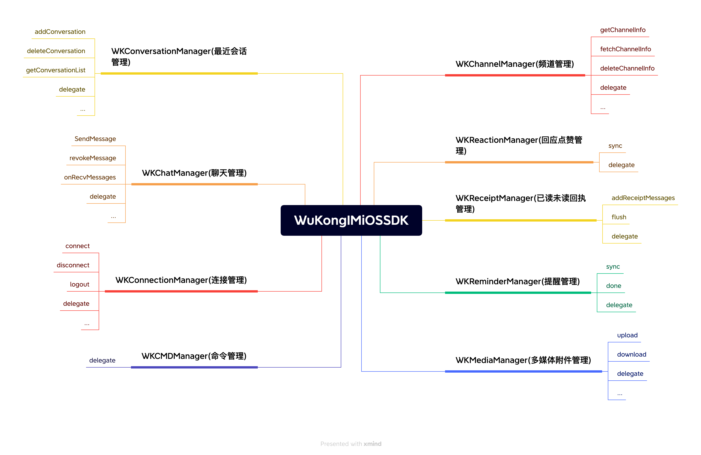

## 设计理念

像设计书的目录一样设计 API，通过 `WKSDK.shared.xxxManager` 我们可以访问到所有需要的功能，例如发送消息 `[WKSDK.shared.chatManager sendMessage:xxx]`

## 结构说明



```objc
// 聊天管理者
// 负责消息相关的增删改查操作 比如发送消息，删除消息，撤回消息，聊天消息的监听等等
WKSDK.shared.chatManager

// 连接管理者
// 负责与IM建立连接或断开连接 监听IM连接状态等等
WKSDK.shared.connectionManager

// 频道管理者
// 负责频道数据的获取和缓存和一些频道的设置，比如置顶，免打扰，禁言等等
WKSDK.shared.channelManager

// 最近会话管理者
// 负责维护最近会话的相关数据，比如未读数量，草稿，@我，最后一条消息等等
WKSDK.shared.conversationManager

// 回应管理者
// 负责点赞数据的维护
WKSDK.shared.reactionManager

// cmd管理者
// 负责监听服务端下发的命令类的消息
WKSDK.shared.cmdManager

// 消息回执管理者
// 负责维护消息的已读未读状态
WKSDK.shared.receiptManager

// 提醒管理者
// 负责最近会话的提醒项，比如 有人@我，入群申请等等 还可以自定义一些提醒，比如类似微信的 [红包] [转账] 列表都会有提醒
WKSDK.shared.reminderManager

// 多媒体管理者
// 负责消息的多媒体文件的上传下载，比如图片消息，视频消息等等带附件的消息
WKSDK.shared.mediaManager
```

## SDK 与已有 APP 交互原则


SDK 与已有 APP 交互的整体流程就是：已有 APP 调用 SDK 对应的方法 → 产生数据变化 → 通过 delegate 回调给已有 APP

比如常用的发送消息 → 消息状态变化 → 通知已有 APP 更新 UI 上的发送状态标记

```objc
// 通过操作chatMananger发送消息
[WKSDK.shared.chatManager sendMessage:xxx]

// chatManagerDelegate 通过chatManager的chatManagerDelegate监听消息的状态变化
-(void) onMessageUpdate:(WKMessage*) message  {
    if(message.status == SUCCESS) {
      [self updateItemUIWithSuccess:message];
    }else {
       [self updateItemUIWithFail:message];
    }
}
```

## 核心功能模块

### 聊天管理 (ChatManager)
- 消息发送、接收、删除
- 消息撤回、编辑
- 消息状态监听
- 历史消息查询

### 连接管理 (ConnectionManager)
- IM 连接建立与断开
- 连接状态监听
- 网络状态处理
- 自动重连机制

### 频道管理 (ChannelManager)
- 频道信息获取与缓存
- 频道设置（置顶、免打扰、禁言）
- 频道成员管理
- 频道状态同步

### 会话管理 (ConversationManager)
- 最近会话列表维护
- 未读消息计数
- 会话草稿管理
- @消息提醒

### 多媒体管理 (MediaManager)
- 图片、视频、音频上传下载
- 文件传输进度监听
- 媒体文件缓存管理
- 缩略图生成

## 开发优势

- **统一入口**：通过 `WKSDK.shared` 访问所有功能
- **模块化设计**：功能模块清晰分离，便于维护
- **事件驱动**：基于 delegate 模式的事件回调
- **高性能**：本地数据库缓存，减少网络请求
- **易于集成**：简洁的 API 设计，快速集成到现有项目

## 下一步

了解了 iOS SDK 的整体架构后，您可以：

1. [集成 SDK](/zh/sdk/wukongim/ios/integration) - 开始集成 WuKongIM iOS SDK
2. [连接管理](/zh/sdk/wukongim/ios/connection) - 学习如何建立和管理连接
3. [聊天管理](/zh/sdk/wukongim/ios/chat) - 实现消息收发功能
4. [频道管理](/zh/sdk/wukongim/ios/channel) - 管理频道和成员
5. [会话管理](/zh/sdk/wukongim/ios/conversation) - 处理会话列表和未读消息
