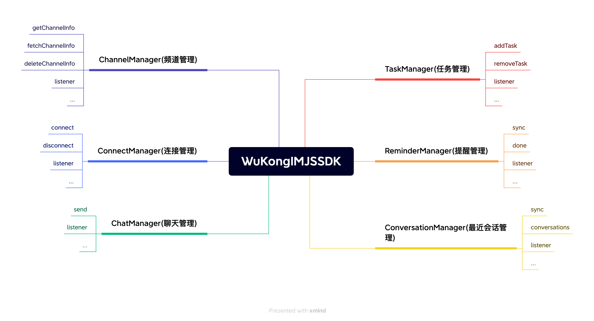

## 设计理念

像设计书的目录一样设计 API，通过 `WKSDK.shared().xxxManager` 我们可以访问到所有需要的功能，例如发送消息 `WKSDK.shared().chatManager.send(xxx)`

## 结构说明



```js
// 聊天管理者
// 负责消息相关的增删改查操作 比如发送消息，删除消息，撤回消息，聊天消息的监听等等
WKSDK.shared().chatManager;

// 连接管理者
// 负责与IM建立连接或断开连接 监听IM连接状态等等
WKSDK.shared().connectionManager;

// 频道管理者
// 负责频道数据的获取和缓存和一些频道的设置，比如置顶，免打扰，禁言等等
WKSDK.shared().channelManager;

// 最近会话管理者
// 负责维护最近会话的相关数据，比如未读数量，草稿，@我，最后一条消息等等
WKSDK.shared().conversationManager;

// 提醒管理者
// 负责最近会话的提醒事项维护
WKSDK.shared().reminderManager;
```

## 核心功能模块

### 聊天管理 (ChatManager)
- 消息发送、接收、删除
- 消息撤回、编辑功能
- 聊天消息监听
- 历史消息查询
- 消息状态管理

### 连接管理 (ConnectionManager)
- 与 IM 服务器建立 WebSocket 连接
- 连接断开和重连机制
- 连接状态监听
- 网络状态处理
- 心跳保活机制

### 频道管理 (ChannelManager)
- 频道数据获取和缓存
- 频道设置管理（置顶、免打扰、禁言等）
- 频道信息同步
- 频道成员管理
- 频道状态监听

### 会话管理 (ConversationManager)
- 最近会话数据维护
- 未读消息数量统计
- 会话草稿管理
- @我消息提醒
- 最后一条消息显示
- 会话排序和过滤

### 提醒管理 (ReminderManager)
- 最近会话提醒事项维护
- 自定义提醒类型
- 提醒状态管理
- 提醒消息处理

## 平台支持

### 浏览器环境
- 现代浏览器 WebSocket 支持
- 本地存储 (localStorage/indexedDB)
- 文件上传下载
- 通知 API 支持

### Node.js 环境
- 服务端 WebSocket 连接
- 文件系统操作
- 数据库集成
- 服务端推送

### 框架集成
- **React**: 提供 React Hooks 支持
- **Vue**: 提供 Vue 组合式 API 支持
- **Angular**: 提供 Angular 服务支持
- **小程序**: 支持微信小程序等平台

## 开发优势

- **统一入口**：通过 `WKSDK.shared()` 访问所有功能
- **模块化设计**：功能模块清晰分离，便于维护
- **事件驱动**：基于事件监听的异步编程模式
- **跨平台**：支持浏览器和 Node.js 环境
- **轻量级**：核心库体积小，按需加载
- **TypeScript 支持**：完整的类型定义
- **现代化**：支持 ES6+ 语法和 Promise/async-await

## 技术特性

### WebSocket 连接
- 自动重连机制
- 连接状态管理
- 心跳检测
- 断线重连

### 数据存储
- 浏览器本地存储
- 消息本地缓存
- 离线消息支持
- 数据同步机制

### 消息处理
- 实时消息推送
- 消息去重处理
- 消息排序
- 消息状态同步

### 文件处理
- 文件上传下载
- 图片压缩
- 文件类型检测
- 上传进度监听

## 使用场景

### Web 应用
- 在线客服系统
- 社交聊天应用
- 协作办公平台
- 在线教育平台

### 移动 H5
- 移动端网页聊天
- 混合应用开发
- PWA 应用
- 微信公众号

### 服务端应用
- 消息推送服务
- 聊天机器人
- 数据同步服务
- API 网关集成

## 下一步

了解了 JavaScript SDK 的整体架构后，您可以：

1. [集成 SDK](/zh/sdk/wukongim/javascript/integration) - 开始集成 WuKongIM JavaScript SDK
2. [基础功能](/zh/sdk/wukongim/javascript/base) - 学习 SDK 的基础配置和使用
3. [聊天管理](/zh/sdk/wukongim/javascript/chat) - 实现消息收发功能
4. [频道管理](/zh/sdk/wukongim/javascript/channel) - 管理频道和成员
5. [会话管理](/zh/sdk/wukongim/javascript/conversation) - 处理会话列表和未读消息
