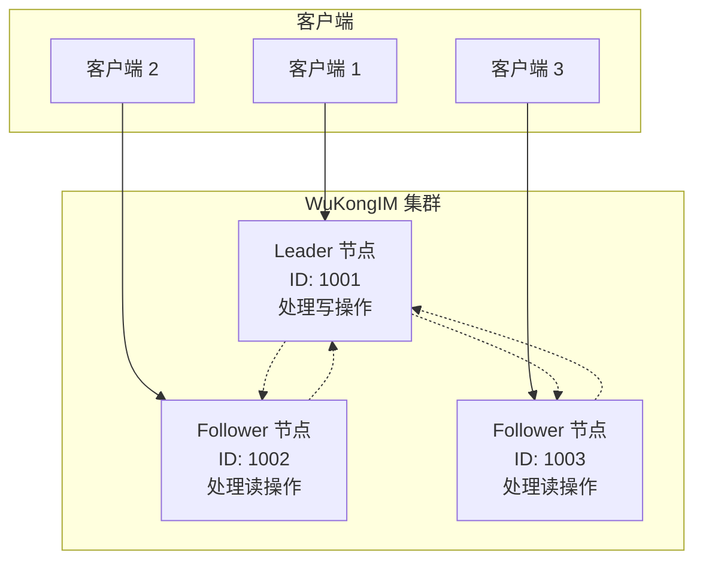

WuKongIM 支持集群模式部署，提供高可用性、负载分布和自动故障转移能力。本指南详细介绍集群配置和管理。

## 集群架构

WuKongIM 集群基于 Raft 共识算法，确保数据一致性和高可用性：



### 核心特性
- **Raft 共识算法**：保证数据一致性
- **自动故障转移**：Leader 故障时自动选举新 Leader
- **读写分离**：Leader 处理写操作，Follower 处理读操作
- **数据复制**：所有数据自动复制到所有节点
- **在线扩容**：支持动态添加节点

## 基础集群配置

### 1. 节点配置

每个节点需要唯一的配置：

```yaml
# 节点 1 配置 (wk-node1.yaml)
mode: "release"
cluster:
  nodeId: 1001                                    # 唯一节点 ID
  serverAddr: "192.168.1.101:11110"             # 集群内部通信地址
  initNodes:                                      # 初始集群节点列表
    - "1001@192.168.1.101:11110"
    - "1002@192.168.1.102:11110"
    - "1003@192.168.1.103:11110"
  heartbeatTick: 1                               # 心跳间隔（秒）
  electionTick: 10                               # 选举超时（心跳间隔的倍数）

# 外部访问配置
external:
  ip: "192.168.1.101"                           # 外部 IP
  tcpAddr: "192.168.1.101:5100"                # TCP 连接地址
  wsAddr: "ws://192.168.1.101:5200"            # WebSocket 地址
  apiUrl: "http://192.168.1.101:5001"          # API 地址

# 数据存储
rootDir: "./wukongim-node1"                     # 数据目录
```

```yaml
# 节点 2 配置 (wk-node2.yaml)
mode: "release"
cluster:
  nodeId: 1002                                    # 不同的节点 ID
  serverAddr: "192.168.1.102:11110"             # 不同的服务器地址
  initNodes:                                      # 相同的初始节点列表
    - "1001@192.168.1.101:11110"
    - "1002@192.168.1.102:11110"
    - "1003@192.168.1.103:11110"
  heartbeatTick: 1
  electionTick: 10

external:
  ip: "192.168.1.102"
  tcpAddr: "192.168.1.102:5100"
  wsAddr: "ws://192.168.1.102:5200"
  apiUrl: "http://192.168.1.102:5001"

rootDir: "./wukongim-node2"
```

```yaml
# 节点 3 配置 (wk-node3.yaml)
mode: "release"
cluster:
  nodeId: 1003
  serverAddr: "192.168.1.103:11110"
  initNodes:
    - "1001@192.168.1.101:11110"
    - "1002@192.168.1.102:11110"
    - "1003@192.168.1.103:11110"
  heartbeatTick: 1
  electionTick: 10

external:
  ip: "192.168.1.103"
  tcpAddr: "192.168.1.103:5100"
  wsAddr: "ws://192.168.1.103:5200"
  apiUrl: "http://192.168.1.103:5001"

rootDir: "./wukongim-node3"
```

### 2. 启动集群

按顺序启动所有节点：

```bash
# 在节点 1 上启动
./wukongim --config wk-node1.yaml

# 在节点 2 上启动
./wukongim --config wk-node2.yaml

# 在节点 3 上启动
./wukongim --config wk-node3.yaml
```

<Callout type="info">
  **启动顺序**：建议按照节点 ID 顺序启动，但不是强制要求。集群会自动进行 Leader 选举。
</Callout>

## 高级集群配置

### 1. Raft 参数调优

```yaml
cluster:
  # 基础配置
  nodeId: 1001
  serverAddr: "192.168.1.101:11110"
  
  # Raft 算法参数
  heartbeatTick: 1                    # 心跳间隔（秒）
  electionTick: 10                    # 选举超时（心跳间隔的倍数）
  maxSizePerMsg: 1048576             # 单条消息最大大小（字节）
  maxInflightMsgs: 256               # 最大飞行中消息数
  checkQuorum: true                   # 启用 Quorum 检查
  preVote: true                       # 启用预投票
  
  # 日志配置
  maxLogSize: 1073741824             # 最大日志大小（1GB）
  logCompactThreshold: 10000         # 日志压缩阈值
  
  # 快照配置
  snapshotEntries: 10000             # 快照间隔（日志条目数）
  compactionOverhead: 5000           # 压缩开销
```

### 2. 网络配置

```yaml
cluster:
  # 网络超时配置
  dialTimeout: "5s"                   # 连接超时
  requestTimeout: "10s"               # 请求超时
  
  # 连接池配置
  maxConnections: 100                 # 最大连接数
  keepAlive: true                     # 启用 Keep-Alive
  keepAlivePeriod: "30s"             # Keep-Alive 周期
  
  # TLS 配置（可选）
  tls:
    enabled: true
    certFile: "/path/to/cluster.crt"
    keyFile: "/path/to/cluster.key"
    caFile: "/path/to/ca.crt"
```

### 3. 性能优化

```yaml
cluster:
  # 批处理配置
  batchSize: 100                      # 批处理大小
  batchTimeout: "10ms"                # 批处理超时
  
  # 并发配置
  workerCount: 4                      # 工作线程数
  queueSize: 1000                     # 队列大小
  
  # 内存配置
  maxMemoryUsage: "2GB"               # 最大内存使用
  gcInterval: "5m"                    # 垃圾回收间隔
```

## 集群管理

### 1. 查看集群状态

```bash
# 查看集群节点信息
curl http://192.168.1.101:5001/cluster/nodes

# 响应示例
{
  "leader": 1001,
  "nodes": [
    {
      "id": 1001,
      "addr": "192.168.1.101:11110",
      "status": "leader",
      "last_heartbeat": "2024-01-20T10:30:00Z"
    },
    {
      "id": 1002,
      "addr": "192.168.1.102:11110",
      "status": "follower",
      "last_heartbeat": "2024-01-20T10:30:01Z"
    },
    {
      "id": 1003,
      "addr": "192.168.1.103:11110",
      "status": "follower",
      "last_heartbeat": "2024-01-20T10:30:02Z"
    }
  ]
}
```

### 2. 添加节点

```bash
# 添加新节点到集群
curl -X POST http://192.168.1.101:5001/cluster/nodes \
  -H "Content-Type: application/json" \
  -d '{
    "id": 1004,
    "addr": "192.168.1.104:11110"
  }'

# 在新节点上启动服务
./wukongim --config wk-node4.yaml
```

### 3. 移除节点

```bash
# 从集群中移除节点
curl -X DELETE http://192.168.1.101:5001/cluster/nodes/1004

# 停止被移除节点的服务
# 在节点 4 上执行
pkill wukongim
```

### 4. 手动故障转移

```bash
# 强制进行 Leader 选举
curl -X POST http://192.168.1.101:5001/cluster/transfer-leadership \
  -H "Content-Type: application/json" \
  -d '{
    "target_node": 1002
  }'
```

## 负载均衡配置

### 1. Nginx 负载均衡

```nginx
# nginx.conf
upstream wukongim_api {
    server 192.168.1.101:5001;
    server 192.168.1.102:5001;
    server 192.168.1.103:5001;
}

upstream wukongim_tcp {
    server 192.168.1.101:5100;
    server 192.168.1.102:5100;
    server 192.168.1.103:5100;
}

upstream wukongim_ws {
    server 192.168.1.101:5200;
    server 192.168.1.102:5200;
    server 192.168.1.103:5200;
}

# HTTP API 负载均衡
server {
    listen 80;
    location /api/ {
        proxy_pass http://wukongim_api;
        proxy_set_header Host $host;
        proxy_set_header X-Real-IP $remote_addr;
    }
}

# WebSocket 负载均衡
server {
    listen 8080;
    location / {
        proxy_pass http://wukongim_ws;
        proxy_http_version 1.1;
        proxy_set_header Upgrade $http_upgrade;
        proxy_set_header Connection "upgrade";
    }
}

# TCP 负载均衡
stream {
    server {
        listen 9100;
        proxy_pass wukongim_tcp;
    }
}
```

### 2. HAProxy 负载均衡

```haproxy
# haproxy.cfg
global
    daemon
    maxconn 4096

defaults
    mode http
    timeout connect 5000ms
    timeout client 50000ms
    timeout server 50000ms

# API 负载均衡
frontend wukongim_api_frontend
    bind *:80
    default_backend wukongim_api_backend

backend wukongim_api_backend
    balance roundrobin
    server node1 192.168.1.101:5001 check
    server node2 192.168.1.102:5001 check
    server node3 192.168.1.103:5001 check

# WebSocket 负载均衡
frontend wukongim_ws_frontend
    bind *:8080
    default_backend wukongim_ws_backend

backend wukongim_ws_backend
    balance roundrobin
    server node1 192.168.1.101:5200 check
    server node2 192.168.1.102:5200 check
    server node3 192.168.1.103:5200 check

# TCP 负载均衡
frontend wukongim_tcp_frontend
    bind *:9100
    mode tcp
    default_backend wukongim_tcp_backend

backend wukongim_tcp_backend
    mode tcp
    balance roundrobin
    server node1 192.168.1.101:5100 check
    server node2 192.168.1.102:5100 check
    server node3 192.168.1.103:5100 check
```

## 监控和告警

### 1. 集群健康监控

```bash
#!/bin/bash
# cluster-health-check.sh

NODES=("192.168.1.101" "192.168.1.102" "192.168.1.103")
ALERT_EMAIL="admin@example.com"

for node in "${NODES[@]}"; do
    # 检查节点健康状态
    if ! curl -f http://$node:5001/health > /dev/null 2>&1; then
        echo "节点 $node 不健康" | mail -s "WuKongIM 集群告警" $ALERT_EMAIL
    fi
    
    # 检查集群状态
    status=$(curl -s http://$node:5001/cluster/status | jq -r '.status')
    if [ "$status" != "healthy" ]; then
        echo "集群状态异常: $status" | mail -s "WuKongIM 集群告警" $ALERT_EMAIL
    fi
done
```

### 2. Prometheus 监控配置

```yaml
# prometheus.yml
global:
  scrape_interval: 15s

scrape_configs:
  - job_name: 'wukongim-cluster'
    static_configs:
      - targets:
        - '192.168.1.101:5300'
        - '192.168.1.102:5300'
        - '192.168.1.103:5300'
    metrics_path: /metrics
    scrape_interval: 10s
```

## 故障排除

### 常见问题

<AccordionGroup>
  <Accordion title="集群分裂（Split Brain）">
    检查网络连接和时间同步：
    ```bash
    # 检查节点间网络连通性
    for node in 192.168.1.101 192.168.1.102 192.168.1.103; do
        ping -c 3 $node
        telnet $node 11110
    done
    
    # 检查时间同步
    for node in 192.168.1.101 192.168.1.102 192.168.1.103; do
        ssh $node "date"
    done
    
    # 重启集群
    # 停止所有节点，然后按顺序重启
    ```
  </Accordion>
  
  <Accordion title="Leader 选举失败">
    检查 Raft 配置和日志：
    ```bash
    # 查看 Raft 状态
    curl http://192.168.1.101:5001/cluster/raft/status
    
    # 检查日志
    tail -f /var/log/wukongim/wukongim.log | grep -i raft
    
    # 手动触发选举
    curl -X POST http://192.168.1.101:5001/cluster/election
    ```
  </Accordion>
  
  <Accordion title="数据不一致">
    检查数据同步状态：
    ```bash
    # 检查各节点数据版本
    for node in 192.168.1.101 192.168.1.102 192.168.1.103; do
        echo "节点 $node:"
        curl -s http://$node:5001/cluster/data/version
    done
    
    # 强制数据同步
    curl -X POST http://192.168.1.101:5001/cluster/sync/force
    ```
  </Accordion>
</AccordionGroup>

## 下一步

<CardGroup cols={2}>
  <Card
    title="性能优化"
    icon="gauge-high"
    href="/zh/server/configuration/performance"
  >
    集群性能调优指南
  </Card>
  <Card
    title="安全配置"
    icon="shield-check"
    href="/zh/server/configuration/ssl"
  >
    集群安全和 TLS 配置
  </Card>
  <Card
    title="监控设置"
    icon="chart-line"
    href="/zh/advanced/monitoring"
  >
    集群监控和告警配置
  </Card>
  <Card
    title="故障排除"
    icon="wrench"
    href="/zh/advanced/troubleshooting"
  >
    集群故障诊断和解决
  </Card>
</CardGroup>
